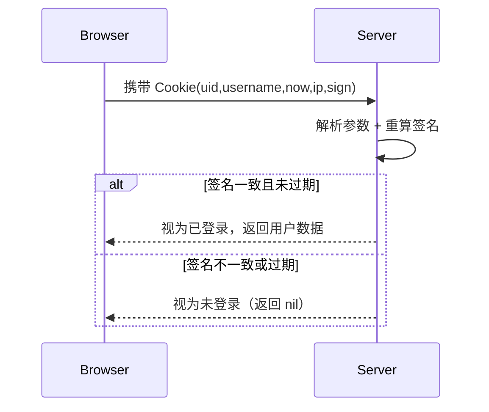

# Go 企业级抽奖项目: 登录和退出安全值校验和防篡改

## 纲要

- 登录用户模型：`ObjLoginuser` 描述站点与浏览器交互的用户信息，关键字段是 `Sign`（签名）。
- 基于 Cookie 的登录态：用户状态完全由 Cookie 承载，服务端必须保证 Cookie 只能由自己生成、不能被客户端篡改。
- 读取与设置：`GetLoginUser` 从请求解析 Cookie 并校验签名；`SetLoginuser` 写入或清除 Cookie。
- 防篡改核心：`createLoginuserSign` 用“密钥 + 用户字段”做 MD5 签名，校验时重算签名并比对，不一致即视为非法。
- 控制器接口：`IndexController` 提供 `GetLogin`（随机生成 UID 并写入 Cookie）与 `GetLogout`（清空 Cookie）。

## 登录用户模型

站点与浏览器交互的用户对象定义在 `models/obj_loginuser.go`，其中 `Sign` 是防篡改的关键：

```go
package models

// 站点中与浏览器交互的用户模型
type ObjLoginuser struct {
	Uid      int
	Username string
	Now      int
	Ip       string
	Sign     string
}
```

## 通用 Web 方法 func_web.go

Cookie 的读写、IP 获取、页面跳转都封装在 `comm/func_web.go` 中。

```go
package comm

import (
	"fmt"
	"log"
	"net"
	"net/http"
	"net/url"
	"strconv"

	"imooc.com/lottery/conf"
	"imooc.com/lottery/models"
)

// 得到客户端 IP 地址
func ClientIP(request *http.Request) string {
	host, _, _ := net.SplitHostPort(request.RemoteAddr)
	return host
}

// 跳转到指定 URL（302 临时跳转）
func Redirect(writer http.ResponseWriter, url string) {
	writer.Header().Add("Location", url)
	writer.WriteHeader(http.StatusFound)
}
```

### 读取并校验登录用户

`GetLoginUser` 的逻辑是：取 Cookie → URL 解码 → 取出 `uid` 并转换为整型 → 检查 `now` 是否超过 30 天 → 重建对象 → **校验签名**。任何一步失败都返回 `nil`（视为未登录）：

```go
// 从 cookie 中得到当前登录的用户
func GetLoginUser(request *http.Request) *models.ObjLoginuser {
	c, err := request.Cookie("lottery_loginuser")
	if err != nil {
		return nil
	}
	params, err := url.ParseQuery(c.Value)
	if err != nil {
		return nil
	}
	uid, err := strconv.Atoi(params.Get("uid"))
	if err != nil || uid < 1 {
		return nil
	}
	// Cookie 最长使用时长 30 天
	now, err := strconv.Atoi(params.Get("now"))
	if err != nil || NowUnix()-now > 86400*30 {
		return nil
	}
	loginuser := &models.ObjLoginuser{}
	loginuser.Uid = uid
	loginuser.Username = params.Get("username")
	loginuser.Now = now
	loginuser.Ip = ClientIP(request)
	loginuser.Sign = params.Get("sign")

	// 用同样的规则重算签名并比对
	sign := createLoginuserSign(loginuser)
	if sign != loginuser.Sign {
		log.Println("GetLoginUser sign mismatch", sign, loginuser.Sign)
		return nil
	}
	return loginuser
}
```

### 写入或清除登录用户

`SetLoginuser` 在 `loginuser` 为 `nil` 或 `uid < 1` 时，写入一个已过期（`MaxAge=-1`）的空 Cookie，从而实现“退出登录”；否则生成签名、组装参数并写回浏览器：

```go
// 将登录的用户信息设置到 cookie 中
func SetLoginuser(writer http.ResponseWriter, loginuser *models.ObjLoginuser) {
	if loginuser == nil || loginuser.Uid < 1 {
		// 清空 Cookie（退出登录）
		c := &http.Cookie{
			Name:   "lottery_loginuser",
			Value:  "",
			Path:   "/",
			MaxAge: -1,
		}
		http.SetCookie(writer, c)
		return
	}
	if loginuser.Sign == "" {
		loginuser.Sign = createLoginuserSign(loginuser)
	}
	params := url.Values{}
	params.Add("uid", strconv.Itoa(loginuser.Uid))
	params.Add("username", loginuser.Username)
	params.Add("now", strconv.Itoa(loginuser.Now))
	params.Add("ip", loginuser.Ip)
	params.Add("sign", loginuser.Sign)
	c := &http.Cookie{
		Name:  "lottery_loginuser",
		Value: params.Encode(),
		Path:  "/",
	}
	http.SetCookie(writer, c)
}
```

### 签名生成

签名规则：`uid&username&secret` 拼接后再加上全局 `SignSecret` 前缀，最后做 MD5。密钥在 `conf.CookieSecret` 中配置，客户端拿不到；MD5 不可逆，因此客户端无法伪造合法签名：

```go
// 根据登录用户信息生成加密字符串
func createLoginuserSign(loginuser *models.ObjLoginuser) string {
	str := fmt.Sprintf("uid=%d&username=%s&secret=%s",
		loginuser.Uid, loginuser.Username, conf.CookieSecret)
	return CreateSign(str)
}
```

`CreateSign` 的实现（`comm/functions.go`）：

```go
func CreateSign(str string) string {
	str = string(conf.SignSecret) + str
	sign := fmt.Sprintf("%x", md5.Sum([]byte(str)))
	return sign
}
```

## 控制器中的登录与退出

在 `IndexController` 中，`GetLogin` 简单地随机生成一个 UID（本演示未做用户名/密码校验），构造 `ObjLoginuser` 后写入 Cookie 并跳回来源页；`GetLogout` 传入空用户对象即触发 Cookie 清除：

```go
// 登录 GET /login
func (c *IndexController) GetLogin() {
	// 每次随机生成一个登录用户信息
	uid := comm.Random(100000)
	loginuser := models.ObjLoginuser{
		Uid:      uid,
		Username: fmt.Sprintf("admin-%d", uid),
		Now:      comm.NowUnix(),
		Ip:       comm.ClientIP(c.Ctx.Request()),
	}
	refer := c.Ctx.GetHeader("Referer")
	if refer == "" {
		refer = "/public/index.html?from=login"
	}
	comm.SetLoginuser(c.Ctx.ResponseWriter(), &loginuser)
	comm.Redirect(c.Ctx.ResponseWriter(), refer)
}

// 退出 GET /logout
func (c *IndexController) GetLogout() {
	refer := c.Ctx.GetHeader("Referer")
	if refer == "" {
		refer = "/public/index.html?from=logout"
	}
	// 传入空对象即可清除 Cookie
	comm.SetLoginuser(c.Ctx.ResponseWriter(), nil)
	comm.Redirect(c.Ctx.ResponseWriter(), refer)
}
```

## 防篡改原理小结



## API 速览

| 函数 | 包 | 说明 |
| --- | --- | --- |
| `ClientIP(r *http.Request) string` | comm | 从请求取出客户端 IP |
| `Redirect(w, url)` | comm | 302 跳转到指定地址 |
| `GetLoginUser(r) *ObjLoginuser` | comm | 解析并校验 Cookie 登录态 |
| `SetLoginuser(w, *ObjLoginuser)` | comm | 写入或清除登录 Cookie |
| `createLoginuserSign(u) string` | comm | 基于密钥生成 MD5 签名 |

## Demo 示例

运行说明：示例演示签名生成与校验闭环（根据讲稿逻辑补充，需导入 `comm`/`conf`/`models` 真实包）。

```go
package main

import (
	"fmt"

	"imooc.com/lottery/comm"
	"imooc.com/lottery/conf"
	"imooc.com/lottery/models"
)

func main() {
	u := models.ObjLoginuser{
		Uid:      12345,
		Username: "admin-12345",
		Now:      comm.NowUnix(),
		Ip:       "127.0.0.1",
	}
	// 服务端生成签名
	sign := comm.CreateSign(
		fmt.Sprintf("uid=%d&username=%s&secret=%s", u.Uid, u.Username, conf.CookieSecret))
	u.Sign = sign

	// 校验：用同样的规则重算，必须一致
	expect := comm.CreateSign(
		fmt.Sprintf("uid=%d&username=%s&secret=%s", u.Uid, u.Username, conf.CookieSecret))
	fmt.Println("valid =", expect == u.Sign) // true
}
```

代码说明：展示“生成签名 → 重算比对”的防篡改核心逻辑，密钥仅在服务端可见。

技术点总结：登录态建立在 Cookie 之上，安全性的根基是“服务端独有密钥 + MD5 签名”；任何客户端篡改都会在 `GetLoginUser` 的签名比对环节被拒绝；过期时间（30 天）与空对象清除机制共同保证登录态可控、可退出。

## 总结

相关度：100%。是否需要继续：是。代码是否可运行：否。
