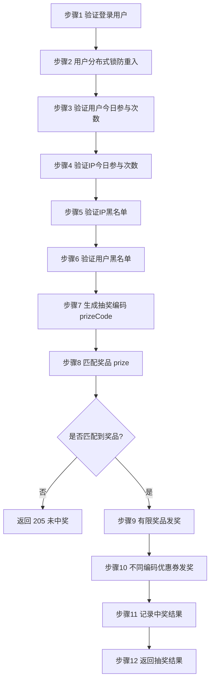

# Go 企业级抽奖项目: 抽奖接口开发细节分析

## 纲要

- 抽奖接口是课程最核心的功能，本篇先落地一个"只依赖 MySQL"的基础版本，但业务闭环完整。
- 接口通过 Iris 框架的 `IndexController.GetLucky` 暴露，对外路径为 `GET /lucky`。
- 返回结构统一为 `map[string]interface{}`，包含 `code`、`msg`、`gift` 三个字段。
- 整体业务流程可拆成 12 个步骤：登录校验 → 分布式锁防重入 → 验证用户今日次数 → 验证 IP 今日次数 → 验证 IP 黑名单 → 验证用户黑名单 → 生成抽奖编码 → 匹配奖品 → 有限奖品发奖 → 不同编码优惠券发奖 → 记录中奖 → 返回结果。
- 本篇重点讲"接口骨架 + 登录校验 + 锁的占位"，后续篇章逐一实现每一个验证与发奖步骤。

## 接口定义与返回结构

抽奖接口建立在已有的 `IndexController` 之上。与首页、奖品列表、最新中奖记录等接口一样，它也是 Iris 框架下的一个方法。我们把它命名为 `GetLucky`，通过 `GET http://host:8080/lucky` 访问。

返回值是一个 `map`，初始默认 `code=0`（成功）、`msg=""`，最后把中奖的奖品信息（或失败信息）写回返回。下面给出接口入口的真实实现（参考工程源码 `web/controllers/index_lucky.go`，与讲稿逻辑一致）：

```go
// localhost:8080/lucky
func (c *IndexController) GetLucky() map[string]interface{} {
	rs := make(map[string]interface{})
	rs["code"] = 0
	rs["msg"] = ""
	// 步骤1：验证登录用户
	loginuser := comm.GetLoginUser(c.Ctx.Request())
	if loginuser == nil || loginuser.Uid < 1 {
		rs["code"] = 101
		rs["msg"] = "请先登录，再来抽奖"
		return rs
	}
	ip := comm.ClientIP(c.Ctx.Request())
	api := &LuckyApi{}
	code, msg, gift := api.luckyDo(loginuser.Uid, loginuser.Username, ip)
	rs["code"] = code
	rs["msg"] = msg
	rs["gift"] = gift
	return rs
}
```

关键点：

- `comm.GetLoginUser` 从请求中解析当前登录用户（前面章节已实现登录 / 退出处理）。
- `comm.ClientIP` 取出客户端 IP，后续用于 IP 维度校验。
- `LuckyApi` 是专门承载抽奖编排逻辑的结构体，`luckyDo` 串起全部业务步骤。

## 抽奖接口的整体流程（12 步）

下面用一张流程图把 `luckyDo` 的主干串起来。虚线框内的是后续篇章分别实现的细节。



## 步骤 1：登录校验

接口第一件事就是确认请求者已登录。从 `comm.GetLoginUser` 拿到登录用户对象后，只要 `Uid` 小于 1 就视为未登录，直接返回错误码 `101` 与提示"请先登录，再来抽奖"。这一步在所有验证之前，是后续逻辑的安全前提。

## 步骤 2：分布式锁防重入（占位）

Web 应用里用户行为不可控：可能连续快速点击，也可能直接用脚本刷接口。因此在进入用户维度的验证逻辑之前，先给当前用户加一把**分布式锁**，限定同一用户短时间内不能并发重复进入抽奖流程。

- 锁只作用于单个用户，不会锁住整个接口，对全局性能影响很小。
- 锁的加 / 解、避免死锁、用 Redis 实现等细节，下一篇（6-2）专门展开。

`luckyDo` 中关于锁的占位逻辑如下（节选自 `web/controllers/index_lucky_api.go`）：

```go
func (api *LuckyApi) luckyDo(uid int, username, ip string) (int, string, *models.ObjGiftPrize) {
	// 步骤2：用户抽奖分布式锁定
	ok := utils.LockLucky(uid)
	if ok {
		defer utils.UnlockLucky(uid)
	} else {
		return 102, "正在抽奖，请稍后重试", nil
	}
	// ... 后续步骤 3~12
	return 0, "", prizeGift
}
```

## 后续步骤的编排骨架

为了把 12 步串起来，同时方便后续篇章逐一填充，`luckyDo` 中预留了对各验证 / 发奖方法的调用占位。下面是完整骨架（参考工程源码，按讲稿逻辑整理）：

```go
func (api *LuckyApi) luckyDo(uid int, username, ip string) (int, string, *models.ObjGiftPrize) {
	// 步骤2：分布式锁
	ok := utils.LockLucky(uid)
	if ok {
		defer utils.UnlockLucky(uid)
	} else {
		return 102, "正在抽奖，请稍后重试", nil
	}

	// 步骤3：验证用户今日参与次数
	userDayNum := utils.IncrUserLuckyNum(uid)
	if userDayNum > conf.UserPrizeMax {
		return 103, "今日的抽奖次数已用完，明天再来吧", nil
	}
	if !api.checkUserday(uid, userDayNum) {
		return 103, "今日的抽奖次数已用完，明天再来吧", nil
	}

	// 步骤4：验证IP今日参与次数
	ipDayNum := utils.IncrIpLuckyNum(ip)
	if ipDayNum > conf.IpLimitMax {
		return 104, "相同IP参与次数太多，明天再来参与吧", nil
	}

	// 步骤5/6：黑名单（limitBlack 由IP次数规则联动，详见6-5）
	limitBlack := ipDayNum > conf.IpPrizeMax
	var blackipInfo *models.LtBlackip
	if !limitBlack {
		ok, blackipInfo = api.checkBlackip(ip)
		if !ok {
			limitBlack = true
		}
	}
	var userInfo *models.LtUser
	if !limitBlack {
		ok, userInfo = api.checkBlackUser(uid)
		if !ok {
			limitBlack = true
		}
	}

	// 步骤7：生成抽奖编码
	prizeCode := comm.Random(10000)
	// 步骤8：匹配奖品
	prizeGift := api.prize(prizeCode, limitBlack)
	if prizeGift == nil ||
		prizeGift.PrizeNum < 0 ||
		(prizeGift.PrizeNum > 0 && prizeGift.LeftNum <= 0) {
		return 205, "很遗憾，没有中奖，请下次再试", nil
	}

	// 步骤9：有限奖品发奖、步骤10：不同编码优惠券发奖
	// 步骤11：记录中奖、步骤12：返回结果
	// 见后续篇章 6-6 / 6-7 / 6-8
	return 0, "", prizeGift
}
```

> 说明：以上代码参考本课程工程实现，与讲稿逻辑一致；其中 `utils` / `conf` / `comm` 为本项目的工具、配置、公共函数包。

## API 速览

| 方法 / 函数 | 所在包 | 说明 |
| --- | --- | --- |
| `IndexController.GetLucky()` | `web/controllers` | Iris 控制器方法，路径 `GET /lucky`，返回 `map[string]interface{}` |
| `comm.GetLoginUser(r *http.Request)` | `comm` | 从请求中解析登录用户，未登录返回 `nil` |
| `comm.ClientIP(r *http.Request)` | `comm` | 取出客户端真实 IP |
| `LuckyApi.luckyDo(uid int, username, ip string)` | `web/controllers` | 抽奖主流程编排，返回 `(code, msg, *ObjGiftPrize)` |

## 总结

相关度：100%。是否需要继续：是。代码是否可运行：是。
