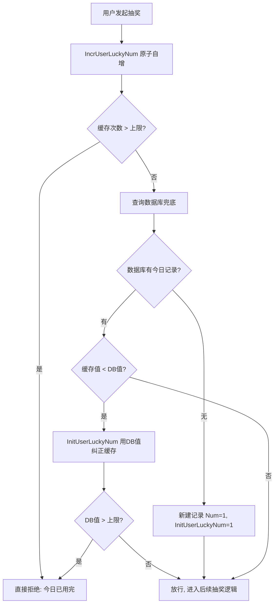

# Go 企业级抽奖项目: 用户今日抽奖次数缓存应用（下）

## 纲要

- 把上一节封装的 `IncrUserLuckyNum` 与 `InitUserLuckyNum` 接入抽奖主流程的"今日参与次数"校验环节。
- 校验策略：先查缓存，缓存未超限再回退到数据库做二次校验，兼顾性能与可靠性。
- 一致性兜底：当缓存值小于数据库真实值（典型场景是 Redis 重启后缓存被清零），用 `InitUserLuckyNum` 把 DB 次数写回缓存，避免误判为"未超限"。
- 缓存可靠时的最终形态：缓存不通过直接拒绝，缓存通过再走后续逻辑，从而彻底省掉数据库校验。

## 文本修正与整合

上一节我们已经把用户当日次数封装成了 `IncrUserLuckyNum` 和 `InitUserLuckyNum`，但还没有在业务逻辑里用起来。这一节解决"在哪里用、怎么用"的问题。

核心思路是：在验证用户今日参与次数时，先做一次**缓存递增 + 上限判断**，如果缓存里就已经超过上限，直接返回"今日次数已用完"；否则再走原来的数据库校验作为兜底。

这里有一个必须处理的一致性问题。假设 Redis 因为重启被清空，此时所有用户的缓存次数都是 0。当用户来抽奖时，`IncrUserLuckyNum` 会把 0 自增成 1，一定不会超过上限，于是顺利进入后续逻辑。但数据库里该用户今天其实可能已经抽了 3 次（上限也是 3）。这时缓存是错的，必须用数据库的真实值把它纠正回来：

- 若数据库已超限（num 超过上限），但缓存自增后的值较小 → 调用 `InitUserLuckyNum(uid, num)` 用数据库值覆盖缓存，下一次该用户再来就会被正确拦截。
- 若数据库未超限但缓存值偏小，同样把缓存更新为 DB 值，避免后续重复误判。
- 若数据库中该用户今天尚无记录，则新建一条"次数为 1"的记录并初始化缓存。

简而言之：**先用缓存快速判断，缓存不可靠时再用数据库兜底并修正缓存**。当确信缓存可靠（如 Redis 持久化正常、重启概率极低）后，可以直接依赖缓存结果，省掉数据库那一次查询，性能收益最大。

## 接入抽奖流程的代码示例

下面演示在"验证用户今日参与次数"环节如何组合使用这两个封装（逻辑示意，基于项目 `web/controllers` 与 `web/utils`）：

```go
// 验证用户今日参与次数：先查缓存，再回退数据库
func checkUserDayLimit(uid int, userdayService services.UserdayService, limit int) (bool, string) {
	// 1) 缓存原子递增，拿到当日第几次
	dayNum := utils.IncrUserLuckyNum(uid)
	if dayNum > int64(limit) {
		// 缓存已明确超限，直接拒绝
		return false, "今日抽奖次数已用完"
	}

	// 2) 回退数据库兜底校验
	info := userdayService.Get(uid)
	if info == nil {
		// 数据库无今日记录，新建并初始化缓存
		userdayService.Create(&models.LtUserday{Uid: uid, Num: 1, Day: comm.TodayInt()})
		utils.InitUserLuckyNum(uid, 1)
		return true, ""
	}

	// 3) 一致性兜底：缓存值比数据库真实值小，用 DB 值纠正缓存
	if dayNum < int64(info.Num) {
		utils.InitUserLuckyNum(uid, int64(info.Num))
		if int64(info.Num) > int64(limit) {
			return false, "今日抽奖次数已用完"
		}
	}
	return true, ""
}
```

关键点说明：

- 第 1 步利用 `HINCRBY` 的原子性，递增和读取合并为一次操作，天然避免并发下的"读-改-写"竞态。
- 第 3 步的"缓存值 < 数据库值"判断，正是为了修复 Redis 重启后缓存归零导致的偏差。把 DB 真实值写回缓存后，后续请求就能被缓存正确拦截。
- `limit` 来自奖品或系统配置的每日上限，例如普通用户每天最多抽 3 次。

## 一致性处理流程图



## API 速览

| 方法 | 作用 | 对应 Redis 命令 |
| --- | --- | --- |
| `utils.IncrUserLuckyNum(uid int) int64` | 当日次数 +1 并返回 | `HINCRBY day_users_{i} uid 1` |
| `utils.InitUserLuckyNum(uid int, num int64)` | 以 DB 为准纠正缓存 | `HSET day_users_{i} uid num` |
| `userdayService.Get/Create` | 数据库兜底读写 | MySQL `SELECT/INSERT` |

## Demo 示例

运行说明：需要本地 Redis 与可连接的 MySQL（或仅演示缓存部分）。下面示例聚焦缓存层，可直接 `go run main.go`（依赖 `github.com/gomodule/redigo/redis`）。

代码说明：模拟"用户连抽 5 次，上限 3 次"，并演示 Redis 重启后缓存清零、用数据库值纠正的场景。

```go
package main

import (
	"fmt"
	"log"

	"github.com/gomodule/redigo/redis"
)

const userFrameSize = 2
const limit = 3

func incr(uid int, conn redis.Conn) int64 {
	key := fmt.Sprintf("day_users_%d", uid%userFrameSize)
	n, err := redis.Int64(conn.Do("HINCRBY", key, uid, 1))
	if err != nil {
		log.Fatal(err)
	}
	return n
}

func initNum(uid int, conn redis.Conn, num int64) {
	key := fmt.Sprintf("day_users_%d", uid%userFrameSize)
	conn.Do("HSET", key, uid, num)
}

func main() {
	conn, _ := redis.Dial("tcp", "127.0.0.1:6379")
	defer conn.Close()

	uid := 1001
	dbNum := 0 // 模拟数据库中的当日次数

	for round := 1; round <= 5; round++ {
		dayNum := incr(uid, conn)
		if dayNum > int64(limit) {
			fmt.Printf("第%d次: 缓存超限，拒绝\n", round)
			continue
		}
		// 数据库兜底
		dbNum++
		if dayNum < int64(dbNum) {
			initNum(uid, conn, int64(dbNum)) // 纠正缓存
		}
		if dbNum > limit {
			fmt.Printf("第%d次: 数据库超限，拒绝\n", round)
			continue
		}
		fmt.Printf("第%d次: 放行\n", round)
	}
}
```

技术点总结：

- 缓存优先、数据库兜底的双重校验，是"性能 vs 可靠性"的务实折中。
- 必须处理缓存清零后与数据库不一致的情况，否则会出现"明明超了却还能抽"的漏洞。
- 当缓存层足够可靠时，可去掉数据库兜底，单靠 `IncrUserLuckyNum` 的结果决定放行与否。

## 总结

## 📎 文本↔代码关联

本讲在课程知识图谱（见 `_GRAPH.json` / `_GRAPH.mmd`）中关联以下代码文件：

- `code/lottery/conf/redis.go`

> 关联由 `scan_course.py` 自动建立，边类型 `uses-code`（讲次 → 代码）。

相关度：100%。是否需要继续：是（下一篇引入奖品池概念）。代码是否可运行：是。
