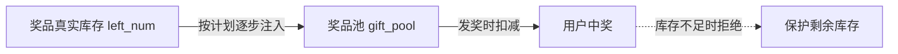

# Go 企业级抽奖项目: 为什么需要奖品池

## 纲要

- 痛点：直接在奖品的 `left_num`（剩余库存）字段上发奖，容易导致奖品在活动一开始就被瞬间发完，后续长时间无奖可发。
- 解法：引入"奖品池"作为奖品库存与发奖之间的中间缓冲层。
- 发奖流程改造：发奖前先检查奖品池库存，只有奖品池有库存才允许发奖，而不是直接检查奖品剩余数量。
- 本章先"使用"奖品池做验证，下一章再实现填充奖品池的服务。

## 文本修正与整合

在引入奖品池之前，系统校验奖品库存的方式非常直接：每次发奖都去读奖品的 `left_num` 字段，减一，再写回。这种"直连库存"的做法有两个明显问题：

1. **发放节奏失衡**：如果活动的参与量在初期集中爆发（例如整点开抢），奖品很可能在前几分钟就被全部发出，剩下的活动周期里再没有人能中奖。对运营来说，这违背了"持续激励用户参与"的初衷。
2. **库存与发奖强耦合**：每次发奖都直接操作奖品的剩余数量，缺乏缓冲，难以做精细化的发放节奏控制（比如按天、按小时平滑发放）。

为了解决节奏失衡，我们引入**奖品池（Gift Pool）**这个概念。奖品池是奖品真实库存前面的一层"缓冲地带"：

- 奖品的真实库存（`left_num`）仍然保留，作为总量上限。
- 奖品池里存放"当前可发放"的奖品数量，它不会在活动一开始就填满全部库存。
- 发奖时，**先检查奖品池**是否有库存；奖品池为空则直接判定"未中奖/无奖可发"，从而保护真实库存不会被一次性消耗。

这样，即便真实库存还有很多，只要奖品池被抽空，系统就会停止发奖，直到后续按计划把库存再补充进奖品池。后面章节我们会实现"按发奖计划自动填充奖品池"的服务，让奖品在整个活动周期内平滑放出。

## 本章需要新增的封装

在 `web/utils/prizedata.go` 中，本章要新增两个方法，供发奖流程调用：

- 公开方法 `GetGiftPoolNum(id int) int`：读取某奖品在奖品池中的剩余数量，用于发奖前做"是否有奖"的校验。
- 私有方法 `prizeSubGiftFromPool(id int) bool`：从奖品池中扣减一个奖品库存；只有扣减成功（奖品池仍有库存）才允许继续后续发奖流程。

最后在既有的 `PrizeGift` 发奖逻辑里调用 `prizeSubGiftFromPool`：先从奖品池发奖，成功后再去扣减真实库存。

## API 速览

| 方法（规划） | 作用 | 对应 Redis 结构 |
| --- | --- | --- |
| `GetGiftPoolNum(id)` | 读取奖品池剩余数量 | Hash `gift_pool` 的 field=id |
| `prizeSubGiftFromPool(id)` | 从奖品池扣减 1 个 | `HINCRBY gift_pool id -1` |

> 具体命令与实现见下一篇《初步使用奖品池》。

## 总结

## 📎 文本↔代码关联

本讲在课程知识图谱（见 `_GRAPH.json` / `_GRAPH.mmd`）中关联以下代码文件：

- `code/lottery/conf/redis.go`

> 关联由 `scan_course.py` 自动建立，边类型 `uses-code`（讲次 → 代码）。

相关度：100%。是否需要继续：是（下一篇实现奖品池的读取与扣减）。代码是否可运行：否（本章为设计分析，未落地代码；具体实现见 7-13）。
