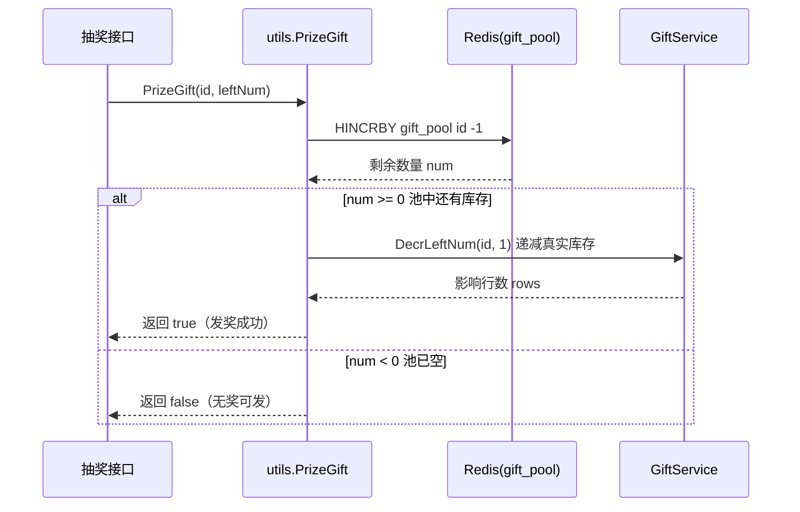

# Go 企业级抽奖项目: 初步使用奖品池

## 纲要

- 在 `web/utils/prizedata.go` 中落地奖品池的两个核心方法：`GetGiftPoolNum`（读取池中剩余数量）、`prizeServGift`（从池中扣减一个）。
- 缓存结构：所有奖品的池内数量存放在同一个 Redis Hash `gift_pool` 中，field 为奖品 id，value 为可发放数量。
- 发奖改造：`PrizeGift` 先调用 `prizeServGift` 扣减奖品池，扣减成功（返回 `num >= 0`）才去递减真实库存 `left_num`。
- 中奖前校验：对有数量限制的奖品，先通过 `GetGiftPoolNum` 判断池中是否还有库存，没有则直接返回"未中奖"。

## 文本修正与整合

上一节我们已经明确了"为什么需要奖品池"。这一节把它真正用起来。奖品池在 Redis 中就是一个 Hash 结构，key 固定为 `gift_pool`，每个 field 是奖品 id，value 是该奖品当前在池中可发放的数量。

读取池中数量用 `HGET gift_pool {id}`；发奖扣减用 `HINCRBY gift_pool {id} -1`，返回扣减后的剩余值。约定：**返回值为负数表示池已空、本次发奖失败**，返回 `>= 0` 表示扣减成功、可以发奖。



## 项目代码实现

以下代码片段来自项目 `web/utils/prizedata.go`，展示奖品池的读取、扣减，以及在 `PrizeGift` 中的接入：

```go
package utils

import (
	"fmt"
	"log"

	"imooc.com/lottery/comm"
	"imooc.com/lottery/datasource"
	"imooc.com/lottery/models"
	"imooc.com/lottery/services"
)

// 奖品池固定 key
const giftPoolKey = "gift_pool"

// 发奖：指定的奖品是否还可以发出（先扣奖品池，再减真实库存）
func PrizeGift(id, leftNum int) bool {
	ok := prizeServGift(id)
	if ok {
		// 更新数据库，减少奖品的真实库存
		giftService := services.NewGiftService()
		rows, err := giftService.DecrLeftNum(id, 1)
		if rows < 1 || err != nil {
			log.Println("prizedata.PrizeGift giftService.DecrLeftNum error=", err, ", rows=", rows)
			return false
		}
	}
	return ok
}

// 获取当前奖品池中的奖品数量
func GetGiftPoolNum(id int) int {
	return getServGiftPoolNum(id)
}

// 发奖：从 Redis 奖品池扣减一个
func prizeServGift(id int) bool {
	cacheObj := datasource.InstanceCache()
	rs, err := cacheObj.Do("HINCRBY", giftPoolKey, id, -1)
	if err != nil {
		log.Println("prizedata.prizeServGift error=", err)
		return false
	}
	num := comm.GetInt64(rs, -1)
	// num >= 0 表示池中还有库存，扣减成功
	return num >= 0
}

// 获取当前奖品池中的奖品数量，从 Redis 中读
func getServGiftPoolNum(id int) int {
	cacheObj := datasource.InstanceCache()
	rs, err := cacheObj.Do("HGET", giftPoolKey, id)
	if err != nil {
		log.Println("prizedata.getServGiftPoolNum error=", err)
		return 0
	}
	return int(comm.GetInt64(rs, 0))
}

// 初始化/设置奖品池数量（由发奖计划服务调用）
func setServGiftPool(id, num int) {
	cacheObj := datasource.InstanceCache()
	_, err := cacheObj.Do("HSET", giftPoolKey, id, num)
	if err != nil {
		log.Println("prizedata.setServGiftPool error=", err)
	}
}
```

在发奖主流程（中奖判定之后、真正发放之前）增加一道奖品池校验：如果中奖的是有数量限制的奖品，先用 `GetGiftPoolNum` 判断池中库存是否大于 0，否则直接返回"很遗憾，未中奖"：

```go
// 中奖后、发奖前的奖品池校验（逻辑示意）
if gift.PrizeNum > 0 { // 有限量属性的奖品
	if utils.GetGiftPoolNum(gift.Id) <= 0 {
		// 池中已空，本次不发奖
		return resultCodeNoPrize, "很遗憾，未中奖"
	}
}
```

## API 速览

| Redis 命令 | 作用 | 本项目封装 |
| --- | --- | --- |
| `HGET gift_pool {id}` | 读取池中剩余库存 | `GetGiftPoolNum(id)` / `getServGiftPoolNum` |
| `HINCRBY gift_pool {id} -1` | 发奖扣减一个 | `prizeServGift(id)` |
| `HSET gift_pool {id} {num}` | 填充/重置池内数量 | `setServGiftPool(id, num)` |

go-redis/v9 等价写法：

```go
n, _ := rdb.HIncrBy(ctx, "gift_pool", strconv.Itoa(id), -1).Result()
num, _ := rdb.HGet(ctx, "gift_pool", strconv.Itoa(id)).Int()
rdb.HSet(ctx, "gift_pool", id, num)
```

## Demo 示例

运行说明：本地启动 Redis，安装 `github.com/gomodule/redigo/redis`，`go run main.go` 即可观察奖品池"扣减 → 耗尽 → 拒绝"的过程。

代码说明：模拟奖品池初始有 2 个库存，连续发奖 4 次，观察第 3 次开始池空被拒。

```go
package main

import (
	"fmt"
	"log"

	"github.com/gomodule/redigo/redis"
)

const giftPoolKey = "gift_pool"

func main() {
	conn, err := redis.Dial("tcp", "127.0.0.1:6379")
	if err != nil {
		log.Fatal(err)
	}
	defer conn.Close()

	giftID := 10
	// 初始化奖品池数量为 2
	conn.Do("HSET", giftPoolKey, giftID, 2)

	fmt.Println("开始模拟发奖（奖品池初始库存=2）")
	for i := 1; i <= 4; i++ {
		n, err := redis.Int64(conn.Do("HINCRBY", giftPoolKey, giftID, -1))
		if err != nil {
			log.Fatal(err)
		}
		if n >= 0 {
			fmt.Printf("第%d次发奖: 成功，池中剩余 %d\n", i, n)
		} else {
			fmt.Printf("第%d次发奖: 失败，奖品池已空\n", i)
		}
	}
}
```

技术点总结：

- 用单个 Hash `gift_pool` 聚合所有奖品的池内库存，field=id，便于统一管理与统计。
- `HINCRBY key field -1` 的返回值是扣减后的剩余量，"是否 >= 0"是判断能否发奖的唯一标准，天然原子、无竞态。
- 发奖顺序：先扣奖品池（快速失败），成功后再去递减真实库存 `left_num`，把"缓冲层"和"真实库存"解耦。

## 总结

## 📎 文本↔代码关联

本讲在课程知识图谱（见 `_GRAPH.json` / `_GRAPH.mmd`）中关联以下代码文件：

- `code/lottery/conf/redis.go`

> 关联由 `scan_course.py` 自动建立，边类型 `uses-code`（讲次 → 代码）。

相关度：100%。是否需要继续：是（下一篇开始优惠券全量缓存的设计分析）。代码是否可运行：是。
