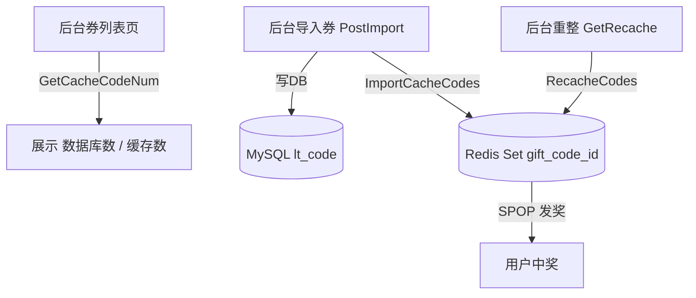

# Go 企业级抽奖项目: 优惠券全量缓存实现（下）

## 纲要

- 在后台管理控制器 `web/controllers/admin_code.go` 中对接优惠券缓存方法。
- 列表页：调用 `GetCacheCodeNum` 把"数据库有效券数"与"缓存剩余券数"传给模板，方便人工核对一致性。
- 导入接口 `PostImport`：券写入数据库后，同时调用 `ImportCacheCodes` 写入 Redis 缓存。
- 新增重整接口 `GetRecache`：手动触发 `RecacheCodes`，用数据库有效编码重建缓存（处理手动改库等异常场景）。

## 文本修正与整合

上一节我们在 `web/utils/prizedata.go` 里把优惠券缓存的四个方法都实现了。这一节把后台管理功能接上，让运营在界面上能"看到缓存状态、导入即入缓存、不一致时一键重整"。

改造点有三处：

1. **列表统计展示**：在券列表页（`Get()`）中，当指定了 `gift_id` 时，调用 `utils.GetCacheCodeNum(giftId, c.ServiceCode)`，得到数据库有效数与缓存剩余数，连同原数据列表一起传给模板。前端即可并排显示两个数，一眼看出是否一致。
2. **导入即入缓存**：在 `PostImport` 中，每成功创建一条数据库记录，就调用 `utils.ImportCacheCodes(giftId, code)` 把编码同时写进缓存，保证导入后立刻可发。
3. **手动重整**：新增 `GetRecache` 接口，接收 `gift_id` 参数，调用 `utils.RecacheCodes(id, c.ServiceCode)` 用数据库有效编码重建缓存，返回成功/失败数量。



## 项目代码实现

以下代码来自项目 `web/controllers/admin_code.go`（已精简、统一风格）：

```go
package controllers

import (
	"fmt"
	"strings"

	"github.com/kataras/iris"
	"github.com/kataras/iris/mvc"
	"imooc.com/lottery/comm"
	"imooc.com/lottery/conf"
	"imooc.com/lottery/models"
	"imooc.com/lottery/services"
	"imooc.com/lottery/web/utils"
)

type AdminCodeController struct {
	Ctx            iris.Context
	ServiceCode    services.CodeService
	ServiceGift   services.GiftService
	// ... 其他 Service 省略
}

// 券列表页：展示数据库有效数与缓存剩余数
func (c *AdminCodeController) Get() mvc.Result {
	giftId := c.Ctx.URLParamIntDefault("gift_id", 0)
	page := c.Ctx.URLParamIntDefault("page", 1)
	size := 100
	var datalist []models.LtCode
	var num, cacheNum int
	if giftId > 0 {
		datalist = c.ServiceCode.Search(giftId)
		num, cacheNum = utils.GetCacheCodeNum(giftId, c.ServiceCode)
	} else {
		datalist = c.ServiceCode.GetAll(page, size)
	}
	// ... 分页逻辑省略
	return mvc.View{
		Name: "admin/code.html",
		Data: iris.Map{
			"Datalist": datalist,
			"CodeNum":  num,      // 数据库有效编码数
			"CacheNum": cacheNum, // 缓存剩余编码数
			// ... 其他字段省略
		},
		Layout: "admin/layout.html",
	}
}

// 导入券：写数据库的同时写入缓存
func (c *AdminCodeController) PostImport() {
	giftId := c.Ctx.URLParamIntDefault("gift_id", 0)
	if giftId < 1 {
		c.Ctx.Text("没有指定奖品ID，无法进行导入")
		return
	}
	gift := c.ServiceGift.Get(giftId, true)
	if gift == nil || gift.Gtype != conf.GtypeCodeDiff {
		c.Ctx.HTML("没有指定的优惠券类型的奖品，无法进行导入")
		return
	}
	codes := c.Ctx.PostValue("codes")
	now := comm.NowUnix()
	list := strings.Split(codes, "\n")
	sucNum, errNum := 0, 0
	for _, code := range list {
		code := strings.TrimSpace(code)
		if code != "" {
			data := &models.LtCode{
				GiftId:     giftId,
				Code:       code,
				SysCreated: now,
			}
			if err := c.ServiceCode.Create(data); err != nil {
				errNum++
			} else if ok := utils.ImportCacheCodes(giftId, code); ok {
				sucNum++
			} else {
				errNum++
			}
		}
	}
	c.Ctx.HTML(fmt.Sprintf("成功导入 %d 条，导入失败 %d 条", sucNum, errNum))
}

// 手动重整缓存：用数据库有效编码重建 Redis Set
func (c *AdminCodeController) GetRecache() {
	refer := c.Ctx.GetHeader("Referer")
	if refer == "" {
		refer = "/admin/code"
	}
	id, err := c.Ctx.URLParamInt("id")
	if id < 1 || err != nil {
		c.Ctx.HTML(fmt.Sprintf("没有指定优惠券所属的奖品id, <a href='%s'>返回</a>", refer))
		return
	}
	sucNum, errNum := utils.RecacheCodes(id, c.ServiceCode)
	c.Ctx.HTML(fmt.Sprintf("sucNum=%d, errNum=%d, <a href='%s'>返回</a>", sucNum, errNum, refer))
}
```

## API 速览

| 控制器方法 | 路由（示意） | 调用的缓存封装 |
| --- | --- | --- |
| `AdminCodeController.Get` | `GET /admin/code?gift_id=xx` | `utils.GetCacheCodeNum` |
| `AdminCodeController.PostImport` | `POST /admin/code/import` | `utils.ImportCacheCodes` |
| `AdminCodeController.GetRecache` | `GET /admin/code/recache?id=xx` | `utils.RecacheCodes` |

涉及的 Redis 命令：`SADD`、`SCARD`、`RENAME`（详见上一篇《优惠券全量缓存实现（上）》）。

## Demo 示例

运行说明：本示例聚焦后台"导入即入缓存"的对接逻辑，可与上篇的缓存方法组合运行（依赖 `github.com/gomodule/redigo/redis` 与本地 Redis）。

代码说明：模拟后台导入 3 个券，每写入一条即同步进缓存，最后统计验证。

```go
package main

import (
	"fmt"
	"log"

	"github.com/gomodule/redigo/redis"
)

// 对应 utils.ImportCacheCodes
func importCacheCodes(conn redis.Conn, id int, code string) bool {
	key := fmt.Sprintf("gift_code_%d", id)
	_, err := conn.Do("SADD", key, code)
	if err != nil {
		log.Println("ImportCacheCodes error=", err)
		return false
	}
	return true
}

// 对应 utils.GetCacheCodeNum 的缓存部分
func getCacheNum(conn redis.Conn, id int) int {
	key := fmt.Sprintf("gift_code_%d", id)
	n, _ := redis.Int(conn.Do("SCARD", key))
	return n
}

func main() {
	conn, err := redis.Dial("tcp", "127.0.0.1:6379")
	if err != nil {
		log.Fatal(err)
	}
	defer conn.Close()

	giftID := 20
	codes := []string{"C-001", "C-002", "C-003"}
	suc := 0
	for _, c := range codes {
		if importCacheCodes(conn, giftID, c) {
			suc++
		}
	}
	fmt.Printf("导入成功 %d 条\n", suc)
	fmt.Printf("缓存剩余券数: %d\n", getCacheNum(conn, giftID))
}
```

技术点总结：

- 后台与缓存的对接触发点要选准：列表页只"读"缓存数用于展示，导入时"写"缓存，重整时"重建"缓存。
- "导入即入缓存"保证运营导入后立刻可发，无需额外操作。
- 把"数据库数 / 缓存数"并排展示，是低成本发现不一致的有效手段；发现偏差用 `GetRecache` 一键重建。

## 总结

## 📎 文本↔代码关联

本讲在课程知识图谱（见 `_GRAPH.json` / `_GRAPH.mmd`）中关联以下代码文件：

- `code/lottery/conf/redis.go`

> 关联由 `scan_course.py` 自动建立，边类型 `uses-code`（讲次 → 代码）。

相关度：100%。是否需要继续：是（下一篇对第 7 章 Redis 缓存优化做整体总结）。代码是否可运行：是。
