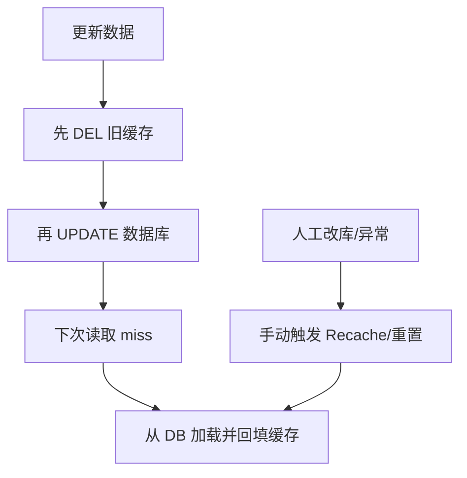

# Go 企业级抽奖项目: Redis缓存优化总结

## 纲要

- 本章把大量热点数据迁移到 Redis：奖品全量缓存、奖品池、用户/ IP 黑名单、今日抽奖次数、优惠券编码。
- Redis 相比 MySQL 在性能与并发上有显著优势，能极大降低对数据库的请求与依赖。
- 借助 Redis 单线程、原子命令（如 `HINCRBY`、`SPOP`）的特性，天然规避并发编程里的线程安全问题。
- 缓存带来"空间换时间"的收益，也必须面对一致性问题：更新数据遵循"先清旧缓存，再更数据库"原则，并提供手动同步手段兜底。

## 文本修正与整合

第 7 章围绕"用 Redis 缓存优化抽奖系统"展开，我们把系统中访问最频繁、对延迟最敏感的数据，逐步从 MySQL 迁移到了 Redis：

- 奖品信息（全量缓存）
- 优惠券编码（Set 结构全量缓存）
- 奖品池（Hash 结构，作为真实库存的缓冲）
- 用户 IP 黑名单
- 用户 / IP 的今日抽奖次数（Hash 结构计数器）

这些数据在读多写少的抽奖场景下，经 Redis 直接读写后，对 MySQL 的请求量和依赖都大幅下降，系统的吞吐与并发能力随之提升。

### Redis 与 MySQL 的对比

| 维度 | MySQL | Redis |
| --- | --- | --- |
| 数据模型 | 关系型、落盘 | 内存 KV、可选持久化 |
| 性能 / 并发 | 磁盘 IO，受连接与锁约束 | 内存操作，单线程无锁竞争 |
| 适用 | 真实数据源、事务、复杂查询 | 热点缓存、计数器、队列、集合 |
| 一致性 | 强一致 | 最终一致（需手动保障） |

### 为什么引入 Redis 能简化并发

如果只依赖数据库，要在高并发下保证"库存不超发、次数不越界"，往往需要分布式锁配合数据库更新，性能和并发能力都会受到明显限制。

而 Redis 利用**单进程单线程**处理命令，配合**原子命令**即可满足大多数"原子性"需求：

- 计数递增用 `HINCRBY`，递增与读取一步完成，无需"先读后写"。
- 发券用 `SPOP`，弹出即移除，天然不会重复发放。
- 奖品池扣减用 `HINCRBY key field -1`，返回值直接决定能否发奖。

这些原子操作把原本需要分布式锁保护的临界区，转化成了单条 Redis 命令，既简单又高效。

### 缓存一致性原则

引入 Redis 等于增加了一层冗余数据，是用"空间换时间"。代价就是必须处理好**缓存与数据库的一致性**。本章贯穿一个原则：

> 更新数据时，先清除旧缓存，再更新数据库；下次读取时，由数据库恢复数据到缓存。

当仍可能出现不一致（如人工直接改库、Redis 重启）时，要提供手动同步入口——例如优惠券的 `RecacheCodes`（重整缓存）、奖品池的重置接口，帮助把缓存重新对齐到数据库。

### 本章工作回顾

- 开发工作量与难度都相对有限：核心就是"选对 Redis 数据结构 + 用对原子命令 + 接好读写点"。
- 奖品全量缓存、优惠券缓存、奖品池、黑名单、今日次数均已落地。
- 后续章节将补充"发奖计划"与"自动填充奖品池"的服务，让奖品在整个活动周期内平滑放出。

## API 速览

| 数据类型 | Redis 结构 | 关键命令 |
| --- | --- | --- |
| 奖品池 | Hash `gift_pool` | `HGET` / `HINCRBY -1` / `HSET` |
| 今日抽奖次数 | Hash `day_users_{i}` | `HINCRBY +1` / `HSET` / `DEL` |
| 优惠券编码 | Set `gift_code_{id}` | `SADD` / `SPOP` / `SCARD` / `RENAME` |
| 缓存实例 | 连接池封装 `*RedisConn` | `Do(cmd, args...)` |

## 总结

## 📎 文本↔代码关联

本讲在课程知识图谱（见 `_GRAPH.json` / `_GRAPH.mmd`）中关联以下代码文件：

- `code/lottery/conf/redis.go`

> 关联由 `scan_course.py` 自动建立，边类型 `uses-code`（讲次 → 代码）。

相关度：100%。是否需要继续：否（第 7 章优化收尾，后续章节进入发奖计划与奖品池填充）。代码是否可运行：否（本章为总结性内容，无新增落地代码）。
