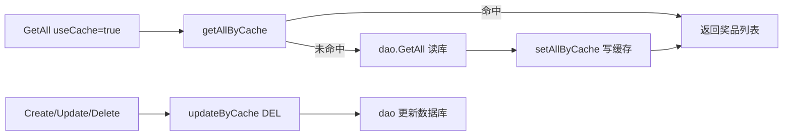

# Go 企业级抽奖项目: 奖品数据全量缓存实现（上）

## 纲要

- 在 `giftService` 中实现三个内部缓存方法：`getAllByCache`、`setAllByCache`、`updateByCache`。
- `getAllByCache`：用 `GET allgift` 读取 JSON，反序列化为 `[]map[string]interface{}`，再逐条转换成 `models.LtGift`。
- `setAllByCache`：把 `[]models.LtGift` 转换成 `[]map[string]interface{}`，JSON 序列化后 `SET allgift`。
- `updateByCache`：数据变更时直接 `DEL allgift`，采用延迟回源策略。
- 一个关键注意点：`PrizeData` 是超大文本字段（发奖计划），不参与序列化，避免无意义的内存与网络开销。
- 项目源码使用 `redigo` 的 `rds.Do("GET"|"SET"|"DEL", ...)`；下方 Demo 改用 `go-redis/v9`。

## getAllByCache 的读取与转换

读取缓存分为三步：从 Redis 取字符串、JSON 反序列化为通用的 `map` 切片、再逐条映射回 `models.LtGift`。

项目源码（`services/gift_service.go`，使用 redigo）：

```go
// 从缓存中获取全部的奖品
func (s *giftService) getAllByCache() []models.LtGift {
	key := "allgift"
	rds := datasource.InstanceCache()
	// 读取缓存
	rs, err := rds.Do("GET", key)
	if err != nil {
		log.Println("gift_service.getAllByCache GET key=", key, ", error=", err)
		return nil
	}
	str := comm.GetString(rs, "")
	if str == "" {
		return nil
	}
	// 将json数据反序列化
	datalist := []map[string]interface{}{}
	err = json.Unmarshal([]byte(str), &datalist)
	if err != nil {
		log.Println("gift_service.getAllByCache json.Unmarshal error=", err)
		return nil
	}
	// 格式转换
	gifts := make([]models.LtGift, len(datalist))
	for i := 0; i < len(datalist); i++ {
		data := datalist[i]
		id := comm.GetInt64FromMap(data, "Id", 0)
		if id <= 0 {
			gifts[i] = models.LtGift{}
		} else {
			gift := models.LtGift{
				Id:           int(id),
				Title:        comm.GetStringFromMap(data, "Title", ""),
				PrizeNum:     int(comm.GetInt64FromMap(data, "PrizeNum", 0)),
				LeftNum:      int(comm.GetInt64FromMap(data, "LeftNum", 0)),
				PrizeCode:    comm.GetStringFromMap(data, "PrizeCode", ""),
				PrizeTime:    int(comm.GetInt64FromMap(data, "PrizeTime", 0)),
				Img:          comm.GetStringFromMap(data, "Img", ""),
				Displayorder: int(comm.GetInt64FromMap(data, "Displayorder", 0)),
				Gtype:        int(comm.GetInt64FromMap(data, "Gtype", 0)),
				Gdata:        comm.GetStringFromMap(data, "Gdata", ""),
				TimeBegin:    int(comm.GetInt64FromMap(data, "TimeBegin", 0)),
				TimeEnd:      int(comm.GetInt64FromMap(data, "TimeEnd", 0)),
				//PrizeData: 不参与序列化
				PrizeBegin: int(comm.GetInt64FromMap(data, "PrizeBegin", 0)),
				PrizeEnd:   int(comm.GetInt64FromMap(data, "PrizeEnd", 0)),
				SysStatus:  int(comm.GetInt64FromMap(data, "SysStatus", 0)),
				SysCreated: int(comm.GetInt64FromMap(data, "SysCreated", 0)),
				SysUpdated: int(comm.GetInt64FromMap(data, "SysUpdated", 0)),
				SysIp:      comm.GetStringFromMap(data, "SysIp", ""),
			}
			gifts[i] = gift
		}
	}
	return gifts
}
```

为什么先序列化成 `[]map[string]interface{}` 再转 `LtGift`？因为 `LtGift` 内部对部分字段定义了 JSON tag，且存在空值处理问题，无法直接用 `LtGift` 做序列化/反序列化，于是用通用 `map` 作为中间结构，再手动字段映射。这部分转换代码虽然繁琐，但属于一次性工作，写完之后很少再改动。

## setAllByCache 的写入与转换

写入是读取的逆过程：把 `[]models.LtGift` 转换成 `[]map[string]interface{}`，JSON 序列化后用 `SET` 写回。注意 `PrizeData` 字段被显式跳过。

项目源码：

```go
// 将奖品的数据更新到缓存
func (s *giftService) setAllByCache(gifts []models.LtGift) {
	strValue := ""
	if len(gifts) > 0 {
		datalist := make([]map[string]interface{}, len(gifts))
		for i := 0; i < len(gifts); i++ {
			gift := gifts[i]
			data := make(map[string]interface{})
			data["Id"] = gift.Id
			data["Title"] = gift.Title
			data["PrizeNum"] = gift.PrizeNum
			data["LeftNum"] = gift.LeftNum
			data["PrizeCode"] = gift.PrizeCode
			data["PrizeTime"] = gift.PrizeTime
			data["Img"] = gift.Img
			data["Displayorder"] = gift.Displayorder
			data["Gtype"] = gift.Gtype
			data["Gdata"] = gift.Gdata
			data["TimeBegin"] = gift.TimeBegin
			data["TimeEnd"] = gift.TimeEnd
			//data["PrizeData"] = gift.PrizeData  // 超大文本，不参与缓存
			data["PrizeBegin"] = gift.PrizeBegin
			data["PrizeEnd"] = gift.PrizeEnd
			data["SysStatus"] = gift.SysStatus
			data["SysCreated"] = gift.SysCreated
			data["SysUpdated"] = gift.SysUpdated
			data["SysIp"] = gift.SysIp
			datalist[i] = data
		}
		str, err := json.Marshal(datalist)
		if err != nil {
			log.Println()
		}
		strValue = string(str)
	}
	key := "allgift"
	rds := datasource.InstanceCache()
	_, err := rds.Do("SET", key, strValue)
	if err != nil {
		log.Println("gift_service.setAllByCache SET key=", key,
			", value=", strValue, ", error=", err)
	}
}
```

## updateByCache 的延迟失效

更新缓存时并未真正去「更新」缓存内容，而是直接删除 key。因为读取路径在缓存未命中时会自动回源数据库并重新写入，这是缓存更新的常见惯例，复杂度最低。

项目源码：

```go
// 数据更新，需要更新缓存，直接清空缓存数据
func (s *giftService) updateByCache(data *models.LtGift, columns []string) {
	if data == nil || data.Id <= 0 {
		return
	}
	key := "allgift"
	rds := datasource.InstanceCache()
	// 删除redis中的缓存
	rds.Do("DEL", key)
}
```

## 三个方法的协作关系



## API 速览

| 方法 | 命令 | 参数说明 |
| --- | --- | --- |
| `getAllByCache` | `GET allgift` | 无参数，返回 `[]LtGift`，空则回源 |
| `setAllByCache` | `SET allgift` | 入参 `[]LtGift`，整体 JSON 覆盖 |
| `updateByCache` | `DEL allgift` | 入参数据模型，仅做删除 |

## Demo 示例

用 `go-redis/v9` 复刻读取与写入的转换逻辑，可直接运行。

运行说明：

```bash
go run main.go   # 需要本地 Redis 在 127.0.0.1:6379
```

代码说明：

```go
package main

import (
	"context"
	"encoding/json"
	"fmt"
	"log"
	"time"

	"github.com/redis/go-redis/v9"
)

type Gift struct {
	Id    int    `json:"Id"`
	Title string `json:"Title"`
	Left  int    `json:"Left"`
}

var (
	rdb = redis.NewClient(&redis.Options{Addr: "127.0.0.1:6379"})
	ctx = context.Background()
)

const key = "allgift"

func getAllByCache() ([]Gift, error) {
	str, err := rdb.Get(ctx, key).Result()
	if err == redis.Nil {
		return nil, nil // 未命中，交由调用方回源
	}
	if err != nil {
		return nil, err
	}
	var gifts []Gift
	if err := json.Unmarshal([]byte(str), &gifts); err != nil {
		return nil, err
	}
	return gifts, nil
}

func setAllByCache(gifts []Gift) error {
	b, err := json.Marshal(gifts)
	if err != nil {
		return err
	}
	return rdb.Set(ctx, key, b, time.Hour).Err()
}

func updateByCache() error {
	return rdb.Del(ctx, key).Err()
}

func main() {
	// 首次未命中
	g, _ := getAllByCache()
	fmt.Println("cache miss:", g)

	// 模拟回源后写缓存
	src := []Gift{{Id: 1, Title: "iPhone", Left: 5}}
	if err := setAllByCache(src); err != nil {
		log.Fatal(err)
	}
	g, _ = getAllByCache()
	fmt.Println("cache hit:", g)

	// 变更后删除缓存
	if err := updateByCache(); err != nil {
		log.Fatal(err)
	}
	g, _ = getAllByCache()
	fmt.Println("after invalidate:", g)
}
```

技术点总结：

- 缓存数据用通用 `map` 做中间结构，规避模型 JSON tag 与空值问题。
- `PrizeData` 等大字段不参与缓存序列化，控制缓存体积。
- 删缓存而非更新缓存，是低成本且常用的失效策略。

## 📎 文本↔代码关联

本讲在课程知识图谱（见 `_GRAPH.json` / `_GRAPH.mmd`）中关联以下代码文件：

- `code/lottery/conf/redis.go`

> 关联由 `scan_course.py` 自动建立，边类型 `uses-code`（讲次 → 代码）。

相关度：100%。是否需要继续：是。代码是否可运行：是。
