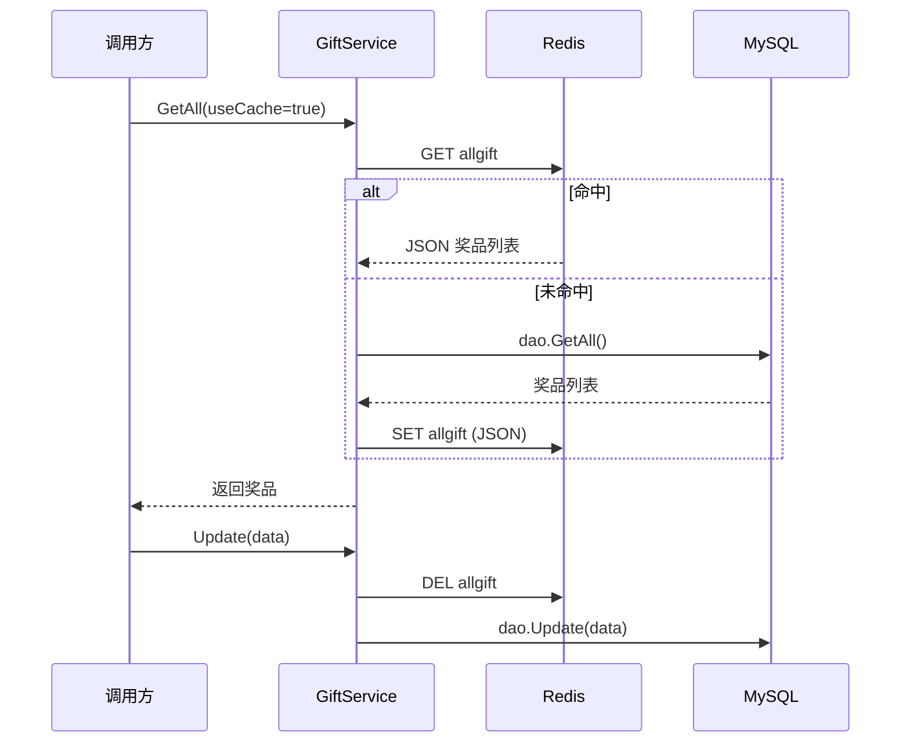

# Go 企业级抽奖项目: 奖品数据全量缓存实现（下）

## 纲要

- 把上一节新增的三个缓存方法接入既有读取/写入流程。
- `GetAll(useCache)`：增加 `useCache` 参数，缓存优先、未命中回源并写回。
- `CountAll`：不再查库计数，直接对带缓存的 `GetAll(true)` 结果取长度。
- `Get(id, useCache)`：走 `GetAll(true)` 后内存过滤，而非直接读 `getAllByCache`（后者只读缓存、不回源）。
- `GetAllUse(useCache)`：在缓存全量数据上做「状态正常 + 时间区间内 + 库存大于等于 0」的过滤。
- 写操作（`Create/Update/Delete`）统一「先 `updateByCache` 删缓存，再更新数据库」。
- 缓存一致性要点：必须先更新缓存（删除）再更新数据库，保证读路径始终能拿到最新数据。

## GetAll 的缓存优先改造

核心逻辑：不启用缓存就直连数据库；启用缓存则先读 `getAllByCache`，为空再读库并 `setAllByCache` 写回。

项目源码（`services/gift_service.go`）：

```go
func (s *giftService) GetAll(useCache bool) []models.LtGift {
	if !useCache {
		// 直接读取数据库的方式
		return s.dao.GetAll()
	}
	// 先读取缓存
	gifts := s.getAllByCache()
	if len(gifts) < 1 {
		// 再读取数据库
		gifts = s.dao.GetAll()
		s.setAllByCache(gifts)
	}
	return gifts
}
```

这里体现了「读缓存 → 未命中读库 → 写缓存 → 返回」的标准链路。由于奖品更新频率极低，绝大多数请求都能在缓存层命中，从而把数据库读压力降下来。

## CountAll 借助缓存计数

原本 `CountAll` 需要 `SELECT COUNT(*)`，优化后直接复用带缓存的 `GetAll(true)`，对其结果取 `len`，彻底省掉一次数据库聚合查询。

```go
func (s *giftService) CountAll() int64 {
	gifts := s.GetAll(true)
	return int64(len(gifts))
}
```

注意：这个改造看似比直接查库复杂，但依赖的是一个带缓存的数据集，直接从内存切片取长度即可，性能更好。

## Get 的缓存读取细节

`Get(id, useCache)` 有两种实现路径，关键在于它调用的是 `GetAll(true)` 而不是 `getAllByCache()` 本身：

```go
func (s *giftService) Get(id int, useCache bool) *models.LtGift {
	if !useCache {
		return s.dao.Get(id)
	}
	// 缓存优化之后的读取方式
	gifts := s.GetAll(true)
	for _, gift := range gifts {
		if gift.Id == id {
			return &gift
		}
	}
	return nil
}
```

之所以走 `GetAll(true)` 而不是 `getAllByCache()`，是因为前者在缓存未命中时会自动回源数据库，保证一定能取到数据；而 `getAllByCache()` 只读缓存，缓存为空时返回 `nil`，并不兜底查库。

## GetAllUse 的可用奖品过滤

`GetAllUse` 在缓存全量数据基础上，过滤出「当前可参与抽奖」的奖品：状态正常（`SysStatus==0`）、时间在 `[TimeBegin, TimeEnd]` 区间内、库存 `PrizeNum >= 0`。

```go
func (s *giftService) GetAllUse(useCache bool) []models.ObjGiftPrize {
	list := make([]models.LtGift, 0)
	if !useCache {
		list = s.dao.GetAllUse()
	} else {
		now := comm.NowUnix()
		gifts := s.GetAll(true)
		for _, gift := range gifts {
			if gift.Id > 0 && gift.SysStatus == 0 &&
				gift.PrizeNum >= 0 &&
				gift.TimeBegin <= now &&
				gift.TimeEnd >= now {
				list = append(list, gift)
			}
		}
	}
	// 后续 ObjGiftPrize 结构映射、PrizeCode 范围解析（略）
	// ...
}
```

缓存命中时，过滤发生在应用内存中，对数据库零依赖。

## 写操作的缓存失效顺序

`Create`、`Update`、`Delete` 都遵循「先删缓存，再更新数据库」。以 `Delete` 与 `Update` 为例：

```go
func (s *giftService) Delete(id int) error {
	// 先更新缓存
	data := &models.LtGift{Id: id}
	s.updateByCache(data, nil)
	// 再更新数据库
	return s.dao.Delete(id)
}

func (s *giftService) Update(data *models.LtGift, columns []string) error {
	// 先更新缓存
	s.updateByCache(data, columns)
	// 再更新数据库
	return s.dao.Update(data, columns)
}

func (s *giftService) Create(data *models.LtGift) error {
	// 先更新缓存
	s.updateByCache(data, nil)
	// 再更新数据库
	return s.dao.Create(data)
}
```

顺序很重要：必须先让缓存失效，再写数据库。这样下一次读取即使并发发生，最多是短暂的缓存未命中并回源，不会把旧数据重新写回缓存。

## 缓存读写整体流程



## API 速览

| 方法 | 缓存行为 |
| --- | --- |
| `GetAll(useCache)` | 缓存优先，未命中回源并写回 |
| `CountAll` | 复用 `GetAll(true)` 取长度 |
| `Get(id, useCache)` | 走 `GetAll(true)` 内存过滤 |
| `GetAllUse(useCache)` | 缓存数据上做可用过滤 |
| `Create/Update/Delete` | 先 `DEL allgift` 再写库 |

## Demo 示例

用 `go-redis/v9` 演示「GetAll 缓存优先 + 写操作先删缓存」的完整可运行样例。

运行说明：

```bash
go run main.go   # 需要本地 Redis 在 127.0.0.1:6379
```

代码说明：

```go
package main

import (
	"context"
	"encoding/json"
	"fmt"
	"log"
	"time"

	"github.com/redis/go-redis/v9"
)

type Gift struct {
	Id    int    `json:"Id"`
	Title string `json:"Title"`
	Left  int    `json:"Left"`
}

var (
	rdb = redis.NewClient(&redis.Options{Addr: "127.0.0.1:6379"})
	ctx = context.Background()
	key = "allgift"
)

// 模拟数据库
var db = []Gift{{Id: 1, Title: "iPhone", Left: 5}, {Id: 2, Title: "优惠券", Left: 100}}

func GetAll(useCache bool) []Gift {
	if !useCache {
		return db
	}
	str, err := rdb.Get(ctx, key).Result()
	if err == redis.Nil {
		b, _ := json.Marshal(db)
		rdb.Set(ctx, key, b, time.Hour)
		return db
	}
	if err != nil {
		return db
	}
	var gifts []Gift
	_ = json.Unmarshal([]byte(str), &gifts)
	return gifts
}

func Update(g Gift) {
	// 先删缓存
	rdb.Del(ctx, key)
	// 再更新数据库
	for i := range db {
		if db[i].Id == g.Id {
			db[i] = g
		}
	}
}

func main() {
	fmt.Println("useCache=false:", GetAll(false))
	fmt.Println("useCache=true :", GetAll(true))
	fmt.Println("useCache=true :", GetAll(true)) // 第二次命中缓存

	Update(Gift{Id: 1, Title: "iPhone", Left: 4})
	fmt.Println("after update  :", GetAll(true)) // 缓存已失效，回源拿到新值
}
```

技术点总结：

- 读路径统一收敛到 `GetAll(true)`，其余读取方法在其上做内存过滤，避免重复造缓存逻辑。
- 写路径「先删缓存再写库」保证最终一致，且实现成本最低。
- 高频、低频更新的数据可共用同一套缓存骨架，仅失效策略不同。

## 📎 文本↔代码关联

本讲在课程知识图谱（见 `_GRAPH.json` / `_GRAPH.mmd`）中关联以下代码文件：

- `code/lottery/conf/redis.go`

> 关联由 `scan_course.py` 自动建立，边类型 `uses-code`（讲次 → 代码）。

相关度：100%。是否需要继续：是。代码是否可运行：是。
