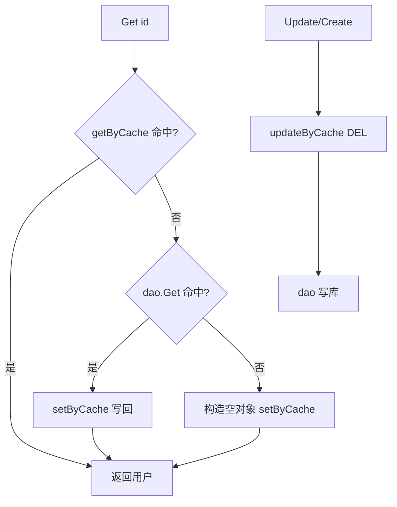

# Go 企业级抽奖项目: 单个用户数据部分缓存实现

## 纲要

- 在 `userService` 中实现 `getByCache`、`setByCache`、`updateByCache` 三个方法，基于 Redis `hash`。
- key 规则：`info_user_<id>`，单用户独立缓存。
- `Get(id)`：缓存优先，未命中回源；数据库也为空时写入「仅含 ID 的空对象」防穿透。
- `Update/Create`：先 `updateByCache` 删缓存，再写数据库。
- 字段转换：用 `redis.StringMap` 把 `HGETALL` 结果转成 `map[string]string`，再逐字段填入 `LtUser`。
- 项目源码使用 redigo；下方 Demo 改用 `go-redis/v9`。

## getByCache 的 hash 读取与转换

项目源码（`services/user_service.go`，使用 redigo）：

```go
// 从缓存中得到信息
func (s *userService) getByCache(id int) *models.LtUser {
	key := fmt.Sprintf("info_user_%d", id)
	rds := datasource.InstanceCache()
	dataMap, err := redis.StringMap(rds.Do("HGETALL", key))
	if err != nil {
		log.Println("user_service.getByCache HGETALL key=", key, ", error=", err)
		return nil
	}
	dataId := comm.GetInt64FromStringMap(dataMap, "Id", 0)
	if dataId <= 0 {
		return nil
	}
	data := &models.LtUser{
		Id:         int(dataId),
		Username:   comm.GetStringFromStringMap(dataMap, "Username", ""),
		Blacktime:  int(comm.GetInt64FromStringMap(dataMap, "Blacktime", 0)),
		Realname:   comm.GetStringFromStringMap(dataMap, "Realname", ""),
		Mobile:     comm.GetStringFromStringMap(dataMap, "Mobile", ""),
		Address:    comm.GetStringFromStringMap(dataMap, "Address", ""),
		SysCreated: int(comm.GetInt64FromStringMap(dataMap, "SysCreated", 0)),
		SysUpdated: int(comm.GetInt64FromStringMap(dataMap, "SysUpdated", 0)),
		SysIp:      comm.GetStringFromStringMap(dataMap, "SysIp", ""),
	}
	return data
}
```

与奖品缓存先用 `GET` 再 JSON 反序列化不同，这里 `HGETALL` 直接返回字段级的 `map`，无需 JSON 序列化，字段读写更灵活。

## setByCache 的 hash 写入

写入时用 `HMSET`，把所有字段作为 `key-value` 对一次性提交。仅当 `Username` 非空（即有效用户）时才写入业务字段，避免把空数据覆盖进缓存。

```go
// 将信息更新到缓存
func (s *userService) setByCache(data *models.LtUser) {
	if data == nil || data.Id <= 0 {
		return
	}
	id := data.Id
	key := fmt.Sprintf("info_user_%d", id)
	rds := datasource.InstanceCache()
	// 数据更新到redis缓存
	params := []interface{}{key}
	params = append(params, "Id", id)
	if data.Username != "" {
		params = append(params, "Username", data.Username)
		params = append(params, "Blacktime", data.Blacktime)
		params = append(params, "Realname", data.Realname)
		params = append(params, "Mobile", data.Mobile)
		params = append(params, "Address", data.Address)
		params = append(params, "SysCreated", data.SysCreated)
		params = append(params, "SysUpdated", data.SysUpdated)
		params = append(params, "SysIp", data.SysIp)
	}
	_, err := rds.Do("HMSET", params...)
	if err != nil {
		log.Println("user_service.setByCache HMSET params=", params, ", error=", err)
	}
}
```

## updateByCache 的失效

与奖品缓存一致，采用删除而非更新：直接 `DEL info_user_<id>`。

```go
// 数据更新了，直接清空缓存数据
func (s *userService) updateByCache(data *models.LtUser, columns []string) {
	if data == nil || data.Id <= 0 {
		return
	}
	key := fmt.Sprintf("info_user_%d", data.Id)
	rds := datasource.InstanceCache()
	rds.Do("DEL", key)
}
```

## Get 的缓存优先与防穿透

`Get` 是接入三个方法的关键：缓存命中直接返回；未命中则读库，库里也没有就构造一个仅含 `Id` 的空对象写回缓存，避免后续请求反复击穿数据库。

```go
func (s *userService) Get(id int) *models.LtUser {
	data := s.getByCache(id)
	if data == nil || data.Id <= 0 {
		data = s.dao.Get(id)
		if data == nil || data.Id <= 0 {
			data = &models.LtUser{Id: id}
		}
		s.setByCache(data)
	}
	return data
}

func (s *userService) Update(data *models.LtUser, columns []string) error {
	// 先更新缓存
	s.updateByCache(data, columns)
	// 然后再更新数据
	return s.dao.Update(data, columns)
}

func (s *userService) Create(data *models.LtUser) error {
	err := s.dao.Create(data)
	if err == nil {
		s.updateByCache(data, nil)
	}
	return err
}
```

注意：`Create` 先写库，成功后再 `updateByCache` 删除旧缓存（因为新建用户此前在缓存里可能是空对象），保证下次 `Get` 能回源拿到完整数据。

## 用户缓存读写流程



## API 速览

| 方法 | 命令 | 说明 |
| --- | --- | --- |
| `getByCache(id)` | `HGETALL info_user_<id>` | 返回 `*LtUser`，空则回源 |
| `setByCache(data)` | `HMSET info_user_<id>` | 有效用户才写业务字段 |
| `updateByCache(data)` | `DEL info_user_<id>` | 删除单用户缓存 |

## Demo 示例

用 `go-redis/v9` 演示单用户 hash 缓存的读写与防穿透。

运行说明：

```bash
go run main.go   # 需要本地 Redis 在 127.0.0.1:6379
```

代码说明：

```go
package main

import (
	"context"
	"fmt"
	"log"

	"github.com/redis/go-redis/v9"
)

type User struct {
	Id       int    `json:"Id"`
	Username string `json:"Username"`
	Mobile   string `json:"Mobile"`
}

var (
	rdb = redis.NewClient(&redis.Options{Addr: "127.0.0.1:6379"})
	ctx = context.Background()
)

func key(id int) string { return fmt.Sprintf("info_user_%d", id) }

func getByCache(id int) (*User, error) {
	m, err := rdb.HGetAll(ctx, key(id)).Result()
	if err != nil {
		return nil, err
	}
	if m["Id"] == "" {
		return nil, nil
	}
	return &User{
		Id:       atoi(m["Id"]),
		Username: m["Username"],
		Mobile:   m["Mobile"],
	}, nil
}

func setByCache(u User) error {
	if u.Username == "" {
		return nil
	}
	return rdb.HMSet(ctx, key(u.Id), map[string]interface{}{
		"Id":       u.Id,
		"Username": u.Username,
		"Mobile":   u.Mobile,
	}).Err()
}

func updateByCache(id int) error {
	return rdb.Del(ctx, key(id)).Err()
}

func atoi(s string) int {
	var n int
	fmt.Sscanf(s, "%d", &n)
	return n
}

func main() {
	// 首次未命中，模拟数据库也没有 -> 写入空对象防穿透
	u, _ := getByCache(1)
	if u == nil {
		setByCache(User{Id: 1}) // 空对象
	}
	fmt.Println("first:", u)

	// 数据库写入后回源并写缓存
	real := User{Id: 1, Username: "alice", Mobile: "13800000000"}
	setByCache(real)
	u, _ = getByCache(1)
	fmt.Println("cached:", u)

	// 更新后删缓存
	updateByCache(1)
	u, _ = getByCache(1)
	fmt.Println("after invalidate:", u)
}
```

技术点总结：

- 单用户改用 `hash`，避免整体 JSON 序列化，支持字段级读写。
- `HGETALL` 返回字段 `map`，配合 `StringMap` 即可零序列化转换。
- 防穿透：库无数据时写空对象，避免缓存与数据库双重未命中造成的重复回源。

## 📎 文本↔代码关联

本讲在课程知识图谱（见 `_GRAPH.json` / `_GRAPH.mmd`）中关联以下代码文件：

- `code/lottery/conf/redis.go`

> 关联由 `scan_course.py` 自动建立，边类型 `uses-code`（讲次 → 代码）。

相关度：100%。是否需要继续：是。代码是否可运行：是。
