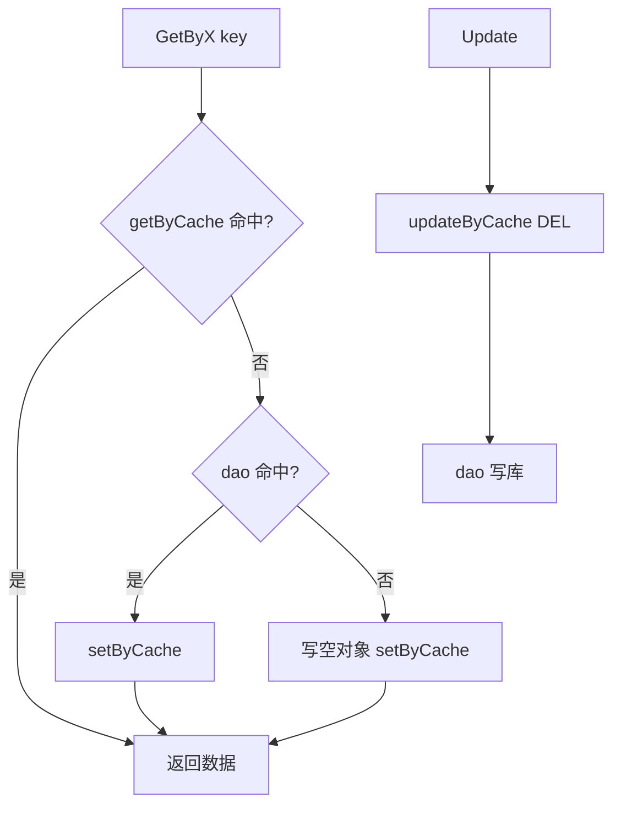

# Go 企业级抽奖项目: IP 黑名单数据缓存实现

## 纲要

- 在 `blackipService` 中实现 `getByCache`、`setByCache`、`updateByCache`，基于 Redis `hash`。
- key 规则：`info_blackip_<ip>`，以 IP 字符串为组件。
- `GetByIp(ip)`：缓存优先，未命中回源；库无则写仅含 `Ip` 的空对象防穿透。
- `Update`：先 `updateByCache` 删缓存，再写数据库。
- 字段转换：`HGETALL` 结果转 `map[string]string` 后逐字段填入 `LtBlackip`。
- 本节与用户缓存实现几乎一致，作为单条 hash 缓存的复习巩固。
- 项目源码使用 redigo；下方 Demo 改用 `go-redis/v9`。

## 源码实现

项目源码（`services/blackip_service.go`，使用 redigo）：

```go
// 根据IP读取IP的黑名单数据
func (s *blackipService) GetByIp(ip string) *models.LtBlackip {
	// 先从缓存中读取数据
	data := s.getByCache(ip)
	if data == nil || data.Ip == "" {
		// 再从数据库中读取数据
		data = s.dao.GetByIp(ip)
		if data == nil || data.Ip == "" {
			data = &models.LtBlackip{Ip: ip}
		}
		s.setByCache(data)
	}
	return data
}

func (s *blackipService) getByCache(ip string) *models.LtBlackip {
	key := fmt.Sprintf("info_blackip_%s", ip)
	rds := datasource.InstanceCache()
	dataMap, err := redis.StringMap(rds.Do("HGETALL", key))
	if err != nil {
		log.Println("blackip_service.getByCache HGETALL key=", key, ", error=", err)
		return nil
	}
	dataIp := comm.GetStringFromStringMap(dataMap, "Ip", "")
	if dataIp == "" {
		return nil
	}
	data := &models.LtBlackip{
		Id:         int(comm.GetInt64FromStringMap(dataMap, "Id", 0)),
		Ip:         dataIp,
		Blacktime:  int(comm.GetInt64FromStringMap(dataMap, "Blacktime", 0)),
		SysCreated: int(comm.GetInt64FromStringMap(dataMap, "SysCreated", 0)),
		SysUpdated: int(comm.GetInt64FromStringMap(dataMap, "SysUpdated", 0)),
	}
	return data
}

func (s *blackipService) setByCache(data *models.LtBlackip) {
	if data == nil || data.Ip == "" {
		return
	}
	key := fmt.Sprintf("info_blackip_%s", data.Ip)
	rds := datasource.InstanceCache()
	params := []interface{}{key}
	params = append(params, "Ip", data.Ip)
	if data.Id > 0 {
		params = append(params, "Blacktime", data.Blacktime)
		params = append(params, "SysCreated", data.SysCreated)
		params = append(params, "SysUpdated", data.SysUpdated)
	}
	_, err := rds.Do("HMSET", params...)
	if err != nil {
		log.Println("blackip_service.setByCache HMSET params=", params, ", error=", err)
	}
}

// 数据更新了，直接清空缓存数据
func (s *blackipService) updateByCache(data *models.LtBlackip, columns []string) {
	if data == nil || data.Ip == "" {
		return
	}
	key := fmt.Sprintf("info_blackip_%s", data.Ip)
	rds := datasource.InstanceCache()
	rds.Do("DEL", key)
}

func (s *blackipService) Update(data *models.LtBlackip, columns []string) error {
	// 先更新缓存的数据
	s.updateByCache(data, columns)
	// 再更新数据的数据
	return s.dao.Update(data, columns)
}
```

## 关键点说明

- **key 用 IP 字符串**：与用户用 UID 不同，黑名单以来源 IP 为唯一标识，因此 key 拼装为 `info_blackip_<ip>`。
- **空对象防穿透**：`GetByIp` 在缓存、数据库都查不到时，写入一个仅 `Ip` 字段的空对象，下次请求直接从缓存拿到空结果，避免反复回源。
- **失效顺序**：`Update` 先删缓存再写库，与前几节保持同一范式，保证最终一致。

## 单条 hash 缓存的范式总结

经过用户缓存与 IP 黑名单两节，可以归纳出「单条数据 hash 缓存」的统一范式：



## API 速览

| 方法 | 命令 | 说明 |
| --- | --- | --- |
| `GetByIp(ip)` | 组合 | 缓存优先 + 回源 + 防穿透 |
| `getByCache(ip)` | `HGETALL info_blackip_<ip>` | 空则回源 |
| `setByCache(data)` | `HMSET info_blackip_<ip>` | 有效数据才写业务字段 |
| `updateByCache(data)` | `DEL info_blackip_<ip>` | 删除单条缓存 |

## Demo 示例

用 `go-redis/v9` 演示 IP 黑名单的 hash 缓存读写与防穿透。

运行说明：

```bash
go run main.go   # 需要本地 Redis 在 127.0.0.1:6379
```

代码说明：

```go
package main

import (
	"context"
	"fmt"
	"log"

	"github.com/redis/go-redis/v9"
)

type BlackIP struct {
	Id        int    `json:"Id"`
	Ip        string `json:"Ip"`
	Blacktime int    `json:"Blacktime"`
}

var (
	rdb = redis.NewClient(&redis.Options{Addr: "127.0.0.1:6379"})
	ctx = context.Background()
)

func key(ip string) string { return fmt.Sprintf("info_blackip_%s", ip) }

func getByCache(ip string) (*BlackIP, error) {
	m, err := rdb.HGetAll(ctx, key(ip)).Result()
	if err != nil {
		return nil, err
	}
	if m["Ip"] == "" {
		return nil, nil
	}
	return &BlackIP{
		Id:        atoi(m["Id"]),
		Ip:        m["Ip"],
		Blacktime: atoi(m["Blacktime"]),
	}, nil
}

func setByCache(b BlackIP) error {
	if b.Ip == "" {
		return nil
	}
	return rdb.HMSet(ctx, key(b.Ip), map[string]interface{}{
		"Id":        b.Id,
		"Ip":        b.Ip,
		"Blacktime": b.Blacktime,
	}).Err()
}

func updateByCache(ip string) error {
	return rdb.Del(ctx, key(ip)).Err()
}

func atoi(s string) int {
	var n int
	fmt.Sscanf(s, "%d", &n)
	return n
}

func main() {
	ip := "192.168.1.100"
	b, _ := getByCache(ip)
	if b == nil {
		setByCache(BlackIP{Ip: ip}) // 空对象防穿透
	}
	fmt.Println("first:", b)

	real := BlackIP{Id: 7, Ip: ip, Blacktime: 1735689600}
	setByCache(real)
	b, _ = getByCache(ip)
	fmt.Println("cached:", b)

	updateByCache(ip)
	b, _ = getByCache(ip)
	fmt.Println("after invalidate:", b)
}
```

技术点总结：

- 单条 hash 缓存范式可复用于任何「按唯一键查询」的场景（用户、IP 黑名单等）。
- 仅在 key 组件与字段映射上做差异化，命令与一致性策略完全通用。
- 空对象防穿透是这类缓存的标准加固手段。

## 📎 文本↔代码关联

本讲在课程知识图谱（见 `_GRAPH.json` / `_GRAPH.mmd`）中关联以下代码文件：

- `code/lottery/conf/redis.go`

> 关联由 `scan_course.py` 自动建立，边类型 `uses-code`（讲次 → 代码）。

相关度：100%。是否需要继续：是。代码是否可运行：是。
