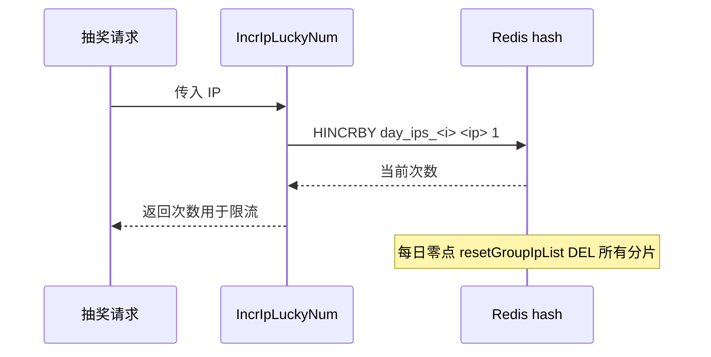

# Go 企业级抽奖项目: 优化 IP 今日抽奖次数

## 纲要

- IP 今日抽奖次数在抽奖业务逻辑中已先行实现，本节作为复习与梳理。
- 计数方案：用 Redis `hash` + `HINCRBY` 做**原子递增**计数，key 为 `day_ips_<i>`。
- 分片优化：定义 `ipFrameSize`，按 `ip % ipFrameSize` 把 IP 散列到多个 key，单 key 体积更小、可更好利用多 Redis 实例。
- 每日归零：程序启动时与每日零点通过定时器调用 `resetGroupIpList` 删除所有分片 key。
- 归零定时器：用 `time.AfterFunc` + `comm.NextDayDuration()` 实现零点定时重置。
- 项目源码使用 redigo；下方 Demo 改用 `go-redis/v9`。

## 为什么用 hash + HINCRBY

同一个 IP 当天的抽奖次数需要频繁递增，并且要在并发下保持准确。用 `hash` 结构、`field` 为 IP 整数值、`value` 为次数，配合 `HINCRBY` 命令即可实现**原子自增**，无需应用层加锁。

- 命令：`HINCRBY day_ips_<i> <ip> 1`
- 返回值：递增后的当前次数，可直接用于限流判断。

## 分片 key 降低单 key 体积

如果所有 IP 都放进同一个 `hash`，随着 IP 数量增长，单 key 会非常庞大，既占用内存，也不利于横向扩展。于是引入分片：

```go
const ipFrameSize = 2

func IncrIpLuckyNum(strIp string) int64 {
	ip := comm.Ip4toInt(strIp)
	i := ip % ipFrameSize
	key := fmt.Sprintf("day_ips_%d", i)
	cacheObj := datasource.InstanceCache()
	rs, err := cacheObj.Do("HINCRBY", key, ip, 1)
	if err != nil {
		log.Println("ip_day_lucky redis HINCRBY error=", err)
		return math.MaxInt32
	} else {
		return rs.(int64)
	}
}
```

把 IP 对 `ipFrameSize` 取模，散列到 `day_ips_0`、`day_ips_1` 等多个 key 上。每个 key 的 `hash` 数据量变小，Redis 执行效率提高；若部署多台 Redis 实例，分散后的 key 也能更均衡地利用服务器资源。

## 每日零点归零

由于 key 里没有带日期，需要每天零点把所有分片计数清空，让次数从 0 重新开始。项目在 `init()` 中先调用一次（本地测试每次启动归零），并通过 `time.AfterFunc` 设置每日定时：

```go
func init() {
	resetGroupIpList()
}

// 重置单机IP今天次数
func resetGroupIpList() {
	log.Println("ip_day_lucky.resetGroupIpList start")
	cacheObj := datasource.InstanceCache()
	for i := 0; i < ipFrameSize; i++ {
		key := fmt.Sprintf("day_ips_%d", i)
		cacheObj.Do("DEL", key)
	}
	log.Println("ip_day_lucky.resetGroupIpList stop")
	// 设置每天零点再次归零的定时器
	duration := comm.NextDayDuration()
	time.AfterFunc(duration, resetGroupIpList)
}
```

`comm.NextDayDuration()` 计算「距离下一个零点」的时间间隔，`time.AfterFunc` 在该间隔后执行一次 `resetGroupIpList`，而 `resetGroupIpList` 内部又会重新设置下一次定时器，从而形成每天零点循环归零的机制。

## IP 次数与用户次数的差异预告

下一节会讲到「用户今日抽奖次数」，它和 IP 次数逻辑高度相似（同样 `hash` + `HINCRBY` + 分片 + 零点归零），但有一个重要区别：**用户次数要求精确**，因此额外增加了「从数据库初始化缓存」的方法，以数据库为准；而 IP 次数没有独立数据表，范围可设得较宽松，异常容忍度更高。

## 计数与归零流程



## API 速览

| 方法 | 命令 | 说明 |
| --- | --- | --- |
| `IncrIpLuckyNum(ip)` | `HINCRBY day_ips_<i> <ip> 1` | 原子递增，返回当前次数 |
| `resetGroupIpList()` | `DEL day_ips_<0..n>` | 归零所有分片 |
| 分片规则 | `ip % ipFrameSize` | 散列到多个 key |

## Demo 示例

用 `go-redis/v9` 演示 IP 今日次数的原子递增与每日归零。

运行说明：

```bash
go run main.go   # 需要本地 Redis 在 127.0.0.1:6379
```

代码说明：

```go
package main

import (
	"context"
	"fmt"
	"log"
	"time"

	"github.com/redis/go-redis/v9"
)

var (
	rdb         = redis.NewClient(&redis.Options{Addr: "127.0.0.1:6379"})
	ctx         = context.Background()
	ipFrameSize = 2
)

func key(i int) string { return fmt.Sprintf("day_ips_%d", i) }

// IncrIpLuckyNum 原子递增某 IP 今日抽奖次数
func IncrIpLuckyNum(ip int64) int64 {
	i := ip % int64(ipFrameSize)
	n, err := rdb.HIncrBy(ctx, key(int(i)), fmt.Sprintf("%d", ip), 1).Result()
	if err != nil {
		log.Println("HINCRBY error:", err)
		return 1<<31 - 1
	}
	return n
}

// ResetGroupIpList 归零所有分片，并设置下一次零点定时
func ResetGroupIpList() {
	for i := 0; i < ipFrameSize; i++ {
		rdb.Del(ctx, key(i))
	}
	// 简化演示：5 秒后再次归零（真实场景用 comm.NextDayDuration 计算到零点）
	time.AfterFunc(5*time.Second, ResetGroupIpList)
}

func main() {
	ResetGroupIpList()
	ip := int64(3232235776) // 192.168.1.100 的整数形式
	fmt.Println("count 1:", IncrIpLuckyNum(ip))
	fmt.Println("count 2:", IncrIpLuckyNum(ip))
	fmt.Println("count 3:", IncrIpLuckyNum(ip))
}
```

技术点总结：

- `HINCRBY` 提供原子自增，天然适配计数器，无需应用锁。
- 分片 key 降低单 key 体积，提升 Redis 执行效率并利于横向扩展。
- 不带日期的 key 必须配合每日定时归零，保证「今日」语义。

## 📎 文本↔代码关联

本讲在课程知识图谱（见 `_GRAPH.json` / `_GRAPH.mmd`）中关联以下代码文件：

- `code/lottery/conf/redis.go`

> 关联由 `scan_course.py` 自动建立，边类型 `uses-code`（讲次 → 代码）。

相关度：100%。是否需要继续：是。代码是否可运行：是。
