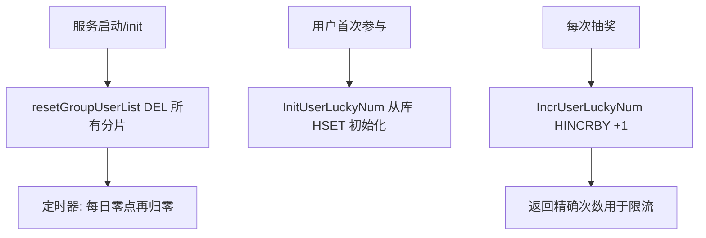

# Go 企业级抽奖项目: 优化用户今日抽奖次数

## 纲要

- 用户今日抽奖次数与 IP 今日次数逻辑高度相似：`hash` + `HINCRBY` 原子递增、分片 key、每日零点归零。
- 关键差异：用户次数要求**精确**，因此额外提供 `InitUserLuckyNum` 从数据库初始化缓存，以数据库数据为准。
- 封装位置：新建 `user_day_lucky.go`，提供 `IncrUserLuckyNum`、`InitUserLuckyNum`、`resetGroupUserList`。
- 分片：`userFrameSize`，按 `uid % userFrameSize` 散列到 `day_users_<i>`。
- 为什么 IP 不用数据表而用户用：IP 是多用户共享累加、范围宽松、容错高；用户次数关乎单个用户权益，必须精确。
- 项目源码使用 redigo；下方 Demo 改用 `go-redis/v9`。

## 与 IP 今日次数的同构部分

用户今日次数同样使用 `hash` 保存计数器，用 `HINCRBY` 做原子递增，并用分片 key 降低单 key 体积：

```go
const userFrameSize = 2

// 今天的用户抽奖次数递增，返回递增后的数值
func IncrUserLuckyNum(uid int) int64 {
	i := uid % userFrameSize
	return incrServUserLucyNum(i, uid)
}

func incrServUserLucyNum(i, uid int) int64 {
	key := fmt.Sprintf("day_users_%d", i)
	cacheObj := datasource.InstanceCache()
	rs, err := cacheObj.Do("HINCRBY", key, uid, 1)
	if err != nil {
		log.Println("user_day_lucky redis HINCRBY key=", key,
			", uid=", uid, ", err=", err)
		return math.MaxInt32
	} else {
		return rs.(int64)
	}
}
```

每日归零同样通过 `init()` 调用一次 + `time.AfterFunc` 周期重置：

```go
func init() {
	resetGroupUserList()
}

// 集群模式，重置用户今天次数
func resetGroupUserList() {
	cacheObj := datasource.InstanceCache()
	for i := 0; i < userFrameSize; i++ {
		key := fmt.Sprintf("day_users_%d", i)
		cacheObj.Do("DEL", key)
	}
	duration := comm.NextDayDuration()
	time.AfterFunc(duration, resetGroupUserList)
}
```

## 与 IP 次数的关键差异：从数据库初始化

IP 今日次数没有独立数据表，范围可设宽松，偶尔误差不影响业务；而**用户今日抽奖次数关乎单个用户的真实权益**，必须是精确值。因此除了递增，还提供 `InitUserLuckyNum` 把数据库里已记录的当日次数同步进缓存，以数据库为准：

```go
// 从给定的数据直接初始化用户的参与次数
func InitUserLuckyNum(uid int, num int64) {
	if num <= 1 {
		return
	}
	i := uid % userFrameSize
	initServUserLuckyNum(i, uid, num)
}

func initServUserLuckyNum(i, uid int, num int64) {
	key := fmt.Sprintf("day_users_%d", i)
	cacheObj := datasource.InstanceCache()
	_, err := cacheObj.Do("HSET", key, uid, num)
	if err != nil {
		log.Println("user_day_lucky redis HSET key=", key,
			", uid=", uid, ", err=", err)
	}
}
```

`InitUserLuckyNum` 在缓存尚未建立（如服务重启后、或用户当日首次参与）时，用数据库中的真实次数 `HSET` 进对应分片，避免缓存从 0 开始累加而丢失历史计数。

## 为什么 IP 无表而用户有表

| 维度 | IP 今日次数 | 用户今日次数 |
| --- | --- | --- |
| 是否独立数据表 | 否 | 是（`lt_userday`） |
| 精确性要求 | 低（多用户共享、范围宽松） | 高（单用户权益，不能模糊） |
| 额外初始化 | 无 | `InitUserLuckyNum` 从库同步 |
| 计数命令 | `HINCRBY day_ips_<i>` | `HINCRBY day_users_<i>` |
| 分片常量 | `ipFrameSize` | `userFrameSize` |

## 用户计数与初始化流程



## API 速览

| 方法 | 命令 | 说明 |
| --- | --- | --- |
| `IncrUserLuckyNum(uid)` | `HINCRBY day_users_<i> <uid> 1` | 原子递增，返回当前次数 |
| `InitUserLuckyNum(uid, num)` | `HSET day_users_<i> <uid> <num>` | 从数据库初始化缓存次数 |
| `resetGroupUserList()` | `DEL day_users_<0..n>` | 每日零点归零 |
| 分片规则 | `uid % userFrameSize` | 散列到多个 key |

## Demo 示例

用 `go-redis/v9` 演示用户今日次数的原子递增与从数据库初始化。

运行说明：

```bash
go run main.go   # 需要本地 Redis 在 127.0.0.1:6379
```

代码说明：

```go
package main

import (
	"context"
	"fmt"
	"log"
	"time"

	"github.com/redis/go-redis/v9"
)

var (
	rdb         = redis.NewClient(&redis.Options{Addr: "127.0.0.1:6379"})
	ctx         = context.Background()
	userFrameSize = 2
)

func key(i int) string { return fmt.Sprintf("day_users_%d", i) }

// IncrUserLuckyNum 原子递增某用户今日抽奖次数
func IncrUserLuckyNum(uid int) int64 {
	i := uid % userFrameSize
	n, err := rdb.HIncrBy(ctx, key(i), fmt.Sprintf("%d", uid), 1).Result()
	if err != nil {
		log.Println("HINCRBY error:", err)
		return 1<<31 - 1
	}
	return n
}

// InitUserLuckyNum 以数据库为准初始化缓存次数
func InitUserLuckyNum(uid int, num int64) {
	if num <= 1 {
		return
	}
	i := uid % userFrameSize
	rdb.HSet(ctx, key(i), fmt.Sprintf("%d", uid), num)
}

// ResetGroupUserList 归零所有分片（演示用 5 秒循环）
func ResetGroupUserList() {
	for i := 0; i < userFrameSize; i++ {
		rdb.Del(ctx, key(i))
	}
	time.AfterFunc(5*time.Second, ResetGroupUserList)
}

func main() {
	ResetGroupUserList()
	uid := 1001
	// 模拟从数据库读出当日已参与 2 次，先初始化
	InitUserLuckyNum(uid, 2)
	fmt.Println("after init:", IncrUserLuckyNum(uid)) // 期望 3
	fmt.Println("incr again:", IncrUserLuckyNum(uid)) // 期望 4
}
```

技术点总结：

- 用户与 IP 今日次数共用「hash + HINCRBY + 分片 + 零点归零」范式。
- 用户次数因涉及单用户权益必须精确，故额外用 `InitUserLuckyNum` 从数据库初始化，避免缓存丢失历史计数。
- 分片 key 同时提升单 key 操作效率与多实例资源利用率。

## 📎 文本↔代码关联

本讲在课程知识图谱（见 `_GRAPH.json` / `_GRAPH.mmd`）中关联以下代码文件：

- `code/lottery/conf/redis.go`

> 关联由 `scan_course.py` 自动建立，边类型 `uses-code`（讲次 → 代码）。

相关度：100%。是否需要继续：否。代码是否可运行：是。
