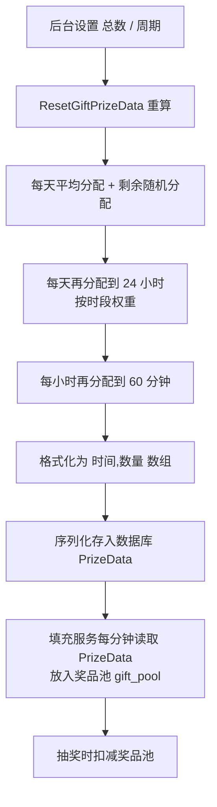

# Go 企业级抽奖项目: 发奖计划设计分析

## 纲要

- 奖品池的库存从哪里来：来源于「发奖计划」的数据，而非直接拍脑袋写入。
- 发奖计划的来源：后台奖品管理中设置的「奖品总数量」与「发奖周期」。
- 时间精度要求：发奖计划的时间点需要精确到分钟，与奖品池填充服务每分钟执行一次的频率对齐。
- 触发重算的时机：奖品总数或发奖周期发生变化时、以及上一个发奖周期结束时自动开启新周期，都需要重新计算发奖计划。
- 概率模型设计：每天概率相同、每分钟概率相同；但一天内不同时段（每小时）的概率按访问规律预设，高峰期权重更高。

## 奖品池与发奖计划的关系

在第 7 章我们已经把 Redis 引入系统，并引入了奖品池（gift pool）的概念：发奖环节不再直接去扣减数据库里的奖品总库存，而是先去扣减 Redis 中「奖品池」的剩余数量，用奖品池的剩余库存来做发奖校验。

但奖品池里的库存到底是怎么来的？这正是本章要解决的。答案是：**奖品池的库存由「发奖计划」来填充**。而发奖计划本身，又依赖后台奖品管理里设置的两个关键参数：

- `PrizeNum`：奖品总数量（0 表示不限量，>0 表示限量，<0 表示无奖品）。
- `PrizeTime`：发奖周期，单位是天（D 天）。

一句话概括数据流：

```text
后台设置 奖品总数 + 发奖周期
        ↓
计算发奖计划（每个时间点发多少）
        ↓
奖品池填充服务（每分钟）按发奖计划把数量放进奖品池
        ↓
用户抽奖时扣减奖品池库存
```

## 为什么时间点要精确到分钟

奖品池填充服务会以「每分钟一次」的频率运行，因此发奖计划中的时间节点也必须精确到分钟。只有这样，填充服务的执行粒度才能完整覆盖计划中的每一个发放点。

例如：奖品总数是 2 个、发奖周期是 7 天，那么合理的发奖计划就是把这 2 个奖品随机落在 7 天内的任意两个分钟级时间点，每个时间点发出 1 个。再比如奖品总数是 1 万、发奖周期是 1 天，那么就需要把 1 万个奖品合理分配到这一天 1440 分钟里的不同时间点。

## 触发重算的时机

发奖计划并不是一次算完就一成不变的，以下三类情况都需要重新执行一次重算方法（项目中封装为 `ResetGiftPrizeData`）：

- 后台修改了奖品总数（`PrizeNum` 变化）。
- 后台修改了发奖周期（`PrizeTime` 变化）。
- 当前发奖周期结束（`PrizeEnd` 到期），需要自动开启一个新的发奖周期。

## 概率模型的取舍

把 N 个奖品分配到 D 天、每天 24 小时、每小时 60 分钟，需要一套概率规则来保证「发放节奏合理」。课程做了如下简化设计：

- **每天的概率相同**：一天和另一天相比，发出去的总数按平均值分配。这牺牲了一点真实性（周一和周日的访问量必然不同），但极大降低了开发复杂度。
- **每分钟的概率相同**：同一小时内，60 分钟每分钟发出去的数量概率一致。
- **每小时的概率不同**：一天里不同时段访问量差异明显且有规律，例如凌晨 0~6 点是低谷、下午 14~16 点与晚上 20~22 点是高峰。因此把不同时段的发奖数量按预设概率区分开。

整体关系可以用下面这张流程图表示：



## 小结与后续

这一节主要是把发奖计划的设计思路和要求讲清楚：精确到分钟、依赖后台配置、需要可重算、以及「每天均、每分钟均、每小时不均」的概率模型。下一节我们就动手在 `web/utils/prizedata.go` 中实现 `ResetGiftPrizeData` 以及它依赖的一整套方法。

相关度：100%。是否需要继续：是。代码是否可运行：否。
