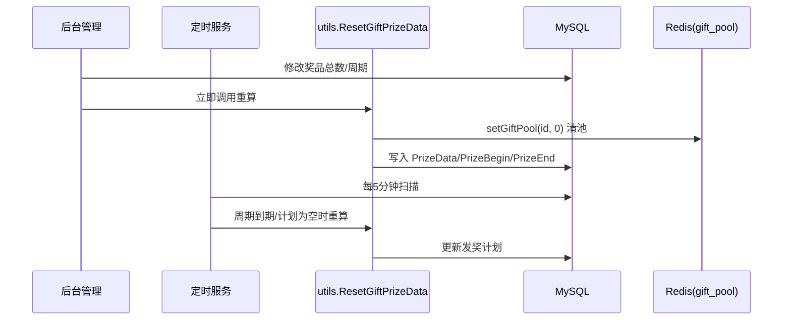

# Go 企业级抽奖项目: 实现发奖计划（下）

## 纲要

- `formatGiftPrizeData`：把 `map[int]map[int][60]int` 三层结构拍平成 `[][2]int`（`[时间,数量]`）的有序数组。
- 拍平过程用「索引循环」而非 `range`，保证天/小时/分钟的输出顺序稳定。
- 小时读取时必须以「当前小时」为基准做取模，避免跨天把数据读错位置。
- 定时服务 `resetAllGiftPrizeData`：每 5 分钟扫描所有奖品，对「未生成计划或周期已到期」的奖品触发 `ResetGiftPrizeData`。
- 在 `cron` 包与启动流程中接入，保证无论后台改数据还是服务重启，发奖计划都能被重新计算。

## formatGiftPrizeData：三层结构拍平

前面 `getGiftPrizeDataOneDay` 算出来的是「天→小时→分钟」的三层结构，存库和后续填充都不方便。这里把它转换成简单的「时间-数量」有序数组：

```go
// 将每天、每小时、每分钟的奖品数量，格式化成具体到一个时间（分钟）的奖品数量
func formatGiftPrizeData(nowTime, dayNum int, prizeData map[int]map[int][60]int) [][2]int {
	rs := make([][2]int, 0)
	nowHour := time.Now().Hour()
	// 处理周期内每一天的计划
	for dn := 0; dn < dayNum; dn++ {
		dayData, ok := prizeData[dn]
		if !ok {
			continue
		}
		dayTime := nowTime + dn*86400
		// 处理周期内，每小时的计划
		for hn := 0; hn < 24; hn++ {
			hourData, ok := dayData[(hn+nowHour)%24]
			if !ok {
				continue
			}
			hourTime := dayTime + hn*3600
			// 处理周期内，每分钟的计划
			for mn := 0; mn < 60; mn++ {
				num := hourData[mn]
				if num <= 0 {
					continue
				}
				minuteTime := hourTime + mn*60
				rs = append(rs, [2]int{minuteTime, num})
			}
		}
	}
	return rs
}
```

几个要点：

- **为什么用索引循环而不是 `range`**：`prizeData` 是 map，Go 的 `range` 遍历 map 是无序的。而发奖计划后续会被「按时间顺序消费」，所以必须用 `dn := 0; dn < dayNum` 这种有序索引来读取，保证输出切片是有序的。小时、分钟同理。
- **小时偏移取模**：`dayData[(hn+nowHour)%24]` 是这里最容易写错的地方。循环 `hn` 从 0 到 23 代表「第几个小时之后」，真正要读取的小时是「当前小时 + hn」再对 24 取模。如果直接读 `dayData[hn]`，会把「当前 18 点」的数据错读到「0 点」那一格，导致整份计划时间错乱。
- **时间累加**：`dayTime = nowTime + dn*86400`，`hourTime = dayTime + hn*3600`，`minuteTime = hourTime + mn*60`，逐层在「当前时间」基础上往后推，得到每一个发放点的绝对时间戳。

最终 `rs` 中每个元素是 `[绝对分钟时间戳, 该分钟应发数量]`，序列化后存入 `LtGift.PrizeData`。

## 接入定时服务：周期性重算

仅靠后台保存奖品时手动触发还不够——数据库可能被直接改、计划服务可能中途停过。需要一个常驻的定时程序来兜底检查并重算。项目在 `cron/run_one.go` 中实现：

```go
// 重置所有奖品的发奖计划
// 每5分钟执行一次
func resetAllGiftPrizeData() {
	giftService := services.NewGiftService()
	list := giftService.GetAll(false)
	nowTime := comm.NowUnix()
	for _, giftInfo := range list {
		if giftInfo.PrizeTime != 0 &&
			(giftInfo.PrizeData == "" || giftInfo.PrizeEnd <= nowTime) {
			// 立即执行
			log.Println("crontab start utils.ResetGiftPrizeData giftInfo=", giftInfo)
			utils.ResetGiftPrizeData(&giftInfo, giftService)
			// 预加载缓存数据
			giftService.GetAll(true)
			log.Println("crontab end utils.ResetGiftPrizeData giftInfo")
		}
	}

	// 每5分钟执行一次
	time.AfterFunc(5*time.Minute, resetAllGiftPrizeData)
}
```

触发条件：设置了发奖周期（`PrizeTime != 0`），且（`PrizeData` 为空，或上一周期已到期 `PrizeEnd <= nowTime`）。重算完成后调用一次 `giftService.GetAll(true)` 重新建立缓存，因为重算过程改写了数据库、缓存已失效。

## 启动时接入

在 `cron` 包里用一个统一入口启动各类计划任务，并在站点启动时调用：

```go
// 只需要一个应用运行的服务（全局的服务）
func ConfigueAppOneCron() {
	// 每5分钟执行一次，奖品的发奖计划到期的时候，需要重新生成发奖计划
	go resetAllGiftPrizeData()
	// 每分钟执行一次，根据发奖计划，把奖品数量放入奖品池
	go distributionAllGiftPool()
}
```

`resetAllGiftPrizeData` 用 `time.AfterFunc` 实现「每 5 分钟自我递归调度」，首次执行也立即跑一次，保证服务一启动就把到期/缺失的计划补上。

## 触发链路总览



## 小结

这一节完成了发奖计划计算链路的收尾：`formatGiftPrizeData` 负责把复杂三层结构拍平成有序的 `[时间,数量]` 数组（注意索引循环与小时取模），并通过 `cron` 定时服务把重算逻辑接入系统，保证计划数据最终一致、可自愈。下一章转入「自动填充奖品池」服务，把这份计划真正变成奖品池里的库存。

相关度：100%。是否需要继续：是。代码是否可运行：否。
