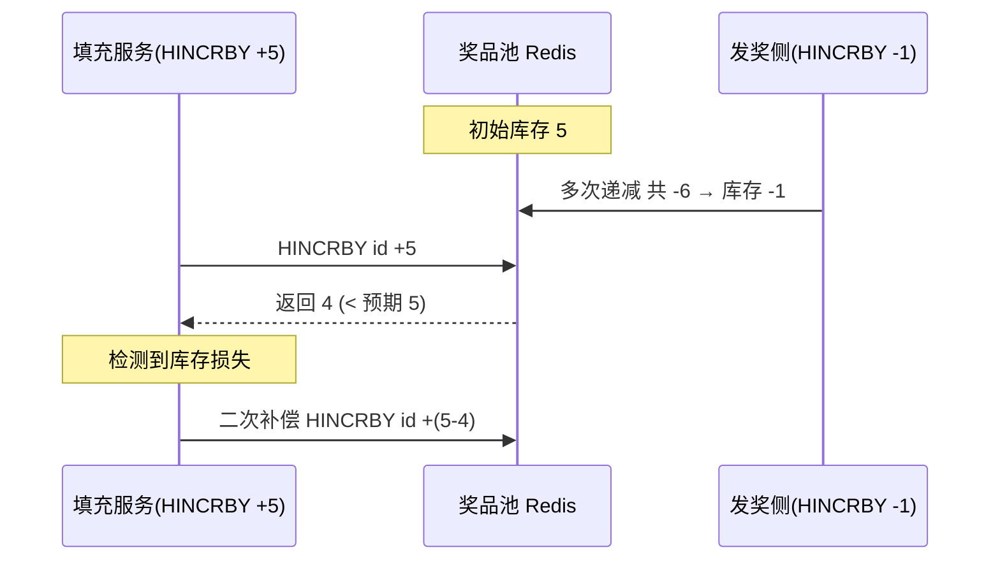

# Go 企业级抽奖项目: 自动填充奖品池分析

## 纲要

- 填充奖品池依赖上一章算好的发奖计划，读取 `PrizeData` 后把对应数量写入奖品池即可，逻辑相对简单。
- 核心方法 `DistributionGiftPool`：既要更新奖品池库存，也要推进（截断）发奖计划数据。
- 库存递增用 `incrGiftPool`（基于 Redis `HINCRBY`），但存在「并发减量导致库存损失」的隐患。
- 库存损失根因：池子在发奖侧不断递减、填充侧不断递增，递减时没有判负，可能出现「递增后返回值小于预期增量」的情况。
- 解决方案：二次补偿——发现实际增量不足预期时，再补一次差额。
- 填充动作要封装成定时服务，每分钟执行一次（与发奖计划的时间精度对齐）。

## 填充服务的职责

发奖计划在上一章已经把「每个时间点发多少」以 `[时间,数量]` 数组的形式存进了数据库（`PrizeData`）。填充服务要做的，就是按当前时间把这些计划「兑现」成奖品池里的真实库存。

需要完成的工作：

1. 实现 `DistributionGiftPool`：遍历所有奖品，按发奖计划把「当前时间及之前应发」的数量放进奖品池，并同时推进（消费掉）发奖计划。
2. 实现 `incrGiftPool`：对奖品池做递增。由于发奖侧在并发递减、填充侧在并发递增，必须依赖 Redis 的原子命令来保证单条更新的原子性。
3. 处理并发下的库存损失：即便用了 `HINCRBY`，仍可能出现「应该加 5 个，实际只加到了 4 个（因为并发发奖把库存减到了负数）」的情况，需要二次补偿。
4. 把填充功能封装成定时服务，每分钟跑一次。

## 并发下的库存损失问题

为什么用了原子递增还会出现数量对不上？看一个具体例子：

- 当前奖品池库存为 5。
- 填充服务要增加 5 个库存，预期递增后应为 10。
- 但在递增的同时，发奖侧在大量并发递减，且递减**不判断库存是否小于 0**。
- 5 个库存经多次发奖后变成了 -1。
- 此时对 -1 做「加 5」的递增，返回值是 4，小于预期的增量 5。

返回值 4 < 预期 5，说明一定发生了库存损失。这时就必须做一次「二次补偿」：把差额（5-4=1）再递增一次。

虽然理论上补偿本身也可能再次不及预期（需要递归补偿），但在 Redis 执行这条命令的时间窗口（微秒级）内，出现连续大规模缺口的概率极低，因此项目里只做一层补偿即可，避免把代码复杂化。

## 小结与后续

这一节把自动填充奖品池的设计与并发风险讲清楚：它重度依赖发奖计划，核心是 `HINCRBY` 原子递增 + 二次补偿。下一节动手实现 `DistributionGiftPool` 与 `incrGiftPool` 的完整代码，并接入每分钟执行的定时服务。

相关度：100%。是否需要继续：是。代码是否可运行：否。
