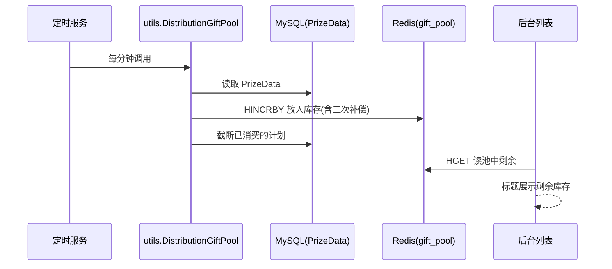

# Go 企业级抽奖项目: 实现奖品池（下）

## 纲要

- 把填充奖品池封装成定时服务 `distributionAllGiftPool`，每分钟执行一次（用 `time.AfterFunc` 自递归调度）。
- 在 `cron` 包入口 `ConfigueAppOneCron` 中与发奖计划重算服务一起启动。
- 后台奖品列表读取奖品池实时库存 `GetGiftPoolNum`，拼到标题上方便运营查看。
- 通过运行验证：修改奖品总数后计划被重置、奖品池按分钟节奏自动填充、高峰时段数量更多。

## 封装为每分钟执行的定时服务

在 `cron/run_one.go` 中，`distributionAllGiftPool` 与上一章的 `resetAllGiftPrizeData` 并列：

```go
// 根据发奖计划，把奖品数量放入奖品池
// 每分钟执行一次
func distributionAllGiftPool() {
	log.Println("crontab start utils.DistributionGiftPool")
	num := utils.DistributionGiftPool()
	log.Println("crontab end utils.DistributionGiftPool, num=", num)

	// 每分钟执行一次
	time.AfterFunc(time.Minute, distributionAllGiftPool)
}
```

因为是后台常驻服务、执行过程不可见，所以在进入和结束时都打印日志，方便通过日志确认它确实在跑、以及本次填充了多少个奖品（`num`）。

统一入口里同时拉起两个服务（一个全局应用只运行一份）：

```go
// 只需要一个应用运行的服务（全局的服务）
func ConfigueAppOneCron() {
	// 每5分钟执行一次，奖品的发奖计划到期的时候，需要重新生成发奖计划
	go resetAllGiftPrizeData()
	// 每分钟执行一次，根据发奖计划，把奖品数量放入奖品池
	go distributionAllGiftPool()
}
```

这样站点一启动，`resetAllGiftPrizeData`（每 5 分钟）负责把发奖计划算好/续期，`distributionAllGiftPool`（每分钟）负责把计划兑现成奖品池库存，两条定时链路各司其职。

## 后台展示奖品池实时库存

运营需要在后台直观看到「奖品池里现在还有多少库存」。奖品池库存从 Redis 读取：

```go
// 获取当前奖品池中的奖品数量
func GetGiftPoolNum(id int) int {
	num := 0
	num = getServGiftPoolNum(id)
	return num
}

// 获取当前奖品池中的奖品数量，从redis中
func getServGiftPoolNum(id int) int {
	key := "gift_pool"
	cacheObj := datasource.InstanceCache()
	rs, err := cacheObj.Do("HGET", key, id)
	if err != nil {
		log.Println("prizedata.getServGiftPoolNum error=", err)
		return 0
	}
	num := comm.GetInt64(rs, 0)
	return int(num)
}
```

在后台奖品列表页（`AdminController` 的列表方法）里，拿到每个奖品后调用 `utils.GetGiftPoolNum(gift.Id)`，把数量拼到标题上：

```go
// 在列表页读取奖品池剩余，并拼装到标题
for i := range list {
	list[i].Title = fmt.Sprintf("%s (池中剩余:%d)",
		list[i].Title, utils.GetGiftPoolNum(list[i].Id))
}
```

这样运营在后台列表就能直接看到每个奖品的「奖品池实时剩余」，无需进 Redis 查。

## 运行验证

启动站点并进入后台（账号 `admin` / 密码 `password`），进入「奖品管理」：

- 导入 20 个优惠券后，发奖计划形如 `[[时间1,5],[时间2,5],...]`——每到一个分钟节点再放 5 个，列表页同时展示奖品池剩余数量、当前总数与当前剩余数量。
- 把总数改成 10，再回看：奖品池被清空，发奖计划重置为 10 条记录（每个时间点 1 个）。
- 改成 1 万，则每分钟发放次数随总量变化；并且每个小时的数量有规律——高峰时段（如配置里的 9、10、20、21 点）分配到的数量明显更多，与 `PrizeDataRandomDayTime` 的权重设计一致。
- 不断刷新页面，能看到奖品池库存按分钟节奏自动涌入，自动填充服务确实生效。

## 整体协作时序



## 小结

这一节把自动填充奖品池完整落地：封装成每分钟执行的定时服务并接入启动入口，后台列表实时读取奖品池库存展示，最后用实际运行验证了「计划重算 + 按分钟填充 + 高峰权重」整套链路。下一节对发奖计划与奖品池做一次整体总结。

相关度：100%。是否需要继续：是。代码是否可运行：否。
