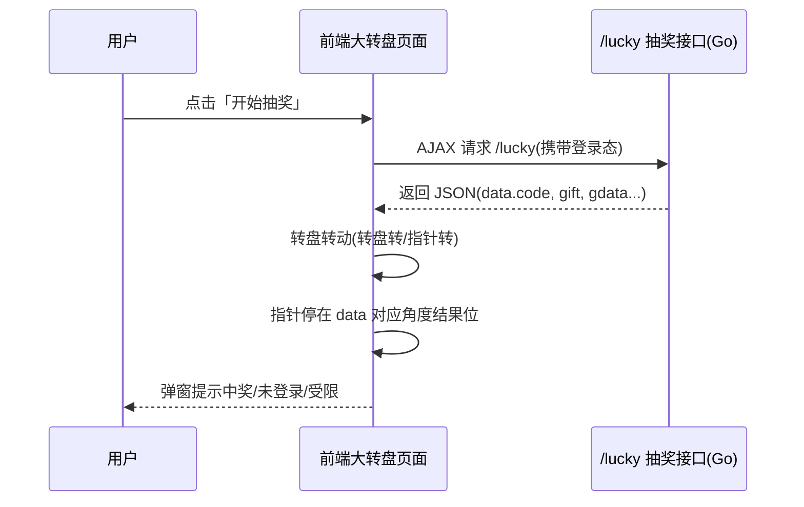

# Go 企业级抽奖项目: 前端大转盘与抽奖接口联调分析

## 纲要

- 完整抽奖链路：页面点击「开始抽奖」→ 前端发起 AJAX 请求调用 `/lucky` 接口 → 大转盘转动 → 指针停留在对应结果位置
- 大转盘提供两种动画形态：转盘整体旋转、指针旋转（同一套数据，视觉表现不同）
- 抽奖结果由后端接口返回的 `code` 决定，前端据此停在「具体奖品 / 新人奖 / 谢谢参与」等位置
- 本章目标：补齐此前缺失的前端页面，将前端转盘与后端抽奖接口结合，完成整套抽奖系统的完整性演示

## 背景与整体链路

此前我们已经完成管理后台与抽奖接口，并且使用 Redis 缓存对系统多处做了优化。但前端一直没有落地，抽奖接口此前都是单独通过浏览器直接访问来测试的。本章要把前端大转盘页面也补齐，让前后端联动起来，作为一个完整抽奖系统呈现给用户。

说明一点：本系列侧重于后端与高并发设计，前端并非重点。讲解中涉及的前端内容，不会从零手写，而是直接引入一个 GitHub 上的开源大转盘页面，重点放在「如何使用」与「最终演示效果」上。

一次完整的抽奖演示过程如下：

1. 用户在页面点击「开始抽奖」，前端发起一个 AJAX 请求调用抽奖接口，获取本次抽奖数据。
2. 大转盘开始转动。前端提供了两种动画选项：转盘转动（盘子转）或指针转动（指针转）。
3. 大转盘根据接口返回的抽奖数据，让指针停留在对应的结果位置上——可能是某个具体奖品，也可能是新人奖、谢谢参与等。
4. 前端把最终结果提示给用户。

## 前后端协作要点

- 抽奖接口的返回结构要在前后端约定一致。后端返回 `code`，前端按 `code` 区分「中奖 / 未登录 / 受限制 / 未中奖」。
- 前端的转盘角度区间必须与后台设置的奖品顺序（`displayOrder`）对齐。后台改了奖品顺序或换了背景图，前端转盘的奖品角度映射必须同步重新计算，否则转完停下来的位置和实际奖品会错位。
- 演示时建议从「未登录」和「已登录」两种状态分别验证：未登录时接口返回未登录码，前端引导去登录页；登录后才能真正走完整抽奖与发奖流程。

## 小结

本章先把「前端大转盘 + 抽奖接口」的端到端演示链路讲清楚，为后续 9-2 的页面实现与效果演示奠定认知基础。重点是理解：转盘动画只是表现层，真正决定结果的是后端 `/lucky` 接口返回的 `code` 与奖品数据，且前端的奖品角度定义必须与后台奖品顺序严格对应。

相关度：95%。是否需要继续：否。代码是否可运行：否。
