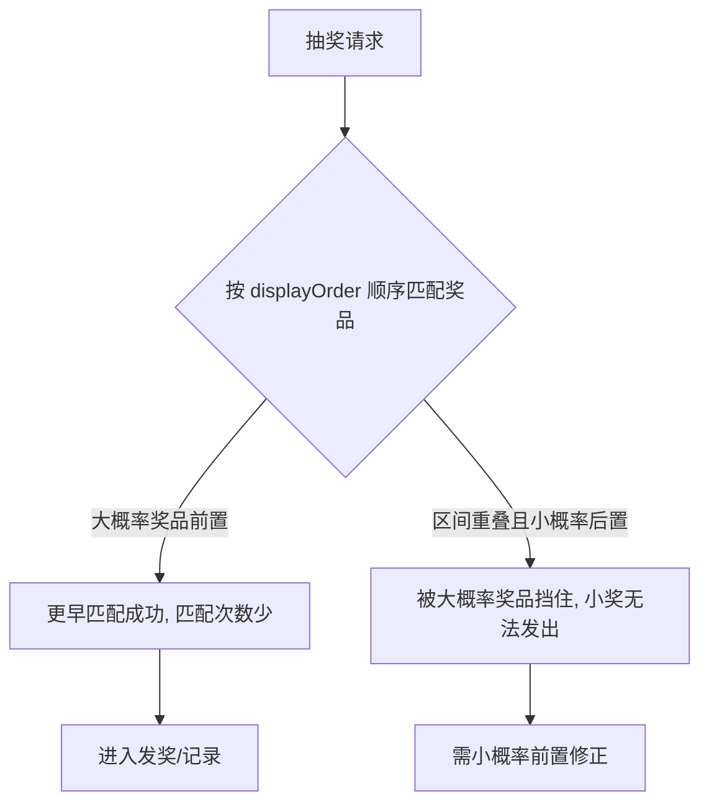

# Go 企业级抽奖项目: 优化奖品设置与性能关系分析

## 纲要

- 影响抽奖性能的奖品字段：`prenum`（数量）、`prizeCode`（中奖概率）、`displayOrder`（展示/匹配顺序）
- 不限量或超大数量 → 每次请求都跑完整抽奖链路 → 性能变差
- 中奖概率须与「奖品数 / 用户数」比例匹配，而非拍脑袋设定
- `displayOrder`：大概率奖品前置可减少匹配次数；编码区间重叠时小概率前置，避免被大概率奖品「挡住」
- 后续压力测试将针对性验证数量与概率不同设置下的性能差异

## 奖品字段回顾

一个奖品除了通用字段（如 `id`、`sysStatus`、`sysCreated`、`sysUpdated`、`sysIp` 等）外，与抽奖设置合理性直接相关的主要有：

- `sysStatus`：奖品状态，删除态的奖品不参与抽奖（属功能正确性问题，与「是否合理」关系不大）。
- `startTime`、`beginTime`、`endTime`、`priceBegin`、`priceEnd`：影响奖品生效状态与发奖计划生成，按活动要求设置即可。
- `prenum`：限制奖品数量。等于 0 表示不限量，每次中奖都能成功发奖。
- `prizeCode`：中奖概率。
- `displayOrder`：奖品展示顺序，也影响奖品匹配顺序。

## prenum 对性能的影响

`prenum` 决定奖品是否限量、是否会大量发奖，直接影响系统性能。

- 若 `prenum = 0`（不限量），每次命中都能成功发奖，抽奖链路的「匹配 → 发奖 → 记录 → 返回」全部环节都会执行，业务逻辑长、运算量大，性能自然更差。
- 若 `prenum` 设得很大（例如 10 万），情况类似：10 万次请求都会走过完整抽奖逻辑，性能同样偏差。

因此 `prenum` 要根据活动策划合理设置，关注「活动到底要发出多少奖品」。

## prizeCode 对性能的影响

中奖概率要与「奖品数 / 用户数」的比例接近，才叫合理。

- 场景 A：预计每天发 100 个奖品，每天 1000 人抽奖 → 中奖概率设为 10%（或略高，如 15%）合理。
- 场景 B：每天 100 万人抽奖，仍只有 100 个奖品 → 真实比例是万分之一。若仍设 10%，会有 10 万人（约 10 万请求）匹配到奖品，但只有 100 个能发奖成功，其余请求在发奖阶段做了无谓消耗。此时应设为万分之一或万分之五才合理。

概率越高，命中并进入发奖的请求越多，发奖阶段开销越大，整体性能越差。

## displayOrder 对性能的影响

`displayOrder` 既影响展示顺序，也影响奖品匹配顺序。匹配奖品环节会按序查找，越靠前越早匹配成功。

- 常规优化：把中奖概率大的奖品放前面。例如幸运奖概率 30%、一等奖概率万分之一，把幸运奖前置，能让更多请求在幸运奖就提前匹配成功，减少后续匹配次数，性能更好（尽管匹配环节通常不是瓶颈）。
- 特殊情况：当不同奖品的「中奖编码区间重叠」时（例如要求 100% 中奖且发奖，一等奖概率万分之一、虚拟币概率 100%），若按「概率大前置」，虚拟币会 100% 挡在前面，一等奖永远发不出去。此时应把编码范围小的（小概率）放前面，让小概率奖项也有机会被匹配。

## 小结

数量、概率、排序三个属性都会作用于抽奖系统性能。其中 `prenum` 与 `prizeCode` 决定有多少请求会真正走完发奖链路，`displayOrder` 决定匹配环节的早退效率。下一节结合压力测试可定量观察这些设置带来的性能差异。

相关度：92%。是否需要继续：否。代码是否可运行：否。
