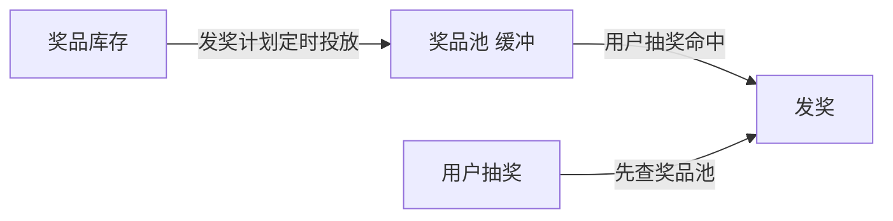

# Go 企业级抽奖项目: 人为控制发奖节奏的策略分析

## 纲要

- 完全随机发奖 vs 人为控制发奖规则：本系统选择人为控制（已实现多类规则）
- 黑名单机制：限制同一 IP / 用户短期内重复中大奖，提升公平性
- 发奖计划 + 奖品池：平滑发放，避免奖品在活动开局被瞬间抽空
- 用户等级 / 注册时长：定向发放大奖，防范水军批量注册套利
- 奖品状态、数量、起止时间等属性：可进一步精确控制发奖节奏

## 完全随机还是人为控制

完全随机发奖指：设好中奖概率，按概率中奖与发奖即可。人为控制则是叠加额外发奖规则——能否中奖不只看概率，还要满足所有人为规则。

我们此前实现抽奖接口时已加入大量规则，因此答案是明确的：需要人为控制。否则系统会比现在简单很多，但也失去了活动运营的意义。

## 同一 IP / 用户多次中大奖

免费抽奖活动中，同一 IP 或用户短时间内多次中大奖并不合理（即使运气好）。对比彩票系统：彩票是付费的，抽得越多买得越多、贡献越大，多次中大奖自然合理；而免费抽奖活动应把机会更公平地分给不同 IP 与用户。

本系统在抽奖接口中已加入用户黑名单与 IP 黑名单校验：让近期中过大奖的 IP / 用户在一段时间内不再发放大奖。虽然触发概率低，但从公平性角度仍值得实现。

## 奖品被瞬间抽空

完全随机下，若中奖概率设得不合理（例如 100 个奖品却设 10% 概率），开局一来 1000 人就把 100 个奖品抽光，当天剩余时间无库存可发，体验很差。

本系统的应对方式是发奖计划 + 奖品池：定时把奖品投放进奖品池这个「缓冲地带」，避免库存一次性放完。奖品池与发奖计划的设计可回看第 8 章。

## 大奖被水军抽走

大型年终活动一等奖若为高价值实物（如手机），会吸引大量用户，其中多为冲着抽奖来的新用户，甚至可能包含批量注册的水军。若完全按概率平等随机，用户量最大的新用户群体中奖机会最大，真实用户反而难中。

一种可控做法是：在奖品上附加发奖用户等级规则，例如「一等奖要求用户等级超过某阈值」或「注册时间须超过 N 天」。本系统未实现该规则，可作为独立练习自行完成，难度不大。

## 用奖品属性控制节奏

除黑名单、发奖计划、用户等级外，还可利用以下属性精确控制发奖节奏：

- 奖品状态（`sysStatus`）：上/下架控制是否参与。
- 奖品数量（`prenum`）：限量发放。
- 开始 / 结束时间（`startTime` / `endTime`）：限定奖品仅在特定时段生效。

这些属性组合使用，可让运营对「什么时候发、发多少、发给谁」有更精细的掌控。

## 小结

抽奖活动不是纯随机抽奖系统，合理的运营需要人为控制发奖节奏：黑名单保障公平、发奖计划 + 奖品池平滑库存、用户等级定向大奖、时间/数量属性精控节奏。规则越丰富，业务逻辑越重，也会反过来影响性能，这正是第 9 章压测要验证的取舍。

相关度：90%。是否需要继续：否。代码是否可运行：否。
