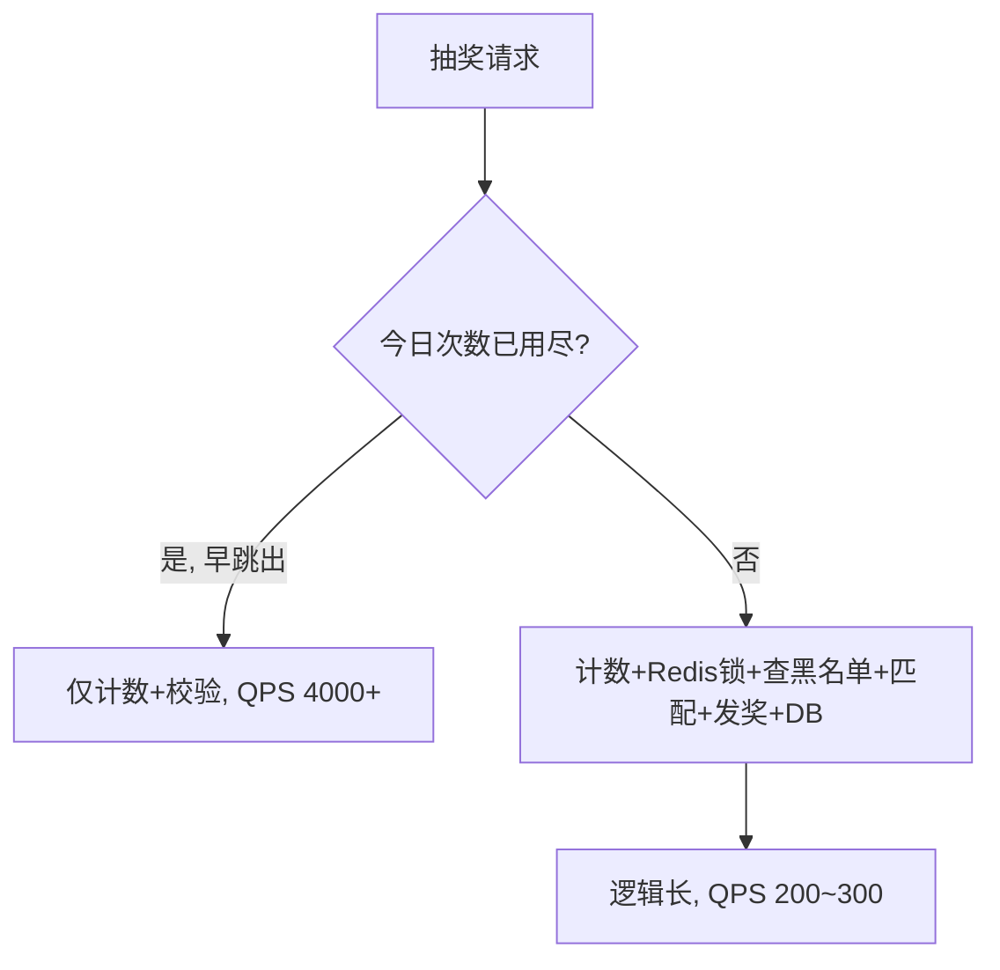

# Go 企业级抽奖项目: 抽奖接口压力测试与性能瓶颈定位

## 纲要

- 测试前改造：模拟随机 IP、随机登录用户，避免未登录直接退出导致压测无效
- 对照一：不限量 100% 中奖 vs 1% 中奖 → 概率低、发奖少则 QPS 略升
- 对照二：放开 vs 收紧「今日抽奖次数限制」→ 早跳出使 QPS 从 300+ 跃升到 4000+
- 瓶颈定位：数据库 insert/查询耗时达 10ms 级，远高于 Redis（亚毫秒级）
- 优化方向：把黑名单等数据下沉到 Redis，减少数据库依赖；权衡「更快」与「更完善」

## 测试前的数据准备

为了做对照，后台先简化：删除大量奖品，只留最后一个，并设为不限量、中奖概率 0~9999（即 100% 中奖）。前端手动请求时不带登录 cookie，处于未登录态，压测会直接退出、毫无意义。因此需要在代码里做改造：模拟随机 IP 与随机登录用户。

```go
// 压测改造：构造随机 IP 与登录用户（根据讲稿逻辑补充，示意）
func mockUser() *User {
    ip := fmt.Sprintf("%d.%d.%d.%d",
        rand.Intn(256), rand.Intn(256), rand.Intn(256), rand.Intn(256))
    uid := rand.Intn(1000000) // 随机 UID，范围可放大以避免被次数限制挡住
    u := &User{
        Uid:       uid,
        Username:  fmt.Sprintf("user%d", uid),
        SysCreated: time.Now().Unix(),
        SysIp:     ip,
        // Sign: 手动计算并回填的防篡改签名
    }
    return u
}
```

改造后重启服务，每次请求都能拿到随机登录态，从而稳定中奖、走完整链路。

## 对照一：中奖概率的影响

- 不限量 + 100% 中奖：10 线程 10 并发压 5 秒，QPS 仅 155~172（< 200）。单次请求约 18~34ms，性能很不理想。
- 改为 1% 中奖（0~99）：QPS 升到 270+。因为命中概率低，进入发奖环节的请求大幅减少。

结论：中奖概率越低、实际发奖越少，QPS 越高。但差异并不悬殊，因为发奖逻辑占比有限。

- 再把奖品数设为 1000（启用发奖计划，奖品池初始为空）：QPS 仍约 200+，与 1% 时接近——奖品池空导致即使命中 1% 也发不出奖，发奖逻辑被跳过，整体提升有限。

## 对照二：今日抽奖次数限制的影响

上述参数不变，仅把「用户/IP 今日抽奖次数」限制值改小并启用。大部分请求会在「今日次数」这一环就被拦截跳出，后面的计数器自增、奖品校验、发奖等逻辑全部跳过。

结果 QPS 从最高的 300+ 直接跃升到 4000+，提升非常显著。这说明：业务逻辑越多、跳出越晚，性能越差；越早命中限制条件跳出，吞吐越高。



## 瓶颈定位：时间到底花在哪

打开调试日志（Redis 与数据库日志），观察单次请求的资源耗时：

- 受限用户单次请求约 9ms：经历 4 次 Redis 操作（含加锁/解锁、今日次数自增与写入），累计 1ms 多；1 次数据库查询（黑名单/今日记录）约 4ms。Redis 与 DB 合计已 3ms+，其余是程序循环、判断、字符串拆分、序列化/反序列化。
- 放开限制后单次请求 23~31ms：9 次 Redis（约 3ms）+ 4 次数据库操作，其中一次 `insert` 写入达 10ms（涉及索引更新、落盘）。数据库操作占据绝大部分时间。

本机环境数据库 insert 竟达 10ms，而经验上简单 insert 应在 1ms 以内，说明本地数据库（索引更新 + 写盘）性能较差。

## 优化方向

- 减少数据库依赖：例如用户黑名单可整体移入 Redis。若业务能容忍缓存重启少量丢失（Redis 重启可恢复、丢失量小），就能砍掉十几毫秒的 DB 开销，性能数倍提升。
- 正视业务逻辑成本：大量 Redis 操作源于加锁解锁、各类计数器、黑名单查询等丰富业务逻辑。即使数据在 Redis，10 次请求累积也会变长。
- 权衡「更快」与「更完善」：抽奖系统并发要求不像秒杀那样极致，可在业务完整度与性能之间取舍。若追求更高性能，应把更多请求放到 Redis，减少 DB 依赖。

## Shell 压测命令示例

```shell
# 基础压测：10 线程、10 并发、5 秒
wrk -t10 -c10 -d5s http://127.0.0.1:8080/lucky

# 提高并发：线程数与连接数放大
wrk -t20 -c200 -d30s http://127.0.0.1:8080/lucky

# 短连接模式（模拟 ab 风格，关闭 keep-alive 可用 Lua 脚本控制，ab 直接：）
ab -n 10000 -c 100 http://127.0.0.1:8080/lucky
```

## 小结

本次压测得出明确结论：

- 限制条件（今日次数）越早命中、逻辑越早跳出，QPS 提升最显著（300+ → 4000+）。
- 只要触发数据库查询/写入，效率就急速下降；瓶颈主要在数据库，而非 Redis 或 Go 业务逻辑本身。
- 本机 DB 性能差是主因，部署到数据库性能更好的线上服务器后，并发与性能会明显优于本地测试结果。

相关度：95%。是否需要继续：否。代码是否可运行：是。
