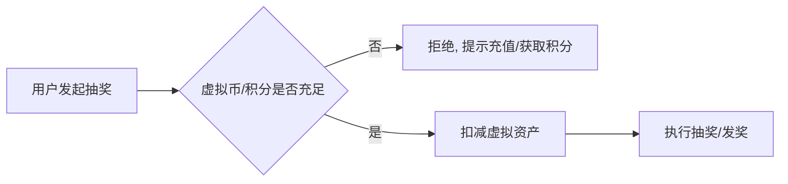

# Go 企业级抽奖项目: 更多运营策略探讨

## 纲要

- 大奖精准发放：用生效时间、用户等级、指定用户等规则控制发奖时机与对象
- 虚拟券结合电商优惠券：通过电商接口直接发到用户电商账号，省去导入/发放环节
- 付费化改造：每次抽奖消耗虚拟币/积分，由免费转类彩票模式，需与虚拟资产系统打通
- 以上均可作为独立练习，在抽奖逻辑中增量实现

## 为什么还要谈运营策略

抽奖活动形式多样、需求百变。我们已实现诸多规则与奖品设置，但仍难以覆盖所有运营场景。这里探讨一些扩展方向，为未来各类抽奖活动提供技术可能性。

## 精准发放大奖

大奖数量极少，若发奖计划随机处理，可能在活动开局就被抽光，并不合适。可考虑：

- 设置奖品生效时间：控制大奖仅在活动期间特定某一天生效。
- 限定用户等级：把大奖定向给更有价值的用户。
- 极端情况：限定大奖只能由特定用户抽中。

这些方法部分靠运营配置，部分需要技术实现，最终取决于运营是否有对应需求。

## 虚拟券与电商/游戏系统打通

虚拟券可与电商优惠券体系结合：通过电商优惠券接口直接发奖，并把券精准发放到用户个人电商账号，省去优惠券的导入与发放环节。类似地，也可与游戏推广码等体系结合。这类需求通常需要增加字段或增加发奖逻辑，实现难度不大，适合作为个人练习独立完成。

## 付费化（类彩票）改造

彩票抽奖需要付费，而我们的活动目前多为免费。可把每次抽奖改为消耗虚拟币或虚拟积分，不再完全免费。这需要与虚拟币/虚拟积分系统打通，并在抽奖逻辑中单独增加扣减与校验逻辑。

## 小结

运营策略永无止境，本文仅列举大奖精准发放、虚拟券外发、付费化三类典型扩展。它们共同点是「在既有抽奖逻辑上增量加规则/加字段/接外部系统」，实现成本可控，建议动手实践以加深理解。至此第 9 章「完整性演示与更多总结」全部结束。

相关度：88%。是否需要继续：否。代码是否可运行：否。
