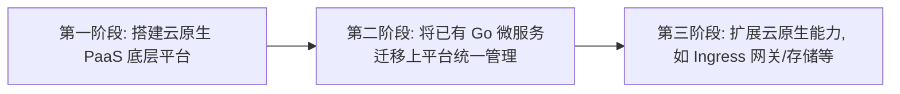

# Go PaaS 平台开发: 云原生时代什么样的人才更稀缺

## 纲要

- 云原生 PaaS 平台的应用现状：**大厂**早已自研 PaaS、**中小企业**正分三阶段建设、**外包/项目型公司**借 DevOps 理念提效
- 中小企业建设云原生 PaaS 的三个阶段：搭建底层平台 → 迁移 Go 微服务 → 扩展存储与网关等能力
- PaaS 平台未来三大发展方向：DevOps+安全、低代码（Gartner 预测 2025 年 95% 采用云原生架构）、持续高速增长
- 技术选型与人才稀缺原因：Go 语言天然贴近 Kubernetes 与云原生，主流厂商 PaaS 普遍采用 Go + K8s
- 课程覆盖的主流技术栈：Kubernetes、Go 微服务框架、Istio 服务网格、Prometheus + Grafana 监控、容器化中间件、Ingress 路由
- 课程效果演示模块：服务管理、中间件一键创建、云应用市场、权限管理、监控看板
- 课程重点知识点：Kubernetes 原理与监控机制、路由管理原理、Istio 存储逻辑

## 云原生 PaaS 已是行业刚需

云原生时代，PaaS（Platform as a Service，平台即服务）不再是大厂的专利。无论是互联网巨头、快速成长的中小企业，还是以交付为主的项目外包公司，都在围绕 PaaS 平台重构自己的研发与交付体系。本篇先回答一个问题：**为什么云原生 PaaS 平台相关的人才越来越稀缺，以及这门课程到底能帮你打开哪条涨薪通道。**

## 谁在用云原生 PaaS 平台

云原生 PaaS 的采用已经呈现明显的分层格局：

- **互联网大厂**：百度、阿里云、京东等早已拥有成熟的云原生体系与自研 PaaS 管理平台，并持续以高薪招募 PaaS 平台开发者。
- **中小企业**：近几年云原生在中小企业中逐步被接受，一部分直接使用云厂商的云原生平台，另一部分处于自建或建设阶段。
- **外包/项目型公司**：为提升资源利用率与交付效率，也在加紧建设 PaaS 平台，并融合 DevOps 理念缩短交付周期。

对中小企业而言，建设云原生 PaaS 通常分三个阶段推进：

在平台基座就绪后，扩展 Ingress、存储等能力变得非常容易，这正是中小企业技术演进的主线。

## PaaS 平台的未来发展方向

云原生 PaaS 仍处于技术上升期，未来有三个清晰的增长点：

1. **DevOps + 安全**：在原有 DevOps 流水线基础上叠加 Security（安全），基于 PaaS 平台进行开发已成为主流厂商的指导性方向。
2. **低代码**：据 Gartner 预测，到 2025 年约 95% 的低代码平台将采用云原生架构，从而高度依赖云原生 PaaS 平台。
3. **持续渗透**：随着中小企业与外包公司全面上云，PaaS 平台的市场空间与人才需求将持续扩大。

## 为什么是 Go，而不是其他语言

各大厂商的 PaaS 平台（如行业内常说的 golden PaaS/Kubernetes 系平台）基本都用 **Go 语言**开发。原因在于：

- Go 语言与 Kubernetes 天然贴近，而 Kubernetes 是云原生的事实上标准。
- Go 的并发模型（goroutine）、静态编译、轻量运行时，都非常契合 PaaS 平台对高并发调度与容器化部署的需求。

因此，"掌握 Go + 云原生"的技术方向，与一线厂商的岗位要求高度匹配，也直接决定了薪资的天花板。

## 课程主流技术栈

本课程基于业界标准的技术选型进行开发：

| 技术域 | 选型 | 说明 |
| --- | --- | --- |
| 编排底座 | Kubernetes | 云原生标准，课程核心 |
| 微服务开发 | Go 微服务框架 | 大厂协作开发 Go 微服务常用 |
| 服务网格 | Istio | 大型分支/服务治理系统 |
| 监控看板 | Prometheus + Grafana | 容器监控业界标准 |
| 中间件接入 | 容器化方案 | 独立章节讲解中间件入容器 |
| 路由管理 | Nginx Ingress | 生产环境标准路由对接 |

此外，课程还演示了以下平台能力模块：

- **服务管理**：通过前端页面操作后端服务。
- **中间件市场**：以图形化方式列出中间件，点击即可快速创建。
- **云应用市场**：将自有应用包装成可对不同用户售卖的商品，形成商业模式。
- **权限管理**：提供基础权限模块，可在此基础上扩展更细粒度权限。
- **监控图表**：学完即可自动获得 Prometheus + Grafana 的图表化监控。

## 课程重点知识点

后续章节将重点展开：

- **Kubernetes 原理**：应用创建、监控机制等核心原理。
- **路由管理原理**：如何在 PaaS 平台上对接路由，生产环境如何使用 Nginx Ingress。
- **Istio 存储逻辑**：结合 Istio 及其存储过程，深入讲解服务网格的存储机制。

掌握以上内容，你就能真正站在云原生 PaaS 平台开发者的视角，打开一条扎实的技术涨薪通道。

相关度：100%。是否需要继续：是。代码是否可运行：否。
