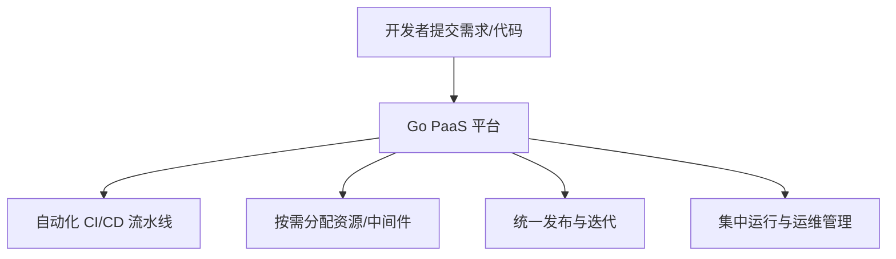
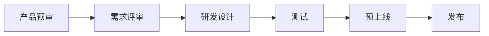
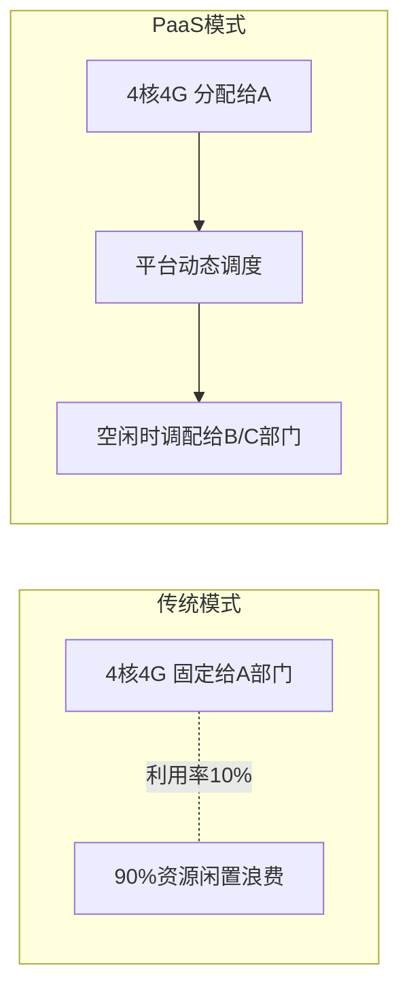

# Go PaaS 平台开发: 什么是云原生 Go PaaS 平台及其优势

## 纲要

- PaaS 定义：平台即服务，提供开发、运行、管理应用的完整云平台
- PaaS 的价值：让发布、运行、管理像本地构建一样高效、低成本、低复杂度
- 三大核心优势：缩短产品上市周期、提升研发团队灵活性、降低总成本
- 传统研发流程 vs PaaS 流程的对比
- 资源按需调配：从"固定划分"到"动态调度"，消除资源浪费

## 什么是云原生 Go PaaS 平台

PaaS 即 **Platform as a Service（平台即服务）**。它的字面含义是为应用的**开发、运行、管理**提供一个完整的平台；从计算模型上看，它向使用者提供一整套云平台能力，让应用的发布、迭代与发布策略都可以通过平台统一操作。

云原生 Go PaaS 平台，特指以 **Go 语言**构建、深度贴合 **Kubernetes** 等云原生标准的 PaaS 平台。引入 PaaS 之后，所有的发布、运行与管理操作都变得像在本地构建一样：高效、低成本，且整体复杂度相比"无平台时代"大幅下降。

## 优势一：缩短产品上市周期

传统研发方式依赖 CICD，流程漫长且跨部门沟通成本高：

上述每个环节都需要多个部门反复沟通，其中大量时间是技术上可避免的损耗。例如需求开发完成后，分支合并、对应分支的配置、自动化测试接口都必须同步合入，在没有 PaaS 时这类协同极为耗时。

有了 PaaS 平台，一整套研发相关能力被整合进平台：开发者在本地提交完一个需求后，后续操作全部自动化。上市时间被大幅压缩，这直接意味着公司的组织能力、产品管理与竞争力提升——时间就是金钱。

## 优势二：为研发团队提供灵活性

在没有 PaaS 时，申请一个 MySQL 实例或开通运维权限，都要与运维部门反复沟通：由运维准备好资源再回传关键信息，一旦出错又要重新走一遍流程，严重制约研发灵活性。

有了 PaaS 平台，研发团队获得"自助式"能力：

- 有一个好的架构调整想法想要验证，直接在平台上**创建所需中间件**、**快速部署已开发好的 Demo**；
- 无需漫长沟通即可快速验证架构模型。

这对研发团队是一种极大的解放，提供了前所未有的便利。

## 优势三：显著降低总成本

总成本包含两部分：**显性成本**（看得见的资源成本）与**隐性成本**（沟通、协作损耗）。

传统模式下，资源按部门固定划分。例如为某部门划分 4 核 4G，无论使用与否都长期占用，假设年利用率仅 10%，其余 90% 的资源无法被其他部门复用，造成巨大浪费。

PaaS 平台支持**按需分配与动态调度**：即使初始分配了 4 核 4G，当部门未使用时，平台可把资源动态调配给其他部门。从实际效果看，这能极大降低总成本，是 PaaS 非常强的一项优势。

## 小结

云原生 Go PaaS 平台通过整合研发全流程、提供自助式资源与中间件、并实现资源动态调度，在**上市周期、研发灵活性、总成本**三个维度同时带来质变。这也是为什么它正成为大厂与中小企业共同的技术基座。

相关度：100%。是否需要继续：是。代码是否可运行：否。
