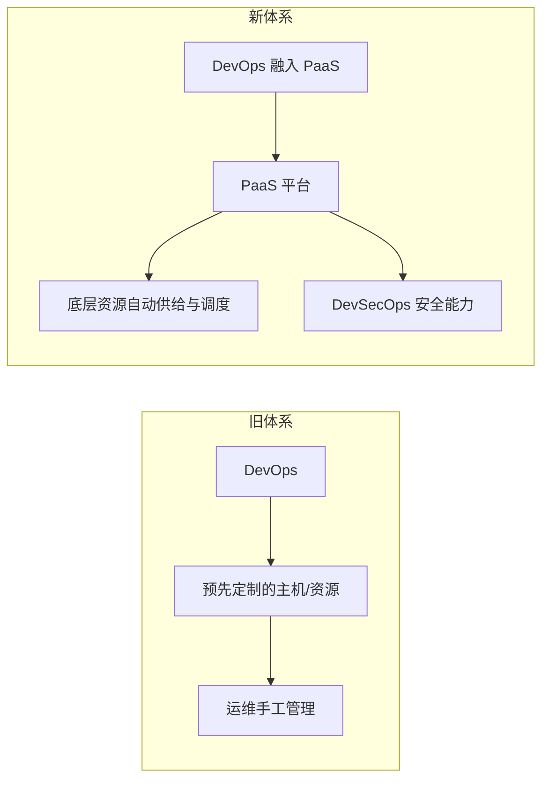
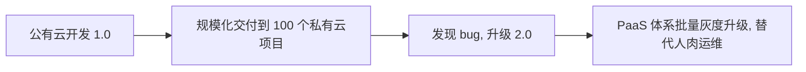

# Go PaaS 平台开发: 云原生 Go PaaS 平台与 DevOps 的关系

## 纲要

- DevOps 定位：规范上线发布流程、解决开发-运维协作与自动化测试/静态检测的研发流水线体系
- 融合趋势：DevOps 正与 PaaS 平台融合，成为平台的组成部分
- 资源治理下沉：底层资源供给与调度逻辑交由 PaaS 平台承担，运维不再手工管理主机
- 规模化交付：公有云 + 私有云的多项目规模化交付，正基于 PaaS 体系融入 DevOps

## DevOps 是什么

DevOps 是一套开发与运维协作的平台与系统，各公司有各自的开发流程与规范。相比"没有 CICD"的时代，DevOps 极大规范了上线发布流程——**每个公司的 DevOps 流程，直接决定了研发效率**。

它主要解决两类问题：

- 开发与运维之间的协作效率；
- 测试自动化、代码静态检测等环节，属于**流水线（pipeline）**的范畴。

## DevOps 与 PaaS 的融合

在新一代云原生体系下，DevOps 会与 PaaS 平台深度融合，最终成为 PaaS 平台的一部分。云原生 PaaS 平台将包含 DevOps 能力，甚至涵盖较新的方向，例如 **DevSecOps（安全 DevOps）**。在这种模式下，开发与安全相关实践都基于 PaaS 平台进行，平台直接把底层服务供给给 DevOps 系统使用。

## 资源治理下沉到 PaaS

在没有 PaaS 之前，DevOps 管理的服务器、主机都是预先定制好的，中间资源缺乏良好管理，仍依赖运维人工维护。

引入 PaaS 平台后：

- 底层资源的供给由平台负责；
- 中间的调配、业务逻辑相关的资源计算，都可以交给 PaaS 平台完成。

运维从"手工管理主机"中解放，研发与运维的协作被平台标准化。

## 规模化交付：DevOps 的新战场

传统理解中，DevOps 往往只是把产品发布到公有云。但在国内行业里，这远远不够：

- 大厂（如阿里、字节）产品主要面向互联网，发到公有云即结束；
- 大量外包公司、项目型公司，仅发到公有云还不够，还需要把公有云上的产品**搬到私有云**，面向私有化交付。

当项目变多，就会遇到**规模化交付**问题。例如开发完 1.0 版本后，规模化交付到 100 个项目；过段时间发现严重 bug 升级到 2.0，就要对 100 多个项目逐一升级。在没有 PaaS 体系前，这靠"人肉运维"逐个更新，效率极低且极易出错。

未来，规模化交付将融入 DevOps，并基于 PaaS 平台体系进行开发与管理——这正是云原生 PaaS 与 DevOps 相辅相成的关键所在。

## 小结

DevOps 解决了研发流水线与协作效率，而云原生 Go PaaS 平台将 DevOps（含安全）收编为自身能力，接管底层资源供给与调度，并支撑公有云到私有云的规模化交付。二者是"平台承载流水线"的共生关系。

相关度：100%。是否需要继续：是。代码是否可运行：否。
