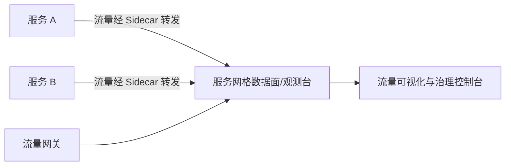

# Go PaaS 平台开发: 云原生 PaaS 平台与服务网格的关系

## 纲要

- 服务网格（Service Mesh）定位：下一代微服务架构
- 诞生背景：单体拆分微服务后，治理与可观测性成本高，配套设施需大量自研
- 核心能力：成熟的观测台（流量可视化）、服务间关系可视、基于 Sidecar 的流量转发与治理
- 与 PaaS 的关系：服务网格自身功能基础，生产级治理需借助 PaaS 平台系统性管理

## 什么是服务网格

服务网格（Service Mesh）被称为**下一代微服务架构**。当前主流微服务多由各类微服务框架（如 Java 生态的 Spring Boot、Spring Cloud 等）编写而成。当传统单体应用被拆分为微服务后，服务治理与可观测性变得困难——流量管控、配套基础设施都需要开发投入大量精力去维护和自研。

服务网格正是为解决这个问题而被研发出来的方案。

## 服务网格解决了什么问题

传统微服务中，链路追踪等能力虽存在，但**不成体系**。服务网格的优势在于：

1. **体系化的可观测性**：提供成熟的观测台，将所有流量及服务间调用关系直观呈现。例如哪些流量打到流量网关、哪些在服务间流转，都能清晰观测。这种流量可视化在定位问题时极为常见。
2. **Sidecar 架构治理**：除单体应用自身的服务治理外，服务网格在网络层采用新的架构——所有流量通过其自身组件进行转发，从而更好地治理和控制微服务。

## 服务网格与 PaaS 平台的关系

服务网格的治理与控制，是**建立在云原生 PaaS 平台之上**进行管理的：

- 如果仅有服务网格自身，功能相对基础；
- 生产环境所需的系统性能力，还需要借助 PaaS 平台进行统一管理。

也就是说，PaaS 平台为服务网格提供了底层资源、部署编排与统一管控的能力，使其从"基础网格"升级为"生产级服务体系"。二者是**基础能力 + 平台管控**的互补关系。

## 小结

服务网格用体系化的可观测性与 Sidecar 流量治理，解决了微服务拆分后的治理难题；而要把它用在生产环境，离不开云原生 PaaS 平台提供的系统性管理。服务网格负责"治理流量"，PaaS 平台负责"承载与管控"。

## 📎 文本↔代码关联

本讲在课程知识图谱（见 `_GRAPH.json` / `_GRAPH.mmd`）中关联以下代码文件：

- `code/课件/go-paas-html/pages-404.html`
- `code/课件/go-paas-html/pages-forgot-password.html`
- `code/课件/go-paas-html/pages-login.html`
- `code/课件/go-paas-html/pages-login2.html`
- `code/课件/go-paas-html/pages-sign-up.html`
- `code/课件/go-paas-html/layouts-nosidebars.html`
- `code/课件/go-paas-front/volume-create.html`
- `code/课件/go-paas-front/route-create.html`

> 关联由 `scan_course.py` 自动建立，边类型 `uses-code`（讲次 → 代码）。

相关度：100%。是否需要继续：是。代码是否可运行：否。
