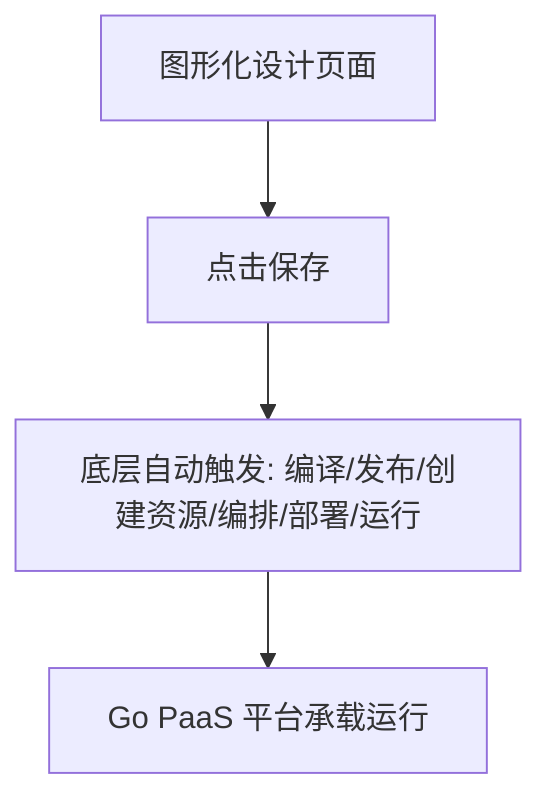

# Go PaaS 平台开发: 云原生 Go PaaS 平台与低代码的关系

## 纲要

- 低代码定位：通过图形化（拖拽）编程快速生成源码、落地业务
- 发展趋势：大厂相继开源低代码平台，解决重复编码、聚焦业务的问题
- 核心机制：低代码生成源码后，运行在 PaaS 平台之上
- 对 PaaS 的要求：低代码需要平台具备极高的自制力与自动化能力（编译、发布、资源创建、编排、部署）
- 权威预测：Gartner 预计 2025 年 95% 的低代码平台将采用 PaaS 与云原生技术
- 二者关系：相辅相成、相互促进，低代码工程化理念也将基于 PaaS 扩展

## 什么是低代码

低代码是当下的技术风口。它的作用是通过**图形化编程（拖拽）**的方式，快速生成源码、快速落地业务。相比传统开发方式，这种图形化拖拽在速度上优势明显。

过去一些外包公司也有类似工具，但那只是为解决当时特定业务，并未形成低代码的理论体系与生态架构。而近几年发展起来的低代码平台——包括大厂（如阿里、字节等）相继开源的方案——能很好地解决互联网行业开发效率低下、重复编码的问题，让开发者把精力放到业务本身。低代码既是当下的风口，也是未来的发展方向。

## 低代码为什么依赖 PaaS 平台

低代码的主流做法，是生成自己的源码，再把源码**运行在 PaaS 平台中**。原因在于：低代码的核心在图形化编程这一层，而图形化编程势必需要高度自动化的底层支撑。

底层的自动化操作包括：开发编译、自动化发布、自动创建资源、自动编排、自动部署与运行。上层只需图形化设计，底层一点"保存"就启动整套流程。相较之前的 DevOps，低代码对 PaaS 平台提出了**更高的自制力与自动化能力**要求。

## 权威预测与未来关系

据权威预测机构 Gartner 的预测，到 2025 年约 **95%** 的低代码平台将采用 PaaS 平台及相关的云原生技术。低代码后续的发展，与 PaaS 平台、云原生有着密不可分的关系——二者是**相辅相成、相互促进**的关系。

此外，低代码工程化管理的思维与理念，其落地也将在 PaaS 平台基础上进行扩展。因此，云原生 PaaS 平台对低代码起着举足轻重的作用。

## 小结

低代码用图形化编程屏蔽重复编码、聚焦业务价值；而它的自动化底座（编译、发布、资源、编排、部署）必须由 PaaS 平台提供。随着 95% 低代码平台转向云原生，PaaS 平台已成为低代码不可或缺的运行载体，二者深度绑定、互相成就。

相关度：100%。是否需要继续：是。代码是否可运行：否。
