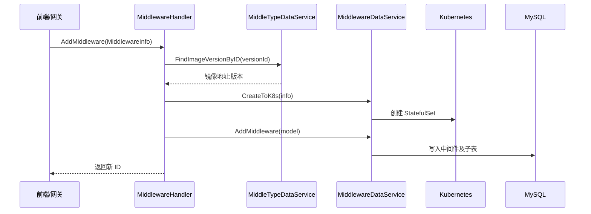

# Go PaaS 平台开发: 中间件主程序调整与 Handler 开发（上）

## 纲要

- `main.go` 需要在启动时初始化数据表，并把 `Middleware` 与 `MiddleType` 两套数据服务注册到 RPC Handler。
- 注册时 Handler 的字段类型是接口（`IMiddlewareDataService` / `IMiddleTypeDataService`），而非具体实现。
- `MiddlewareHandler` 实现 proto 定义的所有 RPC 方法，包含添加、删除、更新、按 ID 查询、查询全部、按类型查询。
- 添加流程：先把请求转换为 model → 用类型服务查镜像地址 → 在 K8s 创建资源 → 写库 → 返回 ID。
- 删除流程：先按 ID 查出 model → 从 K8s 删除 → 级联删库记录。

## main.go 的关键调整

在 `main` 函数中，除了常规的注册中心、配置中心、MySQL、链路追踪、监控外，需要两处与中间件相关的改动：初始化数据表与注册 Handler。

```go
// 7. 创建服务
service := micro.NewService(
	micro.Server(server.NewServer(func(options *server.Options) {
		options.Advertise = serviceHost + ":" + servicePort
	})),
	micro.Name("go.micro.service.middleware"),
	micro.Version("latest"),
	micro.Address(":"+servicePort),
	micro.Registry(consul),
	micro.WrapHandler(opentracing2.NewHandlerWrapper(opentracing.GlobalTracer())),
	micro.WrapClient(opentracing2.NewClientWrapper(opentracing.GlobalTracer())),
	micro.WrapHandler(ratelimit.NewHandlerWrapper(1000)),
)

service.Init()

// 初始化表（只执行一遍，执行完建议注释掉）
// err = repository.NewMiddlewareRepository(db).InitTable()
// err = repository.NewMiddleTypeRepository(db).InitTable()

// 注册句柄：同时注入中间件实例服务与类型服务
middlewareDataService := service2.NewMiddlewareDataService(
	repository.NewMiddlewareRepository(db), clientset)
middleTypeDataService := service2.NewMiddleTypeDataService(
	repository.NewMiddleTypeRepository(db))

middleware.RegisterMiddlewareHandler(service.Server(), &handler.MiddlewareHandler{
	MiddlewareDataService:  middlewareDataService,
	MiddleTypeDataService:  middleTypeDataService,
})

if err := service.Run(); err != nil {
	common.Fatal(err)
}
```

### 要点

- `InitTable` 只执行一次，用于建表；生产环境执行后通常注释掉，避免重复建表。
- Handler 注入的是两个**接口类型**的数据服务，与后续方法实现解耦。
- 两个数据服务都依赖同一个 `*gorm.DB` 连接，K8s 客户端 `clientset` 仅中间件服务需要。

## Handler 结构体

```go
package handler

import (
	"context"
	"git.imooc.com/coding-535/common"
	"git.imooc.com/coding-535/middleware/domain/model"
	"git.imooc.com/coding-535/middleware/domain/service"
	middleware "git.imooc.com/coding-535/middleware/proto/middleware"
	"log"
)

type MiddlewareHandler struct {
	// 注意这里的类型是 IMiddlewareDataService 接口类型
	MiddlewareDataService service.IMiddlewareDataService
	// 添加中间件类型服务
	MiddleTypeDataService service.IMiddleTypeDataService
}
```

## 添加中间件

```go
func (e *MiddlewareHandler) AddMiddleware(ctx context.Context, info *middleware.MiddlewareInfo, rsp *middleware.Response) error {
	log.Info("Received *middleware.AddMiddleware request")
	middleModel := &model.Middleware{}
	if err := common.SwapTo(info, middleModel); err != nil {
		common.Error(err)
		rsp.Msg = err.Error()
		return err
	}
	// 调用其它服务处理数据：根据版本 ID 查出需要的镜像地址
	imageAddress, err := e.MiddleTypeDataService.FindImageVersionByID(info.MiddleVersionId)
	if err != nil {
		common.Error(err)
		return err
	}
	// 赋值镜像版本
	info.MiddleDockerImageVersion = imageAddress
	// 在 K8s 中创建资源
	if err := e.MiddlewareDataService.CreateToK8s(info); err != nil {
		common.Error(err)
		rsp.Msg = err.Error()
		return err
	}
	// 插入数据库
	middleID, err := e.MiddlewareDataService.AddMiddleware(middleModel)
	if err != nil {
		common.Error(err)
		rsp.Msg = err.Error()
		return err
	}
	rsp.Msg = "中间件添加成功 ID 号为：" + strconv.FormatInt(middleID, 10)
	common.Info(rsp.Msg)
	return nil
}
```

## 删除与更新

```go
func (e *MiddlewareHandler) DeleteMiddleware(ctx context.Context, req *middleware.MiddlewareId, rsp *middleware.Response) error {
	log.Info("Received *middleware.DeleteMiddleware request")
	middleModel, err := e.MiddlewareDataService.FindMiddlewareByID(req.Id)
	if err != nil {
		common.Error(err)
		rsp.Msg = err.Error()
		return err
	}
	// 删除 K8s 中资源（内部会级联删库）
	if err := e.MiddlewareDataService.DeleteFromK8s(middleModel); err != nil {
		common.Error(err)
		rsp.Msg = err.Error()
		return err
	}
	return nil
}

func (e *MiddlewareHandler) UpdateMiddleware(ctx context.Context, req *middleware.MiddlewareInfo, rsp *middleware.Response) error {
	log.Info("Received *middleware.UpdateMiddleware request")
	if err := e.MiddlewareDataService.UpdateToK8s(req); err != nil {
		common.Error(err)
		rsp.Msg = err.Error()
		return err
	}
	middleModle, err := e.MiddlewareDataService.FindMiddlewareByID(req.Id)
	if err != nil {
		common.Error(err)
		rsp.Msg = err.Error()
		return err
	}
	if err := common.SwapTo(req, middleModle); err != nil {
		common.Error(err)
		rsp.Msg = err.Error()
		return err
	}
	if err := e.MiddlewareDataService.UpdateMiddleware(middleModle); err != nil {
		common.Error(err)
		rsp.Msg = err.Error()
		return err
	}
	return nil
}
```

## 查询方法

```go
func (e *MiddlewareHandler) FindMiddlewareByID(ctx context.Context, req *middleware.MiddlewareId, rsp *middleware.MiddlewareInfo) error {
	middlewareModel, err := e.MiddlewareDataService.FindMiddlewareByID(req.Id)
	if err != nil {
		common.Error(err)
		return err
	}
	if err := common.SwapTo(middlewareModel, rsp); err != nil {
		common.Error(err)
		return err
	}
	return nil
}

func (e *MiddlewareHandler) FindAllMiddleware(ctx context.Context, req *middleware.FindAll, rsp *middleware.AllMiddleware) error {
	allMiddleware, err := e.MiddlewareDataService.FindAllMiddleware()
	if err != nil {
		common.Error(err)
		return err
	}
	for _, v := range allMiddleware {
		middleInfo := &middleware.MiddlewareInfo{}
		if err := common.SwapTo(v, middleInfo); err != nil {
			common.Error(err)
			return err
		}
		rsp.MiddlewareInfo = append(rsp.MiddlewareInfo, middleInfo)
	}
	return nil
}

func (e *MiddlewareHandler) FindAllMiddlewareByTypeID(ctx context.Context, req *middleware.FindAllByTypeId, rsp *middleware.AllMiddleware) error {
	allMiddleware, err := e.MiddlewareDataService.FindAllMiddlewareByTypeID(req.TypeId)
	if err != nil {
		common.Error(err)
		return err
	}
	for _, v := range allMiddleware {
		middleInfo := &middleware.MiddlewareInfo{}
		if err := common.SwapTo(v, middleInfo); err != nil {
			common.Error(err)
			return err
		}
		rsp.MiddlewareInfo = append(rsp.MiddlewareInfo, middleInfo)
	}
	return nil
}
```

## 数据流示意



## API 速览

| RPC 方法 | 入参 | 行为 |
| --- | --- | --- |
| `AddMiddleware` | `MiddlewareInfo` | 查镜像 → 建 K8s → 写库 |
| `DeleteMiddleware` | `MiddlewareId` | K8s 删除 → 级联删库 |
| `UpdateMiddleware` | `MiddlewareInfo` | 更新 K8s → 更新库 |
| `FindMiddlewareByID` | `MiddlewareId` | 按 ID 查询 |
| `FindAllMiddleware` | `FindAll` | 查询全部 |
| `FindAllMiddlewareByTypeID` | `FindAllByTypeId` | 按类型查询列表 |

## 总结

## 📎 文本↔代码关联

本讲在课程知识图谱（见 `_GRAPH.json` / `_GRAPH.mmd`）中关联以下代码文件：

- `code/课件/appstore/domain/model/app_comment.go`
- `code/课件/base/domain/model/base.go`
- `code/课件/appstore/domain/model/app_category.go`
- `code/课件/appstore/domain/model/app_pod.go`
- `code/课件/appstore/domain/model/app_middle.go`
- `code/课件/docker-compose/chapter3/elasticsearch/config/elasticsearch.yml`
- `code/课件/appstore/domain/model/app_volume.go`
- `code/课件/appstore/domain/model/app_isv.go`

> 关联由 `scan_course.py` 自动建立，边类型 `uses-code`（讲次 → 代码）。

相关度：100%。是否需要继续：是。代码是否可运行：是（依赖 proto 生成代码、common 包、service 与 repository 实现，编译通过；运行需 consul/MySQL/K8s 可达）。
