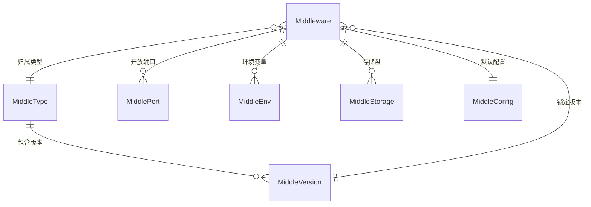

# Go PaaS 平台开发: 中间件主模型 Middleware 设计与关联结构体

## 纲要

- 中间件（Middleware）是 PaaS 平台动态供给的基础设施组件（如 MySQL、Redis、Consul），本章通过一个独立的 `middleware` 微服务来管理它们的生命周期。
- 主模型 `Middleware` 描述一个中间件实例的核心属性：名称、命名空间、类型、版本、CPU/内存、副本数，并通过外键关联一组子表。
- 与 `Middleware` 关联的子模型包括：`MiddlePort`（端口）、`MiddleConfig`（默认账号密码）、`MiddleEnv`（环境变量）、`MiddleStorage`（存储盘）。
- 中间件类型与版本由独立的 `MiddleType` / `MiddleVersion` 模型描述，二者是「一对多」关系。
- 全部模型使用 GORM 标签定义表结构，并通过 `ForeignKey` 建立主子表关系，本章后续 repository / service / handler 都围绕这些模型展开。

## 主模型 Middleware

`Middleware` 是整章的核心聚合根。它把「中间件实例」需要落库的所有信息集中到一个结构体，再以外键方式挂接端口、配置、环境变量和存储盘四类子资源。

```go
package model

type Middleware struct {
	ID int64 `gorm:"primary_key;not_null;auto_increment"`
	// 中间件的名称
	MiddleName string `json:"middle_name"`
	// 中间件创建的命名空间
	MiddleNamespace string `json:"middle_namespace"`
	// 中间件的类型
	MiddleTypeID int64 `json:"middle_type_id"`
	// 中间件的版本
	MiddleVersionID int64 `json:"middle_version_id"`
	// 中间件的端口
	MiddlePort []MiddlePort `gorm:"ForeignKey:MiddleID" json:"middle_port"`
	// 默认生成的账号密码
	MiddleConfig MiddleConfig `gorm:"ForeignKey:MiddleID" json:"middle_config"`
	// 环境变量
	MiddleEnv []MiddleEnv `gorm:"ForeignKey:MiddleID" json:"middle_env"`
	// 中间件的 CPU
	MiddleCpu float32 `json:"middle_cpu"`
	// 中间件内存
	MiddleMemory float32 `json:"middle_memory"`
	// 中间件存储
	MiddleStorage []MiddleStorage `gorm:"ForeignKey:MiddleID" json:"middle_storage"`
	// 中间件副本
	MiddleReplicas int32 `json:"middle_replicas"`
}
```

### 字段含义梳理

- `MiddleName`：中间件实例名，同时也是在 Kubernetes 中创建的 `StatefulSet` 名称。
- `MiddleNamespace`：实例部署的命名空间，对应 K8s 的 namespace。
- `MiddleTypeID` 与 `MiddleVersionID`：分别指向中间件「类型」（MySQL/Redis/Consul…）与「具体镜像版本」。二者解耦——同一类型可以挂着多个版本。
- `MiddlePort / MiddleConfig / MiddleEnv / MiddleStorage`：四个关联子表，使用 GORM 的 `ForeignKey:MiddleID` 建立一对多（端口、环境变量、存储）或一对一（配置）关系。
- `MiddleCpu / MiddleMemory / MiddleReplicas`：资源与副本规格。注意 CPU、内存描述的是「单副本」用量，多副本时实际集群占用会翻倍。

## 关联模型：类型与版本

中间件并非只有实例本身，平台还需要维护「有哪些类型、每种类型有哪些镜像版本」。`MiddleType` 与 `MiddleVersion` 承担这一职责：

```go
package model

// 中间件类型
type MiddleType struct {
	ID int64 `gorm:"primary_key;not_null;auto_increment" json:"id"`
	// 中间件类型名称
	MiddleTypeName string `json:"middle_type_name"`
	// 中间件图片地址
	MiddleTypeImageSrc string `json:"middle_type_image_src"`
	// 中间件的版本
	MiddleVersion []MiddleVersion `gorm:"ForeignKey:MiddleTypeID" json:"middle_version"`
}

type MiddleVersion struct {
	ID int64 `gorm:"primary_key;not_null;auto_increment" json:"id"`
	MiddleTypeID int64 `json:"middle_type_id"`
	// 镜像地址
	MiddleDockerImage string `json:"middle_docker_image"`
	// 镜像版本
	MiddleVS string `json:"middle_vs"`
	// 实际使用时以 middle_docker_image:middle_vs 组合成完整镜像
}
```

## 关联模型：存储盘

有状态中间件（如 MySQL、Redis）需要把数据持久化到存储盘。`MiddleStorage` 描述挂载需求：

```go
package model

// 中间件的存储盘
type MiddleStorage struct {
	ID int64 `gorm:"primary_key;not_null;auto_increment" json:"id"`
	// 关联的中间件 ID
	MiddleID int64 `json:"middle_id"`
	// 存储名称
	MiddleStorageName string `json:"middle_storage_name"`
	// 存储的大小
	MiddleStorageSize float32 `json:"middle_storage_size"`
	// 存储需要挂载的目录
	MiddleStoragePath string `json:"middle_storage_path"`
	// 存储创建的类型
	MiddleStorageClass string `json:"middle_storage_class"`
	// 存储的权限
	MiddleStorageAccessMode string `json:"middle_storage_access_mode"`
}
```

## 模型层级关系



## API 速览

本章所有模型均通过 GORM 持久化，对外并不直接暴露 CRUD，而是通过 repository 接口间接访问。以主模型相关的仓储接口为例：

```go
// 创建中间件记录
CreateMiddleware(*model.Middleware) (int64, error)
// 根据 ID 查询（含关联需 Preload）
FindMiddlewareByID(int64) (*model.Middleware, error)
// 根据类型查询该类型下全部中间件
FindAllByTypeID(int64) ([]model.Middleware, error)
```

## 总结

## 📎 文本↔代码关联

本讲在课程知识图谱（见 `_GRAPH.json` / `_GRAPH.mmd`）中关联以下代码文件：

- `code/课件/go-paas-html/email-compose.html`
- `code/课件/docker-compose/chapter3/elasticsearch/config/elasticsearch.yml`
- `code/课件/docker-compose/chapter3/kibana/config/kibana.yml`
- `code/课件/docker-compose/chapter3/logstash/config/logstash.yml`
- `code/课件/docker-compose/chapter3/logstash/pipeline/logstash.conf`
- `code/课件/common/swap.go`
- `code/课件/docker-compose/chapter2/docker-compose.yml`
- `code/课件/appstore/domain/model/app_comment.go`

> 关联由 `scan_course.py` 自动建立，边类型 `uses-code`（讲次 → 代码）。

相关度：100%。是否需要继续：是。代码是否可运行：否（本篇为模型定义，需配合 repository/service 及 GORM 初始化方可运行）。
