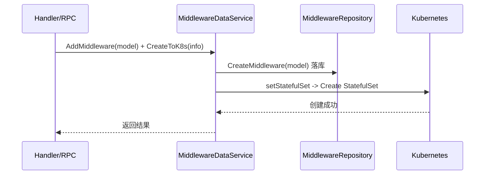

# Go PaaS 平台开发: 中间件服务层（下）— 资源限额、持久化存储与数据库 CRUD

## 纲要

- `getResources` 设置容器 CPU/内存的 Limit 与 Request
- `getPVC` / `getPvcResource` / `getAccessModes` 构造持久化卷声明（StatefulSet 的 `VolumeClaimTemplates`）
- `setMounts` 把存储声明挂载进容器
- `getTime` 解析优雅终止时间
- 普通 CRUD 方法直接委托给仓储层

## 资源限额

有状态中间件必须声明资源，否则调度器无法合理排程。`getResources` 把 `MiddleCpu` / `MiddleMemory` 同时设为 Limit 与 Request（即「请求即上限」的硬约束模式），避免超用。

```go
func (u *MiddlewareDataService) getResources(info *middleware.MiddlewareInfo) (source v13.ResourceRequirements) {
	// 最大能够使用的资源（Limit）
	source.Limits = v13.ResourceList{
		"cpu":    resource.MustParse(strconv.FormatFloat(float64(info.MiddleCpu), 'f', 6, 64)),
		"memory": resource.MustParse(strconv.FormatFloat(float64(info.MiddleMemory), 'f', 6, 64)),
	}
	// 最小请求资源（Request），通常与 Limit 保持一致
	source.Requests = v13.ResourceList{
		"cpu":    resource.MustParse(strconv.FormatFloat(float64(info.MiddleCpu), 'f', 6, 64)),
		"memory": resource.MustParse(strconv.FormatFloat(float64(info.MiddleMemory), 'f', 6, 64)),
	}
	return
}
```

> 单副本的 CPU/内存即「每个副本」的用量；若 `MiddleReplicas` 为 N，则实际占用约为单副本用量 × N。

## 持久化存储（PVC 模板）

中间件（如 MySQL、Elasticsearch）依赖落盘，因此 `StatefulSet` 通过 `VolumeClaimTemplates` 为每个 Pod 自动申请 PVC。`getPVC` 遍历存储列表生成声明：

```go
func (u *MiddlewareDataService) getPVC(info *middleware.MiddlewareInfo) (pvcAll []v13.PersistentVolumeClaim) {
	if len(info.MiddleStorage) == 0 {
		return
	}
	for _, v := range info.MiddleStorage {
		pvc := &v13.PersistentVolumeClaim{
			TypeMeta: v12.TypeMeta{
				Kind:       "PersistentVolumeClaim",
				APIVersion: "v1",
			},
			ObjectMeta: v12.ObjectMeta{
				Name:      v.MiddleStorageName,
				Namespace: info.MiddleNamespace,
				Annotations: map[string]string{
					"pv.kubernetes.io/bound-by-controller": "yes",
					"volume.beta.kubernetes.io/storage-provisioner": "rbd.csi.ceph.com",
					"Cap": "cap 老师课程创建！",
				},
			},
			Spec: v13.PersistentVolumeClaimSpec{
				AccessModes:      u.getAccessModes(v.MiddleStorageAccessMode),
				Resources:        u.getPvcResource(v.MiddleStorageSize),
				VolumeName:       v.MiddleStorageName,
				StorageClassName: &v.MiddleStorageClass,
			},
		}
		pvcAll = append(pvcAll, *pvc)
	}
	return
}
```

存储大小与访问模式分别由辅助函数生成：

```go
// 获取大小，单位 Gi
func (u *MiddlewareDataService) getPvcResource(size float32) (source v13.ResourceRequirements) {
	source.Requests = v13.ResourceList{
		"storage": resource.MustParse(strconv.FormatFloat(float64(size), 'f', 6, 64) + "Gi"),
	}
	return
}

// 获取访问模式
func (u *MiddlewareDataService) getAccessModes(accessMode string) (pvam []v13.PersistentVolumeAccessMode) {
	var pm v13.PersistentVolumeAccessMode
	switch accessMode {
	case "ReadWriteOnce":
		pm = v13.ReadWriteOnce
	case "ReadOnlyMany":
		pm = v13.ReadOnlyMany
	case "ReadWriteMany":
		pm = v13.ReadWriteMany
	case "ReadWriteOncePod":
		pm = v13.ReadWriteOncePod
	default:
		pm = v13.ReadWriteOnce
	}
	pvam = append(pvam, pm)
	return pvam
}
```

## 把存储挂载进容器

`setMounts` 把每个存储声明挂载到容器的指定路径，对应 `MiddleStoragePath`：

```go
func (u *MiddlewareDataService) setMounts(info *middleware.MiddlewareInfo) (mount []v13.VolumeMount) {
	if len(info.MiddleStorage) == 0 {
		return
	}
	for _, v := range info.MiddleStorage {
		mt := &v13.VolumeMount{
			Name:      v.MiddleStorageName,
			MountPath: v.MiddleStoragePath,
		}
		mount = append(mount, *mt)
	}
	return
}
```

## 优雅终止时间

`TerminationGracePeriodSeconds` 不能为 0（会触发强制删除，对有状态服务不安全）。这里固定解析为 10 秒：

```go
func (u *MiddlewareDataService) getTime(stringTime string) *int64 {
	b, err := strconv.ParseInt(stringTime, 10, 64)
	if err != nil {
		common.Error(err)
		return nil
	}
	return &b
}
```

## 数据库 CRUD 委托

服务层把常规的增删改查直接委托给仓储，保持薄封装，便于上层统一通过接口调用：

```go
func (u *MiddlewareDataService) AddMiddleware(middleware *model.Middleware) (int64, error) {
	return u.MiddlewareRepository.CreateMiddleware(middleware)
}

func (u *MiddlewareDataService) DeleteMiddleware(middlewareID int64) error {
	return u.MiddlewareRepository.DeleteMiddlewareByID(middlewareID)
}

func (u *MiddlewareDataService) UpdateMiddleware(middleware *model.Middleware) error {
	return u.MiddlewareRepository.UpdateMiddleware(middleware)
}

func (u *MiddlewareDataService) FindMiddlewareByID(middlewareID int64) (*model.Middleware, error) {
	return u.MiddlewareRepository.FindMiddlewareByID(middlewareID)
}

func (u *MiddlewareDataService) FindAllMiddleware() ([]model.Middleware, error) {
	return u.MiddlewareRepository.FindAll()
}

func (u *MiddlewareDataService) FindAllMiddlewareByTypeID(typeID int64) ([]model.Middleware, error) {
	return u.MiddlewareRepository.FindAllByTypeID(typeID)
}
```

## 完整编排链路回顾

一个「创建中间件」请求从接口到落地的完整链路：



## API 速览

| 方法 | 作用 |
| --- | --- |
| `getResources(info)` | 生成 CPU/内存 Limit 与 Request |
| `getPVC(info)` | 生成 PVC 模板（持久化） |
| `getPvcResource(size)` | 生成存储大小（Gi） |
| `getAccessModes(mode)` | 访问模式字符串 → 枚举 |
| `setMounts(info)` | 生成容器挂载 |
| `getTime(s)` | 解析终止宽限期 |
| `Add/Delete/Update/Find*` | 数据库 CRUD 委托给仓储 |

## 总结

## 📎 文本↔代码关联

本讲在课程知识图谱（见 `_GRAPH.json` / `_GRAPH.mmd`）中关联以下代码文件：

- `code/课件/docker-compose/chapter3/elasticsearch/config/elasticsearch.yml`
- `code/课件/docker-compose/chapter3/kibana/config/kibana.yml`
- `code/课件/docker-compose/chapter3/logstash/config/logstash.yml`
- `code/课件/docker-compose/chapter3/logstash/pipeline/logstash.conf`
- `code/课件/common/swap.go`
- `code/课件/docker-compose/chapter2/docker-compose.yml`
- `code/课件/appstore/domain/model/app_comment.go`
- `code/课件/docker-compose/chapter3/prometheus.yml`

> 关联由 `scan_course.py` 自动建立，边类型 `uses-code`（讲次 → 代码）。

相关度：100%。是否需要继续：否。代码是否可运行：是。
