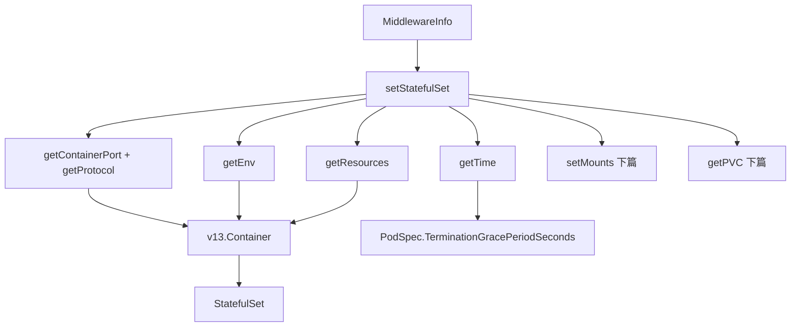

# Go PaaS 平台开发: 中间件服务层开发（三）—— StatefulSet 容器规格构建

## 纲要

- `MiddlewareDataService` 是把「中间件表单参数」落盘到 Kubernetes 的核心，它同时承担两类职责：数据库 CRUD 与 K8s 资源操作。
- `setStatefulSet` 负责组装一个完整的 `StatefulSet` 骨架：副本数、标签选择器、Pod 模板、PVC 模板。
- 容器规格由若干小而专的函数拼装：端口（`getContainerPort` / `getProtocol`）、环境变量（`getEnv`）、资源配额（`getResources`）、优雅删除时间（`getTime`）。
- 本篇聚焦「容器规格」相关的字段映射；存储盘（PVC）与挂载的构建见服务层（下）。

## 服务接口：CRUD 与 K8s 操作并存

`IMiddlewareDataService` 同时定义了持久化方法与集群操作方法，二者都基于同一个 `MiddlewareRepository` 与 `K8sClientSet`：

```go
type IMiddlewareDataService interface {
	// 数据库 CRUD
	AddMiddleware(*model.Middleware) (int64, error)
	DeleteMiddleware(int64) error
	UpdateMiddleware(*model.Middleware) error
	FindMiddlewareByID(int64) (*model.Middleware, error)
	FindAllMiddleware() ([]model.Middleware, error)
	// 根据类型查找中间件
	FindAllMiddlewareByTypeID(int64) ([]model.Middleware, error)
	// 操作 K8s 中的中间件
	CreateToK8s(*middleware.MiddlewareInfo) error
	DeleteFromK8s(*model.Middleware) error
	UpdateToK8s(*middleware.MiddlewareInfo) error
}
```

构造函数把仓储与 K8s 客户端注入，供后续所有方法复用：

```go
func NewMiddlewareDataService(
	middlewareRepository repository.IMiddlewareRepository,
	clientSet *kubernetes.Clientset,
) IMiddlewareDataService {
	return &MiddlewareDataService{
		MiddlewareRepository: middlewareRepository,
		K8sClientSet:         clientSet,
	}
}
```

## StatefulSet 骨架

有状态中间件（如 MySQL、Redis）在 K8s 中以 `StatefulSet` 部署，便于稳定的网络标识与持久化。工厂方法 `setStatefulSet` 把 `MiddlewareInfo` 映射成资源对象：

```go
func (u *MiddlewareDataService) setStatefulSet(info *middleware.MiddlewareInfo) *v1.StatefulSet {
	statefulSet := &v1.StatefulSet{}
	statefulSet.TypeMeta = v12.TypeMeta{
		Kind:       "StatefulSet",
		APIVersion: "v1",
	}
	statefulSet.ObjectMeta = v12.ObjectMeta{
		Name:      info.MiddleName,
		Namespace: info.MiddleNamespace,
		Labels: map[string]string{
			"app-name": info.MiddleName,
			"author":   "Caplost",
		},
	}
	statefulSet.Spec = v1.StatefulSetSpec{
		Replicas: &info.MiddleReplicas,
		Selector: &v12.LabelSelector{
			MatchLabels: map[string]string{"app-name": info.MiddleName},
		},
		Template: v13.PodTemplateSpec{
			ObjectMeta: v12.ObjectMeta{Labels: map[string]string{"app-name": info.MiddleName}},
			Spec: v13.PodSpec{
				Containers: []v13.Container{
					{
						Name:       info.MiddleName,
						Image:      info.MiddleDockerImageVersion,
						Ports:      u.getContainerPort(info), // 端口
						Env:        u.getEnv(info),           // 环境变量
						Resources:  u.getResources(info),     // CPU / 内存
						VolumeMounts: u.setMounts(info),      // 挂载目录（下篇详述）
					},
				},
				TerminationGracePeriodSeconds: u.getTime("10"),
			},
		},
		VolumeClaimTemplates: u.getPVC(info), // PVC 模板（下篇详述）
		ServiceName:          info.MiddleName,
	}
	return statefulSet
}
```

> `getMounts` / `getPVC` 等存储相关构建方法放在服务层（下）一并讲解；本篇只看容器本身的端口、环境变量与资源配额。

## 端口与协议映射

`MiddlewareInfo.MiddlePort` 是一个切片，每个端口要映射成 K8s 的 `ContainerPort`，并给出协议：

```go
// 获取容器的端口
func (u *MiddlewareDataService) getContainerPort(info *middleware.MiddlewareInfo) (containerPort []v13.ContainerPort) {
	for _, v := range info.MiddlePort {
		containerPort = append(containerPort, v13.ContainerPort{
			Name:          "middle-port-" + strconv.FormatInt(int64(v.MiddlePort), 10),
			ContainerPort: v.MiddlePort,
			Protocol:      u.getProtocol(v.MiddleProtocol),
		})
	}
	return
}

// 获取 protocol 协议，默认 TCP
func (u *MiddlewareDataService) getProtocol(protocol string) v13.Protocol {
	switch protocol {
	case "TCP":
		return "TCP"
	case "UDP":
		return "UDP"
	case "SCTP":
		return "SCTP"
	default:
		return "TCP"
	}
}
```

端口名以 `middle-port-<端口号>` 命名，便于在 Service 中引用；协议不在枚举内时回落到 `TCP`。

## 环境变量映射

表单传入的 `MiddleEnv` 直接映射为容器的 `EnvVar`：

```go
// 获取中间件的环境变量
func (u *MiddlewareDataService) getEnv(info *middleware.MiddlewareInfo) (envVar []v13.EnvVar) {
	for _, v := range info.MiddleEnv {
		envVar = append(envVar, v13.EnvVar{
			Name:      v.EnvKey,
			Value:     v.EnvValue,
			ValueFrom: nil,
		})
	}
	return
}
```

## 资源配额映射

CPU 与内存同时写入 `Limits`（上限）与 `Requests`（请求），保证调度器能正确分配节点：

```go
// 获取中间件需要的资源
func (u *MiddlewareDataService) getResources(info *middleware.MiddlewareInfo) (source v13.ResourceRequirements) {
	cpu := resource.MustParse(strconv.FormatFloat(float64(info.MiddleCpu), 'f', 6, 64))
	mem := resource.MustParse(strconv.FormatFloat(float64(info.MiddleMemory), 'f', 6, 64))
	source.Limits = v13.ResourceList{"cpu": cpu, "memory": mem}
	source.Requests = v13.ResourceList{"cpu": cpu, "memory": mem}
	return
}
```

## 优雅删除时间

`TerminationGracePeriodSeconds` 不直接写 0（否则强制删除不安全），而是从字符串解析出 `*int64`：

```go
func (u *MiddlewareDataService) getTime(stringTime string) *int64 {
	b, err := strconv.ParseInt(stringTime, 10, 64)
	if err != nil {
		common.Error(err)
		return nil
	}
	return &b
}
```

## 容器规格组装关系



## 与平台的关联

中间件模块与其他资源模块（Pod、Service、Route、Volume，对应课程第 5–9 章）一样遵循「模型 → 仓储 → 服务 → Handler → API 网关」的五层结构。区别在于中间件用 `StatefulSet` 而非 `Deployment`，因为它强调稳定的网络标识与持久化存储，更贴合数据库类中间件的生产形态。

## API 速览

| 方法 | 作用 |
| --- | --- |
| `setStatefulSet(info)` | 组装 StatefulSet 骨架 |
| `getContainerPort(info)` | 端口切片 → `ContainerPort` |
| `getProtocol(p)` | 协议字符串 → K8s 枚举，默认 TCP |
| `getEnv(info)` | 环境变量切片 → `EnvVar` |
| `getResources(info)` | CPU/内存 → Limits 与 Requests |
| `getTime(s)` | 秒数字符串 → `*int64` 优雅删除时间 |

## 总结

## 📎 文本↔代码关联

本讲在课程知识图谱（见 `_GRAPH.json` / `_GRAPH.mmd`）中关联以下代码文件：

- `code/课件/docker-compose/chapter3/elasticsearch/config/elasticsearch.yml`
- `code/课件/docker-compose/chapter3/kibana/config/kibana.yml`
- `code/课件/docker-compose/chapter3/logstash/config/logstash.yml`
- `code/课件/docker-compose/chapter3/logstash/pipeline/logstash.conf`
- `code/课件/common/swap.go`
- `code/课件/docker-compose/chapter2/docker-compose.yml`
- `code/课件/appstore/domain/model/app_comment.go`
- `code/课件/docker-compose/chapter3/prometheus.yml`

> 关联由 `scan_course.py` 自动建立，边类型 `uses-code`（讲次 → 代码）。

相关度：100%。是否需要继续：是。代码是否可运行：是（依赖 client-go、proto 与 common 包；运行需可达 K8s 集群）。
