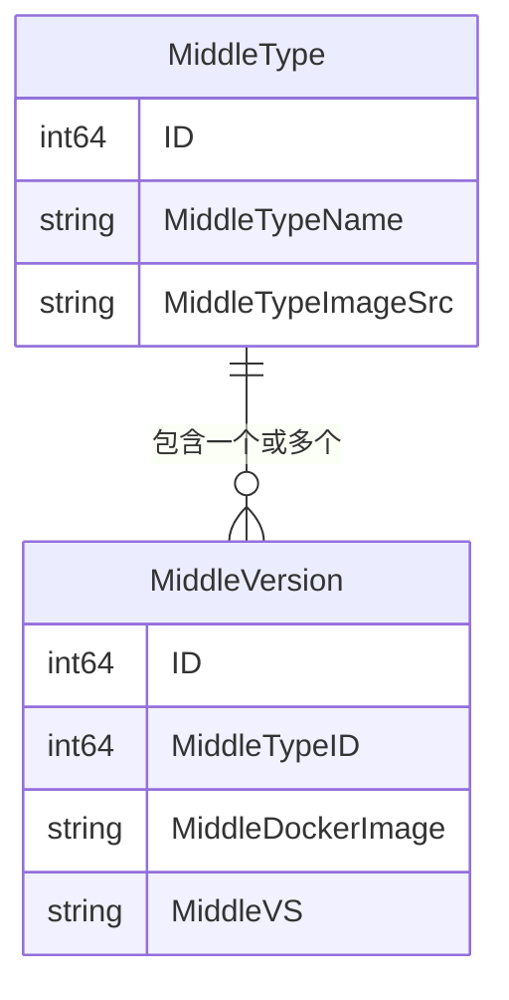
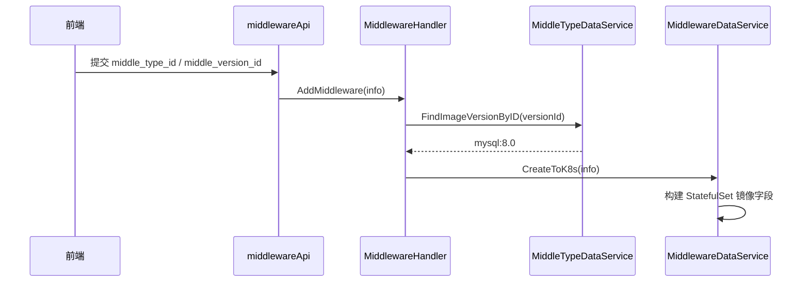

# Go PaaS 平台开发: 中间件类型与版本服务开发

## 纲要

- 中间件「类型」（如 MySQL、Redis、Consul）与「版本」（如 `mysql:8.0`、`redis:6.2`）是两级结构：一个类型下挂多个版本镜像。
- `MiddleTypeDataService` 封装类型与版本的增删改查，对外最关键的是镜像地址的解析。
- `FindImageVersionByID` 把版本 ID 拼成 `镜像地址:版本号`，是「前端选版本 → 实际部署镜像」的桥梁。
- `FindAllVersionByTypeID` 支撑前端「先选类型、再列版本」的下拉联动。

## 类型与版本的模型关系



`MiddleType.MiddleVersion` 通过 `ForeignKey:MiddleTypeID` 关联，类型与版本是多对一。

## 服务接口

```go
type IMiddleTypeDataService interface {
	AddMiddleType(*model.MiddleType) (int64, error)
	DeleteMiddleType(int64) error
	UpdateMiddleType(*model.MiddleType) error
	FindMiddleTypeByID(int64) (*model.MiddleType, error)
	FindAllMiddleType() ([]model.MiddleType, error)
	// 根据版本 ID 返回完整镜像地址
	FindImageVersionByID(int64) (string, error)
	// 根据版本 ID 查单个版本
	FindVersionByID(int64) (*model.MiddleVersion, error)
	// 根据类型 ID 查该类型下所有版本
	FindAllVersionByTypeID(int64) ([]model.MiddleVersion, error)
}

func NewMiddleTypeDataService(repository repository.IMiddleTypeRepository) IMiddleTypeDataService {
	return &MiddleTypeDataService{MiddleTypeRepository: repository}
}
```

与前文 `MiddlewareDataService` 不同，类型服务只依赖数据库仓储，不直接操作 K8s——类型与版本是「元数据」，真正的集群操作发生在实例创建时。

## 类型 CRUD

前五个方法是标准的仓储转发，与实例服务的写法一致：

```go
func (u *MiddleTypeDataService) AddMiddleType(middleType *model.MiddleType) (int64, error) {
	return u.MiddleTypeRepository.CreateMiddleType(middleType)
}
func (u *MiddleTypeDataService) DeleteMiddleType(id int64) error {
	return u.MiddleTypeRepository.DeleteMiddleTypeByID(id)
}
func (u *MiddleTypeDataService) UpdateMiddleType(middleType *model.MiddleType) error {
	return u.MiddleTypeRepository.UpdateMiddleType(middleType)
}
func (u *MiddleTypeDataService) FindMiddleTypeByID(id int64) (*model.MiddleType, error) {
	return u.MiddleTypeRepository.FindTypeByID(id)
}
func (u *MiddleTypeDataService) FindAllMiddleType() ([]model.MiddleType, error) {
	return u.MiddleTypeRepository.FindAll()
}
```

## 版本相关查询（核心）

这是类型服务区别于普通 CRUD 的地方——它把「版本元数据」翻译成「可部署的镜像」：

```go
// 根据 version ID 拼接出 镜像:版本 形式的完整地址
func (u *MiddleTypeDataService) FindImageVersionByID(middleVersionID int64) (string, error) {
	version, err := u.MiddleTypeRepository.FindVersionByID(middleVersionID)
	if err != nil {
		return "", err
	}
	return version.MiddleDockerImage + ":" + version.MiddleVS, nil
}

// 根据 version ID 查单个版本详情
func (u *MiddleTypeDataService) FindVersionByID(middleVersionID int64) (*model.MiddleVersion, error) {
	return u.MiddleTypeRepository.FindVersionByID(middleVersionID)
}

// 根据类型 ID 查该类型下的所有版本（供前端联动下拉）
func (u *MiddleTypeDataService) FindAllVersionByTypeID(middleTypeID int64) ([]model.MiddleVersion, error) {
	return u.MiddleTypeRepository.FindAllVersionByTypeID(middleTypeID)
}
```

在实例创建流程中（`MiddlewareHandler.AddMiddleware`），先用 `FindImageVersionByID(versionID)` 解析出镜像地址，再写入 `info.MiddleDockerImageVersion`，最终进入 `CreateToK8s`——这就是「选版本即定镜像」的实现基础。

## 创建链路中的位置



## 与平台的关联

类型表需要**预先录入**官方镜像（如从 MySQL 官网拉取 `mysql` 各版本），否则前端下拉无版本可选。这与课程其他模块一致：资源模型先入库，再经 API 暴露给前端。类型服务是连接「前端选择」与「K8s 实际镜像」的转换器。

## API 速览

| 方法 | 入参 | 返回 |
| --- | --- | --- |
| `FindImageVersionByID(id)` | 版本 ID | `镜像:版本` 字符串 |
| `FindVersionByID(id)` | 版本 ID | `*MiddleVersion` |
| `FindAllVersionByTypeID(id)` | 类型 ID | `[]MiddleVersion` |
| `FindMiddleTypeByID(id)` | 类型 ID | `*MiddleType`（含版本列表） |
| `FindAllMiddleType()` | 无 | `[]MiddleType` |

## 总结

## 📎 文本↔代码关联

本讲在课程知识图谱（见 `_GRAPH.json` / `_GRAPH.mmd`）中关联以下代码文件：

- `code/课件/docker-compose/chapter3/elasticsearch/config/elasticsearch.yml`
- `code/课件/docker-compose/chapter3/kibana/config/kibana.yml`
- `code/课件/docker-compose/chapter3/logstash/config/logstash.yml`
- `code/课件/docker-compose/chapter3/logstash/pipeline/logstash.conf`
- `code/课件/common/swap.go`
- `code/课件/docker-compose/chapter2/docker-compose.yml`
- `code/课件/appstore/domain/model/app_comment.go`
- `code/课件/docker-compose/chapter3/prometheus.yml`

> 关联由 `scan_course.py` 自动建立，边类型 `uses-code`（讲次 → 代码）。

相关度：100%。是否需要继续：是。代码是否可运行：是（依赖 proto 生成代码、common 包与仓储实现；编译通过，运行需 MySQL 与 consul 配置中心）。
