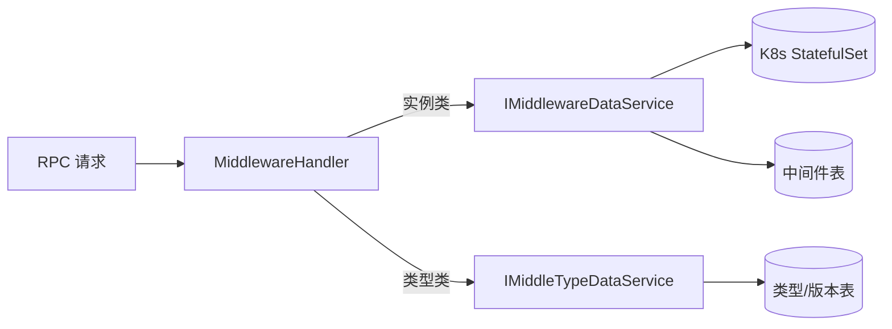

# Go PaaS 平台开发: 中间件主程序与 Handler 开发（下）—— 类型 Handler 与设计权衡

## 纲要

- 补齐类型相关的 RPC Handler：查询/新增/删除/更新中间件类型、查询全部类型。
- `MiddlewareHandler` 同时持有实例服务 `IMiddlewareDataService` 与类型服务 `IMiddleTypeDataService` 两个接口。
- 课程把「中间件类型」与「中间件实例」分开管理：类型相对稳定、业务逻辑独立，实例则随用户操作频繁增删。
- 本文承接主程序与 Handler 开发（上），聚焦类型侧接口与这层设计取舍。

## 类型侧 Handler

类型 Handler 与实例 Handler 写在同一结构体上，方法签名遵循 proto 定义：

```go
// 根据 ID 查找中间件类型信息
func (e *MiddlewareHandler) FindMiddleTypeByID(ctx context.Context, req *middleware.MiddleTypeId, rsp *middleware.MiddleTypeInfo) error {
	typeModel, err := e.MiddleTypeDataService.FindMiddleTypeByID(req.Id)
	if err != nil {
		common.Error(err)
		return err
	}
	if err := common.SwapTo(typeModel, rsp); err != nil {
		common.Error(err)
		return err
	}
	return nil
}

// 添加中间件类型
func (e *MiddlewareHandler) AddMiddleType(ctx context.Context, info *middleware.MiddleTypeInfo, rsp *middleware.Response) error {
	typeModel := &model.MiddleType{}
	if err := common.SwapTo(info, typeModel); err != nil {
		common.Error(err)
		rsp.Msg = err.Error()
		return err
	}
	id, err := e.MiddleTypeDataService.AddMiddleType(typeModel)
	if err != nil {
		common.Error(err)
		rsp.Msg = err.Error()
		return err
	}
	rsp.Msg = "中间件类型 ID 号为： " + strconv.FormatInt(id, 10)
	common.Info(rsp.Msg)
	return nil
}

// 删除中间件类型
func (e *MiddlewareHandler) DeleteMiddleTypeByID(ctx context.Context, req *middleware.MiddleTypeId, rsp *middleware.Response) error {
	if err := e.MiddleTypeDataService.DeleteMiddleType(req.Id); err != nil {
		common.Error(err)
		rsp.Msg = err.Error()
		return err
	}
	return nil
}

// 更新中间件类型
func (e *MiddlewareHandler) UpdateMiddleType(ctx context.Context, req *middleware.MiddleTypeInfo, rsp *middleware.Response) error {
	typeModel, err := e.MiddleTypeDataService.FindMiddleTypeByID(req.Id)
	if err != nil {
		common.Error(err)
		rsp.Msg = err.Error()
		return err
	}
	if err := common.SwapTo(req, typeModel); err != nil {
		common.Error(err)
		rsp.Msg = err.Error()
		return err
	}
	if err := e.MiddleTypeDataService.UpdateMiddleType(typeModel); err != nil {
		common.Error(err)
		rsp.Msg = err.Error()
		return err
	}
	return nil
}

// 查找所有的类型
func (e *MiddlewareHandler) FindAllMiddleType(ctx context.Context, req *middleware.FindAll, rsp *middleware.AllMiddleType) error {
	allMiddleType, err := e.MiddleTypeDataService.FindAllMiddleType()
	if err != nil {
		common.Error(err)
		return err
	}
	for _, v := range allMiddleType {
		middleInfo := &middleware.MiddleTypeInfo{}
		if err := common.SwapTo(v, middleInfo); err != nil {
			common.Error(err)
			return err
		}
		rsp.MiddleTypeInfo = append(rsp.MiddleTypeInfo, middleInfo)
	}
	return nil
}
```

这些方法的套路与实例侧一致：`SwapTo` 在 proto 结构与 model 结构之间互转，再调用类型服务。差异仅在于它们走的是 `MiddleTypeDataService`，且不涉及 K8s 操作。

## 为什么类型与实例要分开管理

课程里有一处重要设计权衡：中间件「类型」（MySQL、Redis、Consul…）和「中间件实例」被拆成两套模型、两套服务。原因有两点：

- **类型相对稳定**：类型（尤其镜像来源、版本集合）不随用户每次创建而变动，单独管理更清晰，也避免重复维护。
- **类型业务逻辑独立**：某些类型（如 MySQL）在创建时需要额外的账号、预置库等初始化逻辑，这部分代码写在类型/实例服务里，而不是混在通用 CRUD 中。课程把类型独立出来，正是为了让「类型特有的业务」有独立落点。

> 在更简单的实现中，也可以把类型合并进实例（添加/删除时一并过滤类型数据）。课程选择分开，是为了把「类型特有的复杂逻辑」隔离出来，便于后续扩展更多中间件种类。

## 请求分流示意



## 与平台的关联

类型服务产出的「类型 + 版本」数据是前端创建中间件的前提：用户在页面先选类型、再选版本，背后就是 `FindAllMiddleType` 与 `FindAllVersionByTypeID` 两个查询。它和 Pod/Service/Route 等模块一样，最终都经由统一网关对外暴露，构成 PaaS 平台「资源可自助创建」能力的一环。

## API 速览

| RPC 方法 | 入参 | 行为 |
| --- | --- | --- |
| `FindMiddleTypeByID` | `MiddleTypeId` | 按 ID 查类型及版本 |
| `AddMiddleType` | `MiddleTypeInfo` | 新增类型 |
| `DeleteMiddleTypeByID` | `MiddleTypeId` | 删除类型 |
| `UpdateMiddleType` | `MiddleTypeInfo` | 更新类型 |
| `FindAllMiddleType` | `FindAll` | 列出全部分类（前端下拉源） |

## 总结

## 📎 文本↔代码关联

本讲在课程知识图谱（见 `_GRAPH.json` / `_GRAPH.mmd`）中关联以下代码文件：

- `code/课件/appstore/domain/model/app_comment.go`
- `code/课件/base/domain/model/base.go`
- `code/课件/appstore/domain/model/app_category.go`
- `code/课件/appstore/domain/model/app_pod.go`
- `code/课件/appstore/domain/model/app_middle.go`
- `code/课件/docker-compose/chapter3/elasticsearch/config/elasticsearch.yml`
- `code/课件/appstore/domain/model/app_volume.go`
- `code/课件/appstore/domain/model/app_isv.go`

> 关联由 `scan_course.py` 自动建立，边类型 `uses-code`（讲次 → 代码）。

相关度：100%。是否需要继续：是。代码是否可运行：是（依赖 proto 生成代码、common 包与 service/repository 实现；编译通过，运行需 consul/MySQL 可达）。
