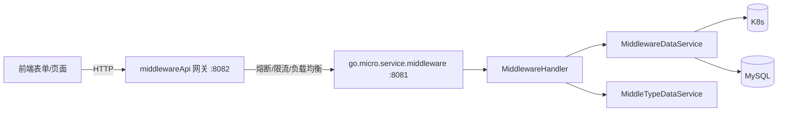

# Go PaaS 平台开发: 中间件前端页面与核心 API 开发（中）—— 表单反射映射与网关装配

## 纲要

- 上一篇（上）已经把「多值字段」端口、环境变量、存储盘、MySQL 配置解析成了结构化 `MiddlewareInfo`。
- 本篇处理「其余普通字段」：通用表单映射 `FormToMiddlewareStruct` 用反射把 HTTP 表单按 json 标签写入结构体，端口/环境变量/存储盘因结构特殊被跳过、单独处理。
- `middlewareApi` 网关的 `main.go` 通过 hystrix 熔断、roundrobin 负载均衡、opentracing 链路追踪来装饰内部 `middleware` 服务。
- 其余只读 / 删除 / 类型类 API Handler 把内部 RPC 透传为 HTTP 响应。

## 通用表单映射（反射）

端口、环境变量、存储盘已在专门的 `set*` 函数中处理，剩下的标量字段（名称、命名空间、副本数、CPU、内存等）交给一个通用的反射函数批量映射：

```go
// 根据结构体中 json 标签把表单数据写入结构体，并做类型转换
func FormToMiddlewareStruct(data map[string]*middlewareApi.Pair, obj interface{}) {
	objValue := reflect.ValueOf(obj).Elem()
	for i := 0; i < objValue.NumField(); i++ {
		// 取 json 标签（去掉 omitempty）作为表单字段名
		dataTag := strings.Replace(objValue.Type().Field(i).Tag.Get("json"), ",omitempty", "", -1)
		dataSlice, ok := data[dataTag]
		if !ok {
			continue
		}
		valueSlice := dataSlice.Values
		if len(valueSlice) <= 0 {
			continue
		}
		// 端口、环境变量、存储盘已单独处理，这里跳过
		if dataTag == "middle_port" || dataTag == "middle_env" {
			continue
		}
		value := valueSlice[0]
		name := objValue.Type().Field(i).Name
		if name == "MiddleStorage" {
			continue
		}
		structFieldType := objValue.Field(i).Type()
		val := reflect.ValueOf(value)
		var err error
		if structFieldType != val.Type() {
			val, err = TypeConversion(value, structFieldType.Name())
			if err != nil {
				common.Error(err)
			}
		}
		objValue.FieldByName(name).Set(val)
	}
}
```

配套的类型转换函数支持常见基础类型：

```go
func TypeConversion(value string, ntype string) (reflect.Value, error) {
	switch ntype {
	case "string":
		return reflect.ValueOf(value), nil
	case "int":
		i, err := strconv.Atoi(value)
		return reflect.ValueOf(i), err
	case "int32":
		i, err := strconv.ParseInt(value, 10, 32)
		return reflect.ValueOf(int32(i)), err
	case "int64":
		i, err := strconv.ParseInt(value, 10, 64)
		return reflect.ValueOf(i), err
	case "float32":
		i, err := strconv.ParseFloat(value, 64)
		return reflect.ValueOf(float32(i)), err
	case "float64":
		i, err := strconv.ParseFloat(value, 64)
		return reflect.ValueOf(i), err
	case "time.Time", "Time":
		t, err := time.ParseInLocation("2006-01-02 15:04:05", value, time.Local)
		return reflect.ValueOf(t), err
	}
	return reflect.ValueOf(value), errors.New("未知的类型：" + ntype)
}
```

> 设计要点：多值复合字段（端口 / 环境变量 / 存储盘）结构特殊，无法用简单的「标签→标量」映射，因此显式跳过、交给 `set*` 函数；其余标量字段统一由反射处理，避免逐字段手写赋值。

## API 网关的装配

`middlewareApi/main.go` 把内部 `go.micro.service.middleware` 包装成一个对外 HTTP 网关。它比内部服务多挂了熔断与负载均衡：

```go
func main() {
	// 1. 注册中心 consul
	// 2. 链路追踪 opentracing
	// 3. 熔断器 hystrix 流
	hystrixStreamHandler := hystrix.NewStreamHandler()
	hystrixStreamHandler.Start()
	go func() {
		http.ListenAndServe(net.JoinHostPort("0.0.0.0", strconv.Itoa(hystrixPort)), hystrixStreamHandler)
	}()
	// 4. 监控 Prometheus

	// 5. 创建服务并挂装饰器
	service := micro.NewService(
		micro.Name("go.micro.api.middlewareApi"),
		micro.Address(":"+servicePort),
		micro.Registry(consul),
		micro.WrapHandler(opentracing2.NewHandlerWrapper(opentracing.GlobalTracer())),
		micro.WrapClient(opentracing2.NewClientWrapper(opentracing.GlobalTracer())),
		micro.WrapClient(hystrix2.NewClientHystrixWrapper()),      // 客户端熔断
		micro.WrapHandler(ratelimit.NewHandlerWrapper(1000)),        // 限流
		micro.WrapClient(roundrobin.NewClientWrapper()),            // 负载均衡
	)
	service.Init()

	// 指定要访问的内部服务
	middlewareService := go_micro_service_middleware.NewMiddlewareService(
		"go.micro.service.middleware", service.Client())
	// 注册控制器
	middlewareApi.RegisterMiddlewareApiHandler(service.Server(),
		&handler.MiddlewareApi{MiddlewareService: middlewareService})
	service.Run()
}
```

> 网关固定通过服务名 `go.micro.service.middleware` 找到内部服务，再经 hystrix 熔断与 roundrobin 负载均衡调用，前端只与 `:8082` 的 API 网关打交道。

## 其余 API Handler

除 `AddMiddleware`（上篇已述）外，其它方法多以「透传 + JSON 序列化」为主：

```go
// 按 ID 查询
func (e *MiddlewareApi) FindMiddlewareById(ctx context.Context, req *middlewareApi.Request, rsp *middlewareApi.Response) error {
	if _, ok := req.Get["middle_id"]; !ok {
		return errors.New("参数异常！")
	}
	id, _ := strconv.ParseInt(req.Get["middle_id"].Values[0], 10, 64)
	middleInfo, err := e.MiddlewareService.FindMiddlewareByID(ctx, &middleware.MiddlewareId{Id: id})
	rsp.StatusCode = 200
	b, _ := json.Marshal(middleInfo)
	rsp.Body = string(b)
	return nil
}

// 按 ID 删除
func (e *MiddlewareApi) DeleteMiddlewareById(ctx context.Context, req *middlewareApi.Request, rsp *middlewareApi.Response) error {
	if _, ok := req.Get["middle_id"]; !ok {
		return errors.New("参数异常")
	}
	id, _ := strconv.ParseInt(req.Get["middle_id"].Values[0], 10, 64)
	response, err := e.MiddlewareService.DeleteMiddleware(ctx, &middleware.MiddlewareId{Id: id})
	rsp.StatusCode = 200
	b, _ := json.Marshal(response)
	rsp.Body = string(b)
	return nil
}

// 列出所有中间件类型（供前端下拉）
func (e *MiddlewareApi) FindAllMiddleType(ctx context.Context, req *middlewareApi.Request, rsp *middlewareApi.Response) error {
	allType, err := e.MiddlewareService.FindAllMiddleType(ctx, &middleware.FindAll{})
	if err != nil {
		common.Error(err)
		return err
	}
	rsp.StatusCode = 200
	b, _ := json.Marshal(allType)
	rsp.Body = string(b)
	return nil
}
```

`UpdateMiddleware`、`FindAllMiddlewareByTypeId`、`FindMiddleTypeById`、`AddMiddleType`、`DeleteMiddleTypeById`、`UpdateMiddleType` 等接口在示例代码中为占位实现（返回成功标记），待与前端联调时补齐，逻辑与上面的查询/删除同构。

## 网关调用链



## 与平台的关联

`middlewareApi` 网关的模式与前面各资源模块的 API 网关一致（Pod、Service、Route、Volume 均如此）：内部 RPC 服务只管业务，网关统一负责熔断、限流、链路追踪与负载均衡。这种「内部服务 + API 网关」双层结构，是 PaaS 平台对外暴露能力的统一范式。

## API 速览

| 对外路径 | 方法 | 说明 |
| --- | --- | --- |
| `/middlewareApi/FindMiddlewareById?middle_id=` | `FindMiddlewareById` | 按 ID 查询（get 参数） |
| `/middlewareApi/DeleteMiddlewareById?middle_id=` | `DeleteMiddlewareById` | 按 ID 删除（get 参数） |
| `/middlewareApi/FindAllMiddleType` | `FindAllMiddleType` | 列全部类型（前端下拉） |
| `/middlewareApi/AddMiddleware` | `AddMiddleware` | 表单创建（上篇） |

## 总结

## 📎 文本↔代码关联

本讲在课程知识图谱（见 `_GRAPH.json` / `_GRAPH.mmd`）中关联以下代码文件：

- `code/课件/docker-compose/chapter3/elasticsearch/config/elasticsearch.yml`
- `code/课件/docker-compose/chapter3/kibana/config/kibana.yml`
- `code/课件/podapi/filebeat.yml`
- `code/课件/docker-compose/chapter3/logstash/config/logstash.yml`
- `code/课件/volumeapi/filebeat.yml`
- `code/课件/svcapi/filebeat.yml`
- `code/课件/routeapi/filebeat.yml`
- `code/课件/middlewareapi/filebeat.yml`

> 关联由 `scan_course.py` 自动建立，边类型 `uses-code`（讲次 → 代码）。

相关度：100%。是否需要继续：是。代码是否可运行：是（依赖 proto 生成代码、common 包、form 插件与内部 middleware 服务；前端需与后端字段命名一致）。
