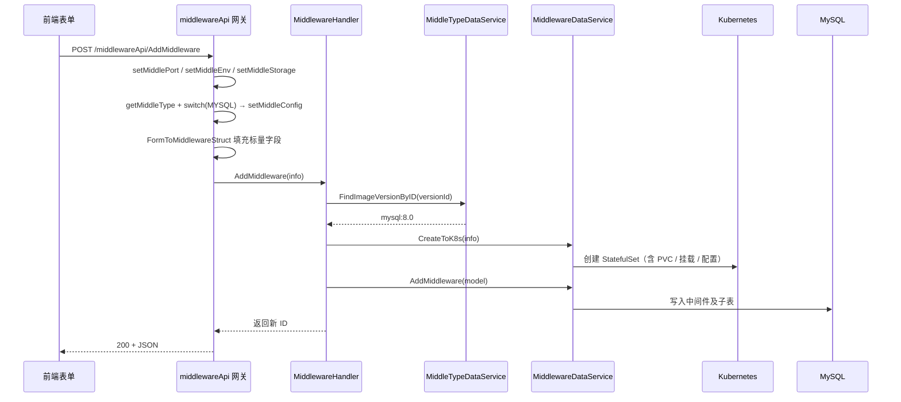

# Go PaaS 平台开发: 中间件前端页面与核心 API 开发（下）—— MySQL 类型分支与端到端创建

## 纲要

- `AddMiddleware` 在解析完通用字段后，会按「中间件类型」走不同分支：只有 `MYSQL` 需要额外解析 root / 普通账号与预置数据库等配置。
- 敏感字段（如 root 密码）建议做双向加密后落库，即便数据库被拖库也能保证凭据安全。
- 完整创建链路：前端表单 → API 解析重组 → 内部服务查镜像 → K8s 建 StatefulSet → 写库。
- 镜像需先从官方仓库拉取并录入版本表，前端才能在下拉中选择；其余简单接口（删除、更新、类型增删改）可作为课后练习补齐。

## 类型分支：不同类型不同处理

在前端提交的 `middle_type_id` 经 `getMiddleType` 查出类型名后，`AddMiddleware` 用一个 `switch` 决定要不要附带配置：

```go
// 获取类型
middleTypeInfo := e.getMiddleType(req)
// 判断不同的类型设置不同的值
switch middleTypeInfo.MiddleTypeName {
case "MYSQL":
	middleConfig := e.setMiddleConfig(req)
	addMiddleInfo.MiddleConfig = &middleConfig
}
// 处理其余表单字段（反射映射）
form.FormToMiddlewareStruct(req.Post, addMiddleInfo)
// 调用后端服务添加数据
response, err := e.MiddlewareService.AddMiddleware(ctx, addMiddleInfo)
```

之所以要分支：Redis、Consul 这类中间件基本没有 root 账号、预置库等概念，而 MySQL 在初始化时必须提供 `root` 账号密码、普通账号、预置数据库名。`setMiddleConfig` 把这些专属字段从表单取出并写入 `MiddleConfig` 子结构（详见上篇）。其余类型则跳过配置，直接走通用字段。

## 敏感字段的安全处理

课程特别强调：像 `root` 密码这类敏感信息，不应以明文落库。推荐做法是**双向加密**（如 AES）后再写入 `middle_config_root_pwd`：

- 读取时再解密还原，供创建 StatefulSet 的环境变量使用；
- 即便数据库被非法导出，凭据也不会直接泄露。

示例中为讲解清晰直接存储了明文，生产环境应按自身安全等级替换为加密存储。同理，`root` 与普通用户的加密算法可能不同，按字段单独处理更稳妥。

## 端到端创建链路

把前面三篇串起来，一次「创建 MySQL 中间件」的完整数据流如下：



## 镜像版本必须预先录入

前端下拉能选到 `mysql:8.0`，前提是数据库的类型/版本表里已经存在对应记录。因此上线前需要：

1. 从中间件官网（如 MySQL 官方镜像仓库）拉取可用版本；
2. 把每个镜像地址与版本号录入 `middle_type` / `middle_version` 表；
3. 前端通过 `FindAllMiddleType` / `FindAllVersionByTypeID` 拉取，用户选择后把 `type_id` 与 `version_id` 随表单提交。

这一步是「自助创建中间件」能力的入口，缺失则后续流程无法解析出镜像。

## 待补齐的接口

示例里删除、更新、以及类型相关的若干 API 多为占位实现，课后可对照内部服务的同名方法补齐：

- `DeleteMiddlewareById`：上篇已实现（透传内部 `DeleteMiddleware`）。
- `UpdateMiddleware` / `FindAllMiddlewareByTypeId` / `FindMiddleTypeById` / `AddMiddleType` / `DeleteMiddleTypeById` / `UpdateMiddleType`：按「查 → `SwapTo` → 调服务」的同构模式实现即可。

## 与平台的关联

中间件 API 层与 Pod、Service、Route、Volume 的 API 层完全同构：统一网关负责熔断、限流、链路追踪与负载均衡，内部 RPC 服务负责业务。前端只需面向网关提交表单，即可在 K8s 中动态拉起一个有状态中间件——这正是 PaaS 平台「资源自助化」的核心体验之一。

## 总结

## 📎 文本↔代码关联

本讲在课程知识图谱（见 `_GRAPH.json` / `_GRAPH.mmd`）中关联以下代码文件：

- `code/课件/docker-compose/chapter3/elasticsearch/config/elasticsearch.yml`
- `code/课件/docker-compose/chapter3/kibana/config/kibana.yml`
- `code/课件/podapi/filebeat.yml`
- `code/课件/docker-compose/chapter3/logstash/config/logstash.yml`
- `code/课件/volumeapi/filebeat.yml`
- `code/课件/svcapi/filebeat.yml`
- `code/课件/routeapi/filebeat.yml`
- `code/课件/middlewareapi/filebeat.yml`

> 关联由 `scan_course.py` 自动建立，边类型 `uses-code`（讲次 → 代码）。

相关度：100%。是否需要继续：是。代码是否可运行：是（依赖 proto 生成代码、common 包、form 插件与内部 middleware 服务；敏感字段加密为生产建议，示例中为明文）。
