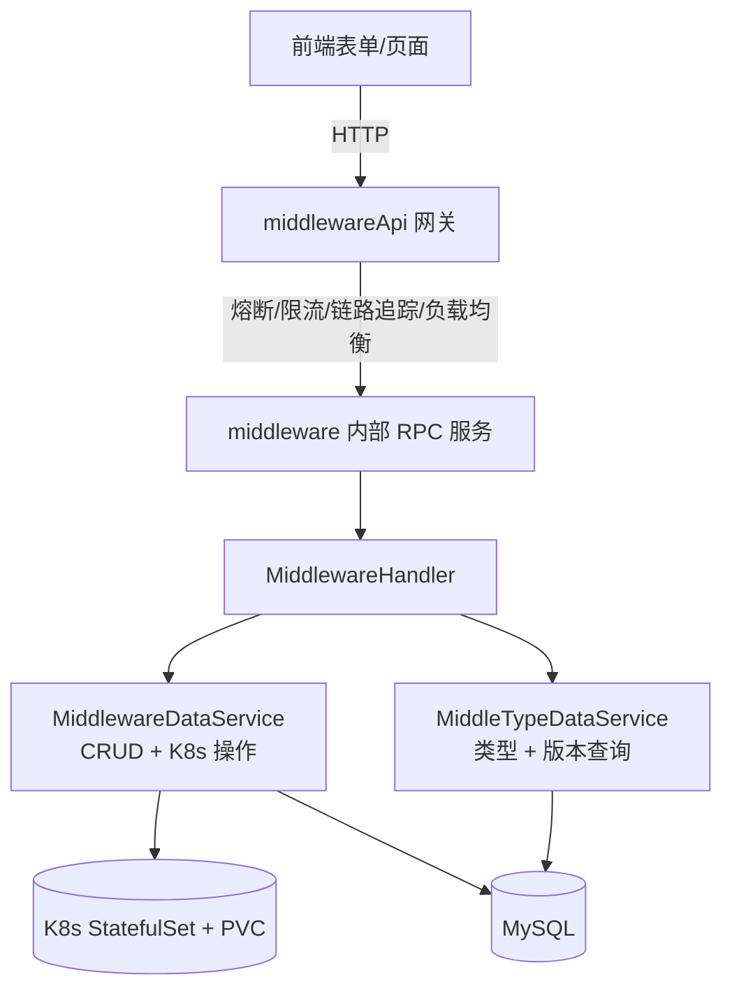

# Go PaaS 平台开发: 中间件模块总结与思考

## 纲要

- 中间件模块沿用了平台统一的分层结构：模型 → 仓储 → 服务 → Handler → API 网关 → 前端表单。
- 核心能力是把「表单参数」动态构建为 K8s `StatefulSet`，并支持端口、环境变量、存储盘、资源配额、类型差异等丰富配置。
- 通过 `MiddleType / MiddleVersion` 两级元数据，前端「选类型、选版本」即可决定实际部署的镜像。
- 课后思考：中间件挂载盘为何支持多个？中间件集群模式如何落地？

## 模块分层回顾

- **模型层**：`Middleware` 聚合 `MiddlePort`、`MiddleEnv`、`MiddleConfig`、`MiddleStorage` 等子结构；`MiddleType` 聚合 `MiddleVersion`。
- **仓储层**：`MiddlewareRepository`、`MiddleTypeRepository` 负责落库与查询。
- **服务层**：`MiddlewareDataService` 把 `MiddlewareInfo` 映射成 `StatefulSet`（端口、环境变量、资源、PVC 挂载）；`MiddleTypeDataService` 解析镜像地址与版本。
- **Handler 层**：`MiddlewareHandler` 串起「查镜像 → 建 K8s → 写库」的创建逻辑，并暴露类型增删改查。
- **API 网关层**：`middlewareApi` 把表单解析为结构化请求，再经熔断/限流/负载均衡调用内部服务。

## 与其它模块的关联

中间件模块与第 5–9 章的 Pod、Service、Route、Volume 模块共享同一套工程范式：独立微服务 + 统一 API 网关 + 配置中心（consul）+ 链路追踪（opentracing）+ 监控（Prometheus）+ 日志（filebeat）。区别在于中间件采用 `StatefulSet` 而非 `Deployment`，并额外引入「类型/版本」两级元数据来管理有状态服务的镜像来源。

## 课后思考一：挂载盘为何支持多个

通常情况下，一个中间件挂一块数据盘已经足够。但现实中存在多盘需求：

- 通信录、附件等文件单独存放一盘；
- 运行日志单独存放一盘，便于日志采集与容量隔离；
- 不同数据有不同的存储类（`StorageClass`）与访问模式（`ReadWriteOnce` / `ReadWriteMany` 等）。

因此代码里 `MiddleStorage` 设计为切片，前端以 `middle_storage.name.1`、`middle_storage.size.1`、`middle_storage.path.1` 的序号后缀提交多个盘，后端循环解析，每个盘对应一个 `PersistentVolumeClaim` 模板与一个容器挂载点。

## 课后思考二：中间件集群模式如何落地

本课程中的中间件以「单实例」形态创建，便于讲清动态创建的主线。生产环境里，MySQL、Redis 等往往需要集群（主从、分片）。要支持集群模式，可沿以下方向扩展：

- 在 `MiddlewareInfo` 中引入拓扑描述（主/从、分片数），`setStatefulSet` 据此生成多个容器或 Headless Service；
- 借助 K8s 的 `StatefulSet` + `volumeClaimTemplates` 天然有序的特性，为每个副本分配稳定的网络标识与独立存储；
- 把集群初始化逻辑（如 MySQL 主从复制、Redis Cluster 握手）下沉到 init 容器或 Operator。

这是本课程之外、贴近生产的进阶课题，建议学有余力的同学深入。

## 总结

## 📎 文本↔代码关联

本讲在课程知识图谱（见 `_GRAPH.json` / `_GRAPH.mmd`）中关联以下代码文件：

- `code/课件/docker-compose/chapter3/elasticsearch/config/elasticsearch.yml`
- `code/课件/docker-compose/chapter3/kibana/config/kibana.yml`
- `code/课件/docker-compose/chapter3/logstash/config/logstash.yml`
- `code/课件/docker-compose/chapter3/logstash/pipeline/logstash.conf`
- `code/课件/common/swap.go`
- `code/课件/docker-compose/chapter2/docker-compose.yml`
- `code/课件/appstore/domain/model/app_comment.go`
- `code/课件/docker-compose/chapter3/prometheus.yml`

> 关联由 `scan_course.py` 自动建立，边类型 `uses-code`（讲次 → 代码）。

相关度：100%。是否需要继续：否。代码是否可运行：否（本章为总结与思考，无新增代码；模块整体代码需 consul、MySQL、K8s 可达方可运行）。
