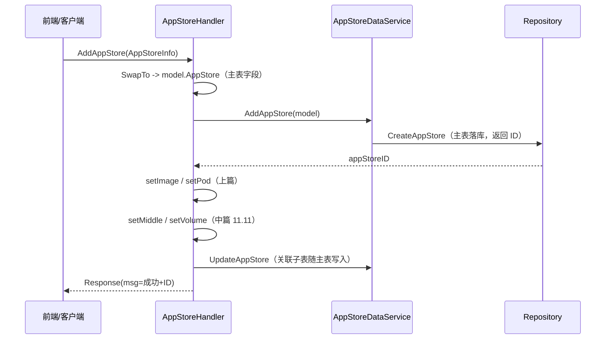

# Go PaaS 平台开发: 云应用添加应用 AddAppStore 接口（上）

## 纲要

- 本篇是 AddAppStore 接口的上半部分：完成「请求 → 模型」的类型转换，并组装图片、Pod 两类关联。
- 入口 `AddAppStore` 先通过 `common.SwapTo` 把 `AppStoreInfo` Proto 拷贝到 `model.AppStore`，再委托 Service 落库。
- 图片 `setImage`：把表单 `app_image` 中的多个图片地址提取为 `AppImage` 切片，支持多图展示。
- Pod `setPod`：把表单 `app_pod` 中的 Pod 模板 ID 提取为 `AppPod` 切片，仅引用模板，不复制 Pod 内容。
- 表单接收的是指针，转换前可先对日期/特定字段做重置，避免脏数据；关联 ID 在跟进时再回填。
- 下半部分（11.11 中）继续完成中间件、存储的组装。

## Handler 入口：AddAppStore

`AddAppStore` 是微服务对外暴露的第一个 RPC，负责把前端提交的「添加应用表单」落库。它的第一步是类型转换——由于 `AppStoreInfo`（Proto 生成）与 `model.AppStore` 的 JSON Tag 一致，直接用 `common.SwapTo` 完成拷贝：

```go
func (e *AppStoreHandler) AddAppStore(ctx context.Context, info *appStore.AppStoreInfo, rsp *appStore.Response) error {
    log.Info("Received *appStore.AddAppStore request")
    appStoreModel := &model.AppStore{}
    if err := common.SwapTo(info, appStoreModel); err != nil {
        common.Error(err)
        rsp.Msg = err.Error()
        return err
    }

    appStoreID, err := e.AppStoreDataService.AddAppStore(appStoreModel)
    if err != nil {
        common.Error(err)
        rsp.Msg = err.Error()
        return err
    }
    rsp.Msg = "应用市场中新应用添加成功 ID 号为：" + strconv.FormatInt(appStoreID, 10)
    common.Info(rsp.Msg)
    return nil
}
```

这一步完成了「主表简单字段」的映射。`appStoreModel` 此时已拥有 `app_sku`、`app_title`、`app_describe`、分类 ID、服务商 ID 等字段，关联子表则进入后续的 `setXxx` 处理。

## 图片关联：setImage

应用详情页需要多张截图以提升吸引力，因此图片是一对多。表单 `app_image` 是 `repeated AppImage`，`setImage` 把每个 `app_image_src` 提取为 `model.AppImage`：

```go
// setImage 把表单中的图片地址绑定到 AppStore 模型
func setImage(info *appStore.AppStoreInfo, store *model.AppStore) {
    for _, img := range info.AppImage {
        store.AppImage = append(store.AppImage, model.AppImage{
            AppID:       store.ID,       // 主应用 ID（落库后回填）
            AppImageSrc: img.AppImageSrc, // 图片地址
        })
    }
}
```

`model.AppImage` 只存 `app_id` 与图片地址：

```go
// 云应用图片
type AppImage struct {
    ID          int64  `gorm:"primary_key;not_null;auto_increment"`
    AppID       int64  `json:"app_id"`
    AppImageSrc string `json:"app_image_src"`
}
```

课程提到图片「可以传多个，课程里暂时是两个」，模型上用切片天然支持任意数量，前端展示时直接遍历 `app_image` 即可。

## Pod 关联：setPod

Pod 模板是应用运行的载体。表单 `app_pod` 是 `repeated AppPod`，`setPod` 把 Pod 模板 ID 提取为 `model.AppPod`：

```go
// setPod 把表单中的 Pod 模板 ID 绑定到 AppStore 模型
func setPod(info *appStore.AppStoreInfo, store *model.AppStore) {
    for _, p := range info.AppPod {
        store.AppPod = append(store.AppPod, model.AppPod{
            AppID:    store.ID,
            AppPodID: p.AppPodId, // 引用的 Pod 模板 ID
        })
    }
}
```

```go
type AppPod struct {
    ID       int64 `gorm:"primary_key;not_null;auto_increment"`
    AppID    int64 `json:"app_id"`
    AppPodID int64 `json:"app_pod_id"` // Pod 模板 ID
}
```

这里只记录「Pod 模板 ID」，不复制模板内的访问地址、规格等内容。模板在前期章节已创建好，应用市场通过 ID 引用它，安装时由模板生成真正的 Pod。

## 表单转换中的细节处理

讲稿提到「在传之前，先把这个 date 给重置一下」「关联 ID 在跟进时再传」。落到代码上，有两点值得注意：

1. **转换前重置字段**：`SwapTo` 是整结构体拷贝，若表单里带有不该写入的脏字段（如日期占位），应在 `SwapTo` 前清空或单独覆盖，保证落库数据干净。
2. **关联 ID 回填时机**：`AppImage`/`AppPod` 等子表的 `AppID` 依赖主表自增 ID，因此 `setImage`/`setPod` 应在主表 `AddAppStore` 拿到 `appStoreID` 之后执行，并将 `store.ID = appStoreID` 回填，再随主表一起持久化。

## 上下篇衔接



## API 速览

| 函数 | 作用 |
| --- | --- |
| AddAppStore | Handler 入口：SwapTo 转换 + 落库 + 返回 ID |
| setImage | 提取图片地址写入 `store.AppImage`（支持多图） |
| setPod | 提取 Pod 模板 ID 写入 `store.AppPod` |
| setMiddle / setVolume | 见 11.11（中）篇 |

## Demo 示例

**运行说明**：下面示例演示 `setImage`/`setPod` 如何把表单里的图片地址与 Pod 模板 ID 组装进领域模型（可直接 `go run`）。

**代码说明**：输入携带两张图片地址与一个 Pod 模板 ID 的表单，输出绑定了关联的 `AppStore`。

**技术点总结**：表单入口先做 `SwapTo` 拷贝主表；图片支持多地址，Pod 只存模板 ID；关联 ID 在主表自增后回填。

```go
package main

import "fmt"

type AppImage struct {
    AppID       int64
    AppImageSrc string
}
type AppPod struct {
    AppID    int64
    AppPodID int64
}
type AppStore struct {
    ID       int64
    AppImage []AppImage
    AppPod   []AppPod
}

type formImage struct{ AppImageSrc string }
type formPod struct{ AppPodID int64 }

func setImage(imgs []formImage, store *AppStore) {
    for _, i := range imgs {
        store.AppImage = append(store.AppImage, AppImage{
            AppID:       store.ID,
            AppImageSrc: i.AppImageSrc,
        })
    }
}
func setPod(pods []formPod, store *AppStore) {
    for _, p := range pods {
        store.AppPod = append(store.AppPod, AppPod{
            AppID:    store.ID,
            AppPodID: p.AppPodID,
        })
    }
}

func main() {
    store := &AppStore{ID: 1}
    setImage([]formImage{{"https://cdn/x/1.png"}, {"https://cdn/x/2.png"}}, store)
    setPod([]formPod{{101}}, store)
    fmt.Printf("组装结果: %+v\n", store)
}
```

## 总结

## 📎 文本↔代码关联

本讲在课程知识图谱（见 `_GRAPH.json` / `_GRAPH.mmd`）中关联以下代码文件：

- `code/课件/docker-compose/chapter3/elasticsearch/config/elasticsearch.yml`
- `code/课件/docker-compose/chapter3/kibana/config/kibana.yml`
- `code/课件/docker-compose/chapter3/logstash/config/logstash.yml`
- `code/课件/docker-compose/chapter3/logstash/pipeline/logstash.conf`
- `code/课件/common/swap.go`
- `code/课件/docker-compose/chapter2/docker-compose.yml`
- `code/课件/appstore/domain/model/app_comment.go`
- `code/课件/docker-compose/chapter3/prometheus.yml`

> 关联由 `scan_course.py` 自动建立，边类型 `uses-code`（讲次 → 代码）。

相关度：100%。是否需要继续：是。代码是否可运行：是。
