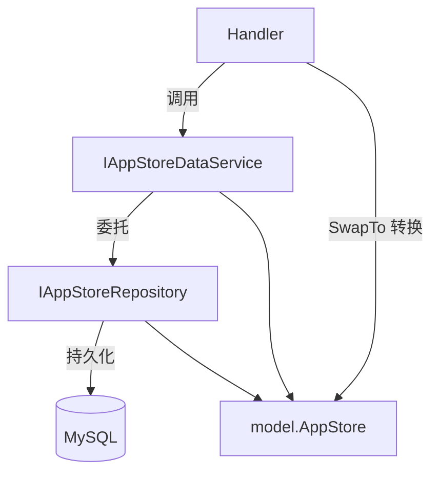

# Go PaaS 平台开发: 云应用平台 Service 代码开发

## 纲要

- Service 层以接口 `IAppStoreDataService` 对外提供业务能力，Handler 依赖该接口而非具体实现，便于替换与测试。
- 接口包含 CRUD（`AddAppStore`/`DeleteAppStore`/`UpdateAppStore`/`FindAppStoreByID`/`FindAllAppStore`）与四个统计方法（`AddInstallNum`/`GetInstallNum`/`AddViewNum`/`GetViewNum`）。
- 实现 `AppStoreDataService` 持有一个 `IAppStoreRepository` 成员，所有方法直接委托给 Repository；事务相关逻辑下沉在 Repository 层。
- 构造函数 `NewAppStoreDataService` 返回接口类型，符合「面向接口编程」的设计习惯。
- 统计类方法（安装数、浏览数）高频自增，与主体更新解耦，由 Repository 用 `UpdateColumn` + `gorm.Expr` 原子自增。

## Service 层的定位

在 go-micro 的分层里，Handler 只做「请求适配」，真正的业务编排放在 Service 层，而 Service 又依赖 Repository 完成持久化。本章在 Repository（11.4 节）就绪后，于 Service 层补全对外暴露的方法，并实现 `AddAppStore` 等的业务逻辑。

## 接口定义

先定义接口，约束对外能力；Handler 持有的就是这一接口类型：

```go
package service

import (
    "git.imooc.com/coding-535/appStore/domain/model"
    "git.imooc.com/coding-535/appStore/domain/repository"
    "k8s.io/client-go/kubernetes"
)

// 接口类型
type IAppStoreDataService interface {
    AddAppStore(*model.AppStore) (int64, error)
    DeleteAppStore(int64) error
    UpdateAppStore(*model.AppStore) error
    FindAppStoreByID(int64) (*model.AppStore, error)
    FindAllAppStore() ([]model.AppStore, error)

    // 统计服务
    AddInstallNum(int64) error
    GetInstallNum(int64) int64
    AddViewNum(int64) error
    GetViewNum(int64) int64
}
```

注意 `NewAppStoreDataService` 的返回值也是接口类型，且依赖注入的是 `IAppStoreRepository` 接口：

```go
// 创建
// 注意：返回值 IAppStoreDataService 接口类型
func NewAppStoreDataService(appStoreRepository repository.IAppStoreRepository, clientSet *kubernetes.Clientset) IAppStoreDataService {
    return &AppStoreDataService{AppStoreRepository: appStoreRepository}
}

type AppStoreDataService struct {
    // 注意：这里是 IAppStoreRepository 类型
    AppStoreRepository repository.IAppStoreRepository
}
```

这里 `clientSet` 参数预留给后续需要与 Kubernetes 交互（如真正下发 Pod）的场景，当前实现中统计与 CRUD 都委托给 Repository。

## CRUD 实现

CRUD 方法本质上是对 Repository 的简单转发，业务编排空间留给后续扩展：

```go
// 插入
func (u *AppStoreDataService) AddAppStore(appStore *model.AppStore) (int64, error) {
    return u.AppStoreRepository.CreateAppStore(appStore)
}

// 删除
func (u *AppStoreDataService) DeleteAppStore(appStoreID int64) error {
    return u.AppStoreRepository.DeleteAppStoreByID(appStoreID)
}

// 更新
func (u *AppStoreDataService) UpdateAppStore(appStore *model.AppStore) error {
    return u.AppStoreRepository.UpdateAppStore(appStore)
}

// 查找
func (u *AppStoreDataService) FindAppStoreByID(appStoreID int64) (*model.AppStore, error) {
    return u.AppStoreRepository.FindAppStoreByID(appStoreID)
}

// 查找全部
func (u *AppStoreDataService) FindAllAppStore() ([]model.AppStore, error) {
    return u.AppStoreRepository.FindAll()
}
```

## 统计方法实现

安装数、浏览数是高频自增字段。Service 把「加一」和「查询」拆成独立方法，查询直接返回 `int64`（无需 error），写操作返回 error：

```go
// 安装数量统计
func (u *AppStoreDataService) AddInstallNum(appID int64) error {
    return u.AppStoreRepository.AddInstallNumber(appID)
}

// 查询安装数量
func (u *AppStoreDataService) GetInstallNum(appID int64) int64 {
    return u.AppStoreRepository.GetInstallNumber(appID)
}

// 添加浏览统计
func (u *AppStoreDataService) AddViewNum(appID int64) error {
    return u.AppStoreRepository.AddViewNumber(appID)
}

// 获取浏览量
func (u *AppStoreDataService) GetViewNum(appID int64) int64 {
    return u.AppStoreRepository.GetViewNumber(appID)
}
```

对应的 Repository 实现用 `gorm.Expr` 做原子自增，避免「先读后写」的并发覆盖问题：

```go
// 添加安装数量统计（Repository 层）
func (u *AppStoreRepository) AddInstallNumber(appID int64) error {
    return u.mysqlDb.Model(&model.AppStore{}).
        Where("id = ?", appID).
        UpdateColumn("app_install", gorm.Expr("app_install + ?", 1)).Error
}
```

## 分层协作关系



Handler 依赖 `IAppStoreDataService` 接口，Service 依赖 `IAppStoreRepository` 接口，两层都面向接口编程，符合依赖倒置原则。事务边界（如删除时的级联清理）放在 Repository 层，Service 保持「薄」。

## API 速览

| 方法 | 签名 | 说明 |
| --- | --- | --- |
| AddAppStore | `AddAppStore(*model.AppStore) (int64, error)` | 新增应用，返回自增 ID |
| DeleteAppStore | `DeleteAppStore(int64) error` | 删除应用（级联子表） |
| UpdateAppStore | `UpdateAppStore(*model.AppStore) error` | 更新应用 |
| FindAppStoreByID | `FindAppStoreByID(int64) (*model.AppStore, error)` | 按 ID 查询 |
| FindAllAppStore | `FindAllAppStore() ([]model.AppStore, error)` | 查询全部 |
| AddInstallNum | `AddInstallNum(int64) error` | 安装数 +1 |
| GetInstallNum | `GetInstallNum(int64) int64` | 取安装数 |
| AddViewNum | `AddViewNum(int64) error` | 浏览数 +1 |
| GetViewNum | `GetViewNum(int64) int64` | 取浏览数 |

## Demo 示例

**运行说明**：下面示例在内存中用接口模拟 Service 层调用 Repository，演示 Handler 如何使用 `IAppStoreDataService`（无需真实 MySQL 即可理解协作）。

**代码说明**：用一个内存实现替换 `IAppStoreRepository`，注入 `AppStoreDataService`，验证 `AddAppStore` 与统计方法。

**技术点总结**：Service 层面向接口、薄委托；统计字段原子自增；Handler 只持有接口，便于单测时替换实现。

```go
package main

import "fmt"

// 领域模型（简化）
type AppStore struct {
    ID    int64
    Title string
}

// 接口定义（与课程一致，精简统计签名）
type IAppStoreDataService interface {
    AddAppStore(*AppStore) (int64, error)
    GetInstallNum(int64) int64
}

// 内存版 Repository 实现，便于演示
type memRepo struct {
    store map[int64]*AppStore
    seq   int64
}

func (m *memRepo) CreateAppStore(a *AppStore) (int64, error) {
    m.seq++
    a.ID = m.seq
    m.store[a.ID] = a
    return a.ID, nil
}
func (m *memRepo) GetInstallNumber(id int64) int64 { return 1 }

// Service 实现
type AppStoreDataService struct {
    repo *memRepo
}

func (s *AppStoreDataService) AddAppStore(a *AppStore) (int64, error) {
    return s.repo.CreateAppStore(a)
}
func (s *AppStoreDataService) GetInstallNum(id int64) int64 {
    return s.repo.GetInstallNumber(id)
}

func main() {
    repo := &memRepo{store: map[int64]*AppStore{}}
    svc := &AppStoreDataService{repo: repo}

    id, _ := svc.AddAppStore(&AppStore{Title: "Redis 缓存模板"})
    fmt.Printf("新增应用 ID=%d, 安装数=%d\n", id, svc.GetInstallNum(id))
}
```

## 总结

## 📎 文本↔代码关联

本讲在课程知识图谱（见 `_GRAPH.json` / `_GRAPH.mmd`）中关联以下代码文件：

- `code/课件/docker-compose/chapter3/elasticsearch/config/elasticsearch.yml`
- `code/课件/docker-compose/chapter3/kibana/config/kibana.yml`
- `code/课件/docker-compose/chapter3/logstash/config/logstash.yml`
- `code/课件/docker-compose/chapter3/logstash/pipeline/logstash.conf`
- `code/课件/common/swap.go`
- `code/课件/docker-compose/chapter2/docker-compose.yml`
- `code/课件/appstore/domain/model/app_comment.go`
- `code/课件/docker-compose/chapter3/prometheus.yml`

> 关联由 `scan_course.py` 自动建立，边类型 `uses-code`（讲次 → 代码）。

相关度：100%。是否需要继续：是。代码是否可运行：是。
