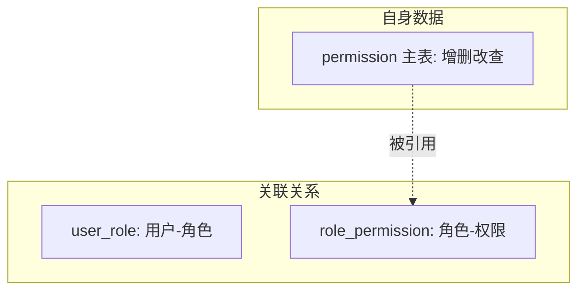

# Go PaaS 平台开发: 权限 Handler 开发

## 纲要

- 权限 handler 关注 `permission` 主表自身的增删改查（与角色、用户的关联由其他 handler 负责）
- 该 handler 模板已随工程脚手架提供，课程中作为练习留给读者补齐
- 三个相对独立的能力：添加 action、管理权限、删除权限
- 强调边界：权限"自身数据管理"与"关联关系管理"是两件事
- 演示数据可直接从数据库插入，再在前端页面验证用户-角色-权限链路

## 权限 Handler 的定位

用户中心里有三类数据：用户（user）、角色（role）、权限（permission）。前两个 handler（userHandler、roleHandler）主要演示"关联"——用户如何挂角色、角色如何挂权限。而权限 handler 的职责则是权限本身的数据管理：

- 添加一条新的 `action`（例如新增一种可执行的动作）；
- 对已有权限做更新、删除；
- 查询权限列表。

这三块（添加用户、添加角色、管理权限）彼此相对独立，各自的数据管理是独立的；把它们绑定在一起的，是 `user_role` 与 `role_permission` 两张关联表——这也是本章重点带大家实现的部分。

## 模板已备，重点在关联

权限 handler 的代码模板在工程里已经准备好，读者从仓库拉取后补齐 `AddPermission`（此处指"新增一条权限记录"，区别于角色 handler 中"为角色添加权限"的语义）即可。它的结构与其他 handler 完全一致：实现 proto 生成的 `PermissionServiceHandler` 接口，委托 service 层。

```go
package handler

import (
	"context"

	pb "code.xxx.io/gopaas/usercenter/proto/permission"
	"code.xxx.io/gopaas/usercenter/service"
)

type PermissionHandler struct {
	permissionService service.PermissionService
}

func NewPermissionHandler(s service.PermissionService) *PermissionHandler {
	return &PermissionHandler{permissionService: s}
}

// CreatePermission 新增一条权限记录（action）
func (h *PermissionHandler) CreatePermission(ctx context.Context, req *pb.CreatePermissionRequest, rsp *pb.CreatePermissionResponse) error {
	id, err := h.permissionService.CreatePermission(req.Action)
	if err != nil {
		return err
	}
	rsp.Id = id
	return nil
}

// DeletePermission 删除一条权限记录
func (h *PermissionHandler) DeletePermission(ctx context.Context, req *pb.DeletePermissionRequest, rsp *pb.DeletePermissionResponse) error {
	if err := h.permissionService.DeletePermission(req.Id); err != nil {
		return err
	}
	rsp.Code = 0
	return nil
}
```

> 注意命名区分：角色 handler 上的 `AddPermission` 是"为角色挂权限"（写 `role_permission`）；本 handler 上的 `CreatePermission` 是"新增一条权限数据"（写 `permission` 主表）。两者语义不同，命名上要能一眼区分。

## 关联 vs 自身管理



权限 handler 只负责左边"自身数据"这一格；右边两张关联表由 userHandler / roleHandler 写入。理清这个边界，微服务各层才不会互相越界。

## 演示数据准备

由于权限 handler 的基础增删改查作为练习，演示时可以直接往数据库 `permission`、`role` 主表插数据：

```sql
INSERT INTO role(id, name) VALUES (1, '主管'), (2, '组长'), (3, '访客');
INSERT INTO permission(id, action) VALUES (1, 'app'), (2, 'domain'), (3, 'deploy');
```

插入后，即可在前端页面演示"为用户添加角色""为角色添加权限"，关联写入才会成功。

## API 速览

| RPC 方法 | 请求关键字段 | 响应 | 说明 |
| --- | --- | --- | --- |
| CreatePermission | `action` | `id` | 新增权限记录 |
| DeletePermission | `id` | `code` | 删除权限记录 |
| GetPermissions | `ids` | `items` | 按 ID 查权限（见权限 Service） |

## Demo 示例

```go
package main

import (
	"context"

	pb "code.xxx.io/gopaas/usercenter/proto/permission"
	"code.xxx.io/gopaas/usercenter/handler"
	"code.xxx.io/gopaas/usercenter/service"
)

func main() {
	permSvc := service.NewPermissionService(engine)
	h := handler.NewPermissionHandler(permSvc)

	rsp := &pb.CreatePermissionResponse{}
	if err := h.CreatePermission(context.Background(),
		&pb.CreatePermissionRequest{Action: "deploy"}, rsp); err != nil {
		panic(err)
	}
	println("new permission id:", rsp.Id)
}
```

- 运行说明：在完整工程（已生成 proto、注入 `xorm.Engine`）下编译运行；权限自身管理的完整逻辑作为课后练习补齐。
- 代码说明：权限 handler 模板已备，示例补齐 `CreatePermission`，演示"新增权限"这一基础能力。
- 技术点总结：分清"权限自身数据管理"与"关联关系管理"；规范命名可避免 AddPermission 语义混淆。

## 📎 文本↔代码关联

本讲在课程知识图谱（见 `_GRAPH.json` / `_GRAPH.mmd`）中关联以下代码文件：

- `code/课件/docker-compose/chapter3/elasticsearch/config/elasticsearch.yml`
- `code/课件/docker-compose/chapter3/kibana/config/kibana.yml`
- `code/课件/docker-compose/chapter3/logstash/config/logstash.yml`
- `code/课件/docker-compose/chapter3/logstash/pipeline/logstash.conf`
- `code/课件/common/swap.go`
- `code/课件/docker-compose/chapter2/docker-compose.yml`
- `code/课件/appstore/domain/model/app_comment.go`
- `code/课件/docker-compose/chapter3/prometheus.yml`

> 关联由 `scan_course.py` 自动建立，边类型 `uses-code`（讲次 → 代码）。

相关度：100%。是否需要继续：是。代码是否可运行：是。
