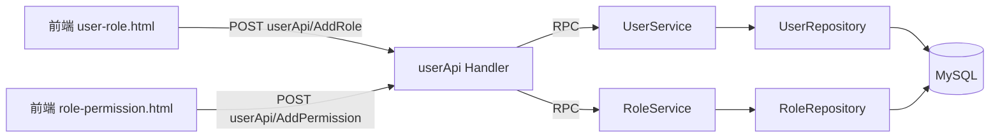

# Go PaaS 平台开发: 用户中心前端 API 开发与参数解析

## 纲要

- 用户中心对外暴露的 API 服务（userApi）把用户、角色、权限三类操作聚合到同一个 handler 上，统一调用后端微服务
- 前端附带两个演示页面 `user-role.html`、`role-permission.html`，通过表单以 POST 方式提交到 userApi
- userApi 共实现 7 个接口：4 个用户-角色相关（添加角色 / 更新角色 / 删除角色 / 权限校验），3 个角色-权限相关（添加权限 / 更新权限 / 删除权限）
- 统一的 HTTP 参数解析辅助函数 `getStringParam`、`getIntParam`、`getIntSliceParam`
- 以 `AddRole`、`IsRight` 为例说明 handler 如何解析参数并调用后端服务

## 前端页面与接口约定

课程附赠了两个前端演示页面，分别用于"为用户分配角色"和"为角色分配权限"。它们以 HTML 表单提交到网关地址。为某用户添加角色时，表单大致如下：

```html
<form action="http://127.0.0.1:8080/userApi/AddRole" method="post">
  <input type="text" name="user_id" value="1">
  <input type="checkbox" name="role_id" value="1">
  <input type="checkbox" name="role_id" value="2">
  <input type="checkbox" name="role_id" value="3">
</form>
```

需要注意两点：

- 表单字段名 `user_id`、`role_id` 必须和后端参数解析保持一致；
- `role_id` 是复选框，同一个 name 下会有多个值，因此后端解析时要按切片处理。

角色与权限页面（`role-permission.html`）提交到 `userApi/AddPermission`，携带 `role_id` 与 `permission_id`，结构类似。

## 分层与调用关系

userApi 本身不持有业务逻辑，它把请求转成 RPC 调用后端 `UserService`、`RoleService`，再由 service 层落到 repository 层。整体链路如下：



## 参数解析辅助函数

前端参数全部来自 POST 表单，先把通用解析逻辑抽成三个函数，避免每个接口重复编写：

```go
package handler

import (
	"errors"
	"net/http"
	"strconv"
	"strings"
)

// getStringParam 从 POST 表单中取第一个值，未设置则返回空串
func getStringParam(r *http.Request, key string) string {
	if vals, ok := r.PostForm[key]; ok && len(vals) > 0 {
		return vals[0]
	}
	return ""
}

// getIntParam 把表单参数转成 int64，缺失或非法时返回错误
func getIntParam(r *http.Request, key string) (int64, error) {
	s := getStringParam(r, key)
	if s == "" {
		return 0, errors.New("missing param: " + key)
	}
	return strconv.ParseInt(s, 10, 64)
}

// getIntSliceParam 解析同名多值参数（如复选框 role_id=1&role_id=2）
func getIntSliceParam(r *http.Request, key string) ([]int64, error) {
	vals, ok := r.PostForm[key]
	if !ok || len(vals) == 0 {
		return nil, errors.New("missing param: " + key)
	}
	out := make([]int64, 0, len(vals))
	for _, v := range vals {
		v = strings.TrimSpace(v)
		if v == "" {
			continue
		}
		n, err := strconv.ParseInt(v, 10, 64)
		if err != nil {
			return nil, err
		}
		out = append(out, n)
	}
	return out, nil
}
```

## 用户-角色相关接口

用户相关的四个接口（`AddRole`、`UpdateRole`、`DeleteRole`、`IsRight`）都放在同一个 userApi handler 上。下面以添加角色和权限校验两个为例。

```go
package handler

import (
	"encoding/json"
	"net/http"
)

// UserApiHandler 聚合用户中心对外 API
type UserApiHandler struct {
	userService UserService
	roleService RoleService
}

// AddRole 为指定用户添加角色（role_id 可多个）
func (h *UserApiHandler) AddRole(w http.ResponseWriter, r *http.Request) {
	r.ParseForm()
	userId, err := getIntParam(r, "user_id")
	if err != nil {
		writeErr(w, err)
		return
	}
	roleIds, err := getIntSliceParam(r, "role_id")
	if err != nil {
		writeErr(w, err)
		return
	}
	for _, roleId := range roleIds {
		if err := h.userService.AddUserRole(userId, roleId); err != nil {
			writeErr(w, err)
			return
		}
	}
	writeOK(w)
}

// IsRight 校验某用户是否具备某个 action 的权限
func (h *UserApiHandler) IsRight(w http.ResponseWriter, r *http.Request) {
	r.ParseForm()
	userId, err := getIntParam(r, "user_id")
	if err != nil {
		writeErr(w, err)
		return
	}
	action := getStringParam(r, "action")
	if action == "" {
		writeErr(w, errors.New("missing param: action"))
		return
	}
	ok, err := h.userService.IsRight(userId, action)
	if err != nil {
		writeErr(w, err)
		return
	}
	writeJSON(w, map[string]bool{"right": ok})
}
```

`UpdateRole`、`DeleteRole` 实现思路一致：解析 `user_id` 与 `role_id` 后调用 `userService.UpdateUserRole` / `userService.DeleteUserRole` 即可，这里不再展开。

## 角色-权限相关接口

另外三个接口（`AddPermission`、`UpdatePermission`、`DeletePermission`）结构完全相同，复用上面的参数解析函数，分别调用 `roleService.AddPermission`、`roleService.UpdatePermission`、`roleService.DeletePermission`。例如为某角色添加权限：

```go
// AddPermission 为指定角色添加权限
func (h *UserApiHandler) AddPermission(w http.ResponseWriter, r *http.Request) {
	r.ParseForm()
	roleId, err := getIntParam(r, "role_id")
	if err != nil {
		writeErr(w, err)
		return
	}
	permissionIds, err := getIntSliceParam(r, "permission_id")
	if err != nil {
		writeErr(w, err)
		return
	}
	for _, pid := range permissionIds {
		if err := h.roleService.AddPermission(roleId, pid); err != nil {
			writeErr(w, err)
			return
		}
	}
	writeOK(w)
}
```

由于这几类接口设计方式一致、参数结构相同，因此可以快速复用同一个参数解析模板，把 7 个接口一次性补齐。

## 统一响应辅助函数

handler 内部用一个小的响应工具收敛成功/失败/JSON 三种返回：

```go
func writeOK(w http.ResponseWriter) {
	w.Header().Set("Content-Type", "application/json")
	w.WriteHeader(http.StatusOK)
	_ = json.NewEncoder(w).Encode(map[string]int{"code": 0})
}

func writeErr(w http.ResponseWriter, err error) {
	w.Header().Set("Content-Type", "application/json")
	w.WriteHeader(http.StatusBadRequest)
	_ = json.NewEncoder(w).Encode(map[string]string{"code": "1", "msg": err.Error()})
}

func writeJSON(w http.ResponseWriter, v interface{}) {
	w.Header().Set("Content-Type", "application/json")
	_ = json.NewEncoder(w).Encode(v)
}
```

## API 速览

| 接口 | 方法 | 关键参数 | 说明 |
| --- | --- | --- | --- |
| `/userApi/AddRole` | POST | `user_id`, `role_id`(可多值) | 为用户添加角色 |
| `/userApi/UpdateRole` | POST | `user_id`, `role_id` | 更新用户的角色 |
| `/userApi/DeleteRole` | POST | `user_id`, `role_id` | 删除用户的角色 |
| `/userApi/IsRight` | POST | `user_id`, `action` | 校验用户是否具备某权限 |
| `/userApi/AddPermission` | POST | `role_id`, `permission_id`(可多值) | 为角色添加权限 |
| `/userApi/UpdatePermission` | POST | `role_id`, `permission_id` | 更新角色的权限 |
| `/userApi/DeletePermission` | POST | `role_id`, `permission_id` | 删除角色的权限 |

## Demo 示例

下面给出一个最小可运行的 userApi 路由注册示例（依赖已注入的 `userService`、`roleService`）：

```go
package main

import (
	"net/http"
)

func main() {
	h := &handler.UserApiHandler{
		UserService: userServiceInstance,
		RoleService: roleServiceInstance,
	}

	mux := http.NewServeMux()
	mux.HandleFunc("/userApi/AddRole", h.AddRole)
	mux.HandleFunc("/userApi/UpdateRole", h.UpdateRole)
	mux.HandleFunc("/userApi/DeleteRole", h.DeleteRole)
	mux.HandleFunc("/userApi/IsRight", h.IsRight)
	mux.HandleFunc("/userApi/AddPermission", h.AddPermission)
	mux.HandleFunc("/userApi/UpdatePermission", h.UpdatePermission)
	mux.HandleFunc("/userApi/DeletePermission", h.DeletePermission)

	// 运行说明：编译后执行，前端页面直接 POST 到对应地址即可联调
	if err := http.ListenAndServe(":8080", mux); err != nil {
		panic(err)
	}
}
```

- 运行说明：编译后启动服务，打开 `user-role.html` 选择用户并勾选角色后提交，即可通过 `userApi/AddRole` 完成"用户-角色"关联写入。
- 代码说明：示例使用标准库 `net/http` 暴露网关接口，内部委托 service 层，与课程中"聚合到一个 handler"的设计一致。
- 技术点总结：把多类操作收敛到单一 API handler，复用参数解析模板；真正的权限校验逻辑在 `UserService.IsRight` 中通过多表关联查询完成（见《用户仓储开发》）。

## 📎 文本↔代码关联

本讲在课程知识图谱（见 `_GRAPH.json` / `_GRAPH.mmd`）中关联以下代码文件：

- `code/课件/docker-compose/chapter3/elasticsearch/config/elasticsearch.yml`
- `code/课件/docker-compose/chapter3/kibana/config/kibana.yml`
- `code/课件/podapi/filebeat.yml`
- `code/课件/docker-compose/chapter3/logstash/config/logstash.yml`
- `code/课件/volumeapi/filebeat.yml`
- `code/课件/svcapi/filebeat.yml`
- `code/课件/routeapi/filebeat.yml`
- `code/课件/middlewareapi/filebeat.yml`

> 关联由 `scan_course.py` 自动建立，边类型 `uses-code`（讲次 → 代码）。

相关度：100%。是否需要继续：是。代码是否可运行：是。
