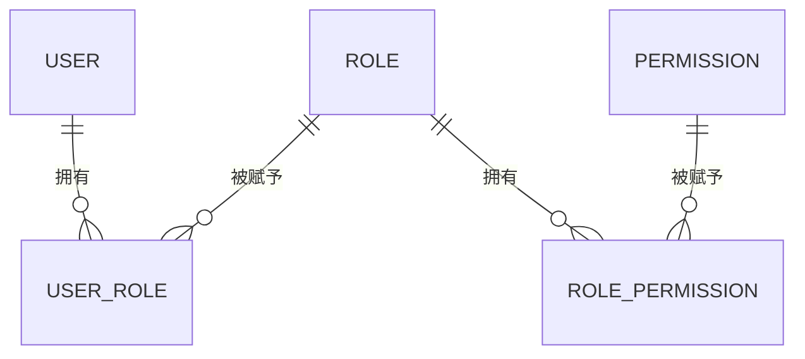

# Go PaaS 平台开发: 用户中心总结与思考

## 纲要

- 回顾：用户中心服务端（user / role / permission 三块）、API 聚合层、前端联调
- 关联关系的核心：`user_role`、`role_permission` 两张中间表，串联"用户-角色-权限"
- 思考一：职位（position，如 CEO、HR）与权限的解耦 —— 引入第三张关联表
- 思考二：数据权限（行级权限）的实现思路
- 工程收尾：在 `main` 中注册多个 service 与 handler

## 本章回顾

用户中心基于角色的访问控制（RBAC）展开，核心目标不是单纯地把"用户、角色、权限"三张主表建出来，而是把它们之间的关联关系讲清楚、把功能做健全。整章内容可以归纳成三块：

- 服务端开发：包含 user、role、permission 各自的 repository、service、handler 三层，重点演示如何在一个服务里开启多个 proto 文件、注册多个 handler。
- API 聚合层：把分散的接口收敛到同一个 API handler 上，前端通过统一的网关地址调用，整体更聚合、更易联调。
- 前端联调：附赠两个演示页面，页面上的输入参数直接以 POST 方式推到网关代码，可独立下载使用。

其中 role（角色）与 permission（权限）的"基础增删改查"作为练习留给读者自主完善；课程演示主要聚焦在关联关系本身——即用户如何添加角色、角色如何与权限关联。

## 关联关系的核心

整个 RBAC 的骨架由两张中间表承载：

- `user_role(user_id, role_id)`：用户与角色的多对多关系。
- `role_permission(role_id, permission_id)`：角色与权限的多对多关系。

正因为有这两张表，权限校验才能从"用户"出发，经"角色"最终落到"权限"。演示前需要先在数据库里预置角色与权限数据，否则按 ID 关联插入时会因查不到对应记录而失败。

## 思考一：职位与权限的解耦

课程演示的是"基于角色"的模型。但在真实组织里，还存在 CEO、HR 这类"职位（position）"信息，它们与权限并非永远一一对应：

- 一个人可能同时拥有多个职位；
- 同一个职位在不同业务线对应的权限也可能不同。

当职位与权限出现"一对多 / 多对多"且需要独立管理时，就需要再引入第三张关联表，例如 `position_permission(position_id, permission_id)`，把"职位"也作为一条独立的授权链路。读者可以从"如何新增第三张关联关系表"这一角度去扩展本章的模型。

## 思考二：数据权限

前文都是"功能权限"——基于角色分配"能做什么动作（action）"。但在很多场景下还需要"数据权限"，即：同一批数据里，谁能看、谁不能看。

例如一次创建了十条数据，期望 A 角色可见其中三条、B 角色可见另外五条。这就需要把"数据行"也纳入授权体系，常见的做法是：

- 在数据表上增加 `owner_id` 或 `visible_scope` 字段；
- 或单独建 `data_permission` 关联表，记录"角色-数据范围"的映射；
- 查询时在 SQL 层追加可见性过滤条件。

把功能权限与数据权限组合，才能构成完整的权限体系。

## 工程收尾

在 `main` 中需要把本章开发的多个 service 与 handler 注册到微服务运行时，并保证 repository 在启动时通过 `Sync2` 自动创建主表与两张关联表。基础框架已经搭好，余下的角色/权限自身的管理逻辑与练习题，留给读者在现有骨架之上补齐，从而真正掌握基于角色的权限开发。

## 📎 文本↔代码关联

本讲在课程知识图谱（见 `_GRAPH.json` / `_GRAPH.mmd`）中关联以下代码文件：

- `code/课件/docker-compose/chapter3/elasticsearch/config/elasticsearch.yml`
- `code/课件/docker-compose/chapter3/kibana/config/kibana.yml`
- `code/课件/docker-compose/chapter3/logstash/config/logstash.yml`
- `code/课件/docker-compose/chapter3/logstash/pipeline/logstash.conf`
- `code/课件/common/swap.go`
- `code/课件/docker-compose/chapter2/docker-compose.yml`
- `code/课件/appstore/domain/model/app_comment.go`
- `code/课件/docker-compose/chapter3/prometheus.yml`

> 关联由 `scan_course.py` 自动建立，边类型 `uses-code`（讲次 → 代码）。

相关度：100%。是否需要继续：否。代码是否可运行：否。
