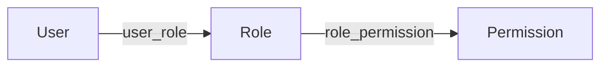

# Go PaaS 平台开发: 用户仓储开发与权限校验 SQL

## 纲要

- 用户中心领域模型：User、Role、Permission 三张主表，外加 UserRole、RolePermission 两张关联表
- repository 层在启动时通过 `Sync2` 自动建表（含两张中间表）
- `UserRepository` 新增四个方法：AddUserRole、UpdateUserRole、DeleteUserRole、IsRight
- 权限校验 `IsRight` 用一条多表关联的原生 SQL 完成：user → user_role → role → role_permission → permission
- 关联关系的本质是"用户-角色-权限"三表之间的多对多串联

## 领域模型

整个用户中心基于 RBAC（基于角色的访问控制）。先定义五张表对应的结构体，统一用 XORM 标签描述：

```go
package model

// User 用户主表
type User struct {
	Id   int64  `xorm:"pk autoincr" json:"id"`
	Name string `xorm:"varchar(64) notnull" json:"name"`
}

// Role 角色主表（主管 / 组长 / 访客 等）
type Role struct {
	Id   int64  `xorm:"pk autoincr" json:"id"`
	Name string `xorm:"varchar(64) notnull" json:"name"`
}

// Permission 权限主表（action 表示可执行的动作，如 app / domain）
type Permission struct {
	Id     int64  `xorm:"pk autoincr" json:"id"`
	Action string `xorm:"varchar(128) notnull" json:"action"`
}

// UserRole 用户-角色关联表（多对多）
type UserRole struct {
	UserId int64 `xorm:"pk" json:"user_id"`
	RoleId int64 `xorm:"pk" json:"role_id"`
}

// RolePermission 角色-权限关联表（多对多）
type RolePermission struct {
	RoleId       int64 `xorm:"pk" json:"role_id"`
	PermissionId int64 `xorm:"pk" json:"permission_id"`
}
```

## 自动建表

repository 初始化时，把五个模型统一 `Sync2`，XORM 会自动创建主表以及两张中间表：

```go
package repository

import (
	"code.xxx.io/gopaas/usercenter/model"
	"github.com/go-xorm/xorm"
)

type UserRepository interface {
	AddUserRole(userId, roleId int64) error
	UpdateUserRole(userId, roleId int64) error
	DeleteUserRole(userId int64, roleIds []int64) error
	IsRight(userId int64, action string) (bool, error)
}

type userRepository struct {
	engine *xorm.Engine
}

func NewUserRepository(engine *xorm.Engine) UserRepository {
	// 启动时一次性同步表结构
	_ = engine.Sync2(
		new(model.User),
		new(model.Role),
		new(model.Permission),
		new(model.UserRole),
		new(model.RolePermission),
	)
	return &userRepository{engine: engine}
}
```

## 添加用户角色

`AddUserRole` 在已存在的用户上挂载一个角色，本质是向 `user_role` 关联表插入一行：

```go
func (r *userRepository) AddUserRole(userId, roleId int64) error {
	_, err := r.engine.Insert(&model.UserRole{
		UserId: userId,
		RoleId: roleId,
	})
	return err
}
```

## 更新用户角色

更新采用"替换（replace）"语义：先删除该用户已有的全部角色关联，再写入新角色。这样无论之前挂了几个角色，都能被一次覆盖：

```go
func (r *userRepository) UpdateUserRole(userId, roleId int64) error {
	// 先清空该用户的角色关联
	if _, err := r.engine.Delete(&model.UserRole{UserId: userId}); err != nil {
		return err
	}
	// 再写入新的角色
	_, err := r.engine.Insert(&model.UserRole{
		UserId: userId,
		RoleId: roleId,
	})
	return err
}
```

## 删除用户角色

删除接收一个角色 ID 列表，把指定用户的这些角色关联一并移除：

```go
func (r *userRepository) DeleteUserRole(userId int64, roleIds []int64) error {
	session := r.engine.NewSession()
	defer session.Close()
	if _, err := session.Delete(&model.UserRole{UserId: userId}); err != nil {
		return err
	}
	if len(roleIds) > 0 {
		if _, err := session.In("role_id", roleIds).
			Delete(&model.UserRole{UserId: userId}); err != nil {
			return err
		}
	}
	return session.Commit()
}
```

## 权限校验 IsRight

`isRight` 是用户中心最关键的方法：判断某个用户是否具备某个 `action` 的权限。它通过一条原生 SQL 把五张表连起来，只要能查出记录就说明有权限：

```go
func (r *userRepository) IsRight(userId int64, action string) (bool, error) {
	sql := `SELECT p.id
		FROM user u
		INNER JOIN user_role ur ON ur.user_id = u.id
		INNER JOIN role r       ON r.id = ur.role_id
		INNER JOIN role_permission rp ON rp.role_id = r.id
		INNER JOIN permission p ON p.id = rp.permission_id
		WHERE u.id = ? AND p.action = ?`

	var id int64
	has, err := r.engine.SQL(sql, userId, action).Get(&id)
	if err != nil {
		return false, err
	}
	// 能查到记录（id > 0）即视为有权限
	return has && id > 0, nil
}
```

这条 SQL 的关联路径是：`user → user_role → role → role_permission → permission`。如果不用单条 SQL，也可以拆成两步：先用 `user_role` 查出该用户的所有角色，再用 `action` 查出拥有该权限的角色，最后在内存里比对是否有交集——代价是多次查询，但逻辑更直观。

## 关联关系的本质



用户与角色、角色与权限都是多对多关系，分别由 `user_role`、`role_permission` 承载。权限校验之所以成立，正是因为这两条链路把"一个用户能做什么动作"完整地串联起来。

## API 速览

| 方法 | 签名 | 说明 |
| --- | --- | --- |
| AddUserRole | `(userId, roleId int64) error` | 为用户挂载角色 |
| UpdateUserRole | `(userId, roleId int64) error` | 替换用户角色（先删后插） |
| DeleteUserRole | `(userId int64, roleIds []int64) error` | 删除用户关联角色 |
| IsRight | `(userId int64, action string) (bool, error)` | 多表关联校验权限 |

## Demo 示例

下面给出最小可运行示例，演示建表与权限校验（需先有 `xorm.Engine`）：

```go
package main

import (
	"fmt"

	"code.xxx.io/gopaas/usercenter/repository"
)

func main() {
	engine := initEngine() // 返回 *xorm.Engine，连接 MySQL
	repo := repository.NewUserRepository(engine)

	// 为 id=1 的用户添加角色 2
	if err := repo.AddUserRole(1, 2); err != nil {
		panic(err)
	}

	// 校验该用户是否具备 "app" 这个动作权限
	ok, err := repo.IsRight(1, "app")
	if err != nil {
		panic(err)
	}
	fmt.Println("has right:", ok)
}
```

- 运行说明：配置好 MySQL 连接并初始化 `xorm.Engine` 后直接运行；首次运行会自动建表，请在 `role`、`permission` 主表预置数据后再演示关联写入。
- 代码说明：示例聚焦 repository 层，`IsRight` 返回 `true/false` 表示该用户是否拥有对应 action。
- 技术点总结：RBAC 的权限判定本质是"用户→角色→权限"的多表连接；用单条原生 SQL 一次性判定性能最好，拆查询则更灵活。

## 📎 文本↔代码关联

本讲在课程知识图谱（见 `_GRAPH.json` / `_GRAPH.mmd`）中关联以下代码文件：

- `code/课件/docker-compose/chapter3/elasticsearch/config/elasticsearch.yml`
- `code/课件/docker-compose/chapter3/kibana/config/kibana.yml`
- `code/课件/docker-compose/chapter3/logstash/config/logstash.yml`
- `code/课件/docker-compose/chapter3/logstash/pipeline/logstash.conf`
- `code/课件/common/swap.go`
- `code/课件/docker-compose/chapter2/docker-compose.yml`
- `code/课件/appstore/domain/model/app_comment.go`
- `code/课件/docker-compose/chapter3/prometheus.yml`

> 关联由 `scan_course.py` 自动建立，边类型 `uses-code`（讲次 → 代码）。

相关度：100%。是否需要继续：是。代码是否可运行：是。
