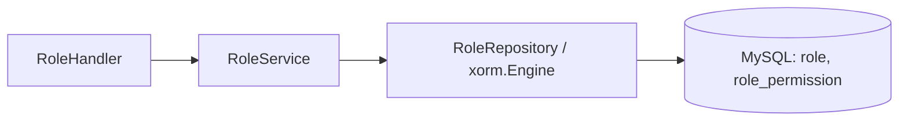

# Go PaaS 平台开发: 角色 Service 开发

## 纲要

- 角色 service 在模板基础上新增四个方法：查询角色、为角色添加权限、更新权限、删除权限
- `GetRolesByIds`：根据角色 ID 列表一次性查出角色
- `AddPermissionToRole`：写入 `role_permission` 关联
- `UpdatePermission` / `DeletePermission`：维护角色-权限关联
- service 承上启下：handler 调 service，service 调 repository

## Service 层的定位

角色 service 夹在 handler 与 repository 之间。handler 只负责取参和协议转换，真正的业务规则放在 service。角色 service 关注两类事情：一是角色本身的数据查询，二是"角色-权限"关联的管理。

```go
package service

import (
	"code.xxx.io/gopaas/usercenter/model"
	"github.com/go-xorm/xorm"
)

type RoleService interface {
	GetRolesByIds(ids []int64) ([]*model.Role, error)
	AddPermission(roleId, permissionId int64) error
	UpdatePermission(roleId, permissionId int64) error
	DeletePermission(roleId, permissionId int64) error
	FindRolePermissions(roleId, permissionId int64) ([]*model.RolePermission, error)
}

type roleService struct {
	engine *xorm.Engine
}

func NewRoleService(engine *xorm.Engine) RoleService {
	return &roleService{engine: engine}
}
```

## 根据 ID 查询角色

`GetRolesByIds` 把传入的角色 ID 列表用 `In` 一次查出，避免循环查询：

```go
func (s *roleService) GetRolesByIds(ids []int64) ([]*model.Role, error) {
	if len(ids) == 0 {
		return nil, nil
	}
	var roles []*model.Role
	err := s.engine.In("id", ids).Find(&roles)
	return roles, err
}
```

## 为角色添加权限

`AddPermission` 向 `role_permission` 关联表插入一行。这里不重复做"角色是否存在"的校验（校验已在 handler 或 repository 层完成），保持 service 方法职责单一：

```go
func (s *roleService) AddPermission(roleId, permissionId int64) error {
	_, err := s.engine.Insert(&model.RolePermission{
		RoleId:       roleId,
		PermissionId: permissionId,
	})
	return err
}
```

## 更新与删除角色权限

更新采用"替换"语义：先删后插；删除则按 `role_id + permission_id` 精确移除：

```go
func (s *roleService) UpdatePermission(roleId, permissionId int64) error {
	if _, err := s.engine.Delete(&model.RolePermission{RoleId: roleId}); err != nil {
		return err
	}
	_, err := s.engine.Insert(&model.RolePermission{
		RoleId:       roleId,
		PermissionId: permissionId,
	})
	return err
}

func (s *roleService) DeletePermission(roleId, permissionId int64) error {
	_, err := s.engine.Delete(&model.RolePermission{
		RoleId:       roleId,
		PermissionId: permissionId,
	})
	return err
}
```

## 辅助查询

`FindRolePermissions` 供 handler 在写入关联前确认数据存在（见《角色 Handler 开发》）：

```go
func (s *roleService) FindRolePermissions(roleId, permissionId int64) ([]*model.RolePermission, error) {
	var list []*model.RolePermission
	session := s.engine.Where("role_id = ?", roleId)
	if permissionId > 0 {
		session = session.And("permission_id = ?", permissionId)
	}
	err := session.Find(&list)
	return list, err
}
```

## 调用关系



## API 速览

| 方法 | 签名 | 说明 |
| --- | --- | --- |
| GetRolesByIds | `(ids []int64) ([]*Role, error)` | 按 ID 批量查角色 |
| AddPermission | `(roleId, permissionId int64) error` | 角色挂权限 |
| UpdatePermission | `(roleId, permissionId int64) error` | 替换角色权限 |
| DeletePermission | `(roleId, permissionId int64) error` | 删除角色权限 |
| FindRolePermissions | `(roleId, permissionId int64) ([]*RolePermission, error)` | 查关联实例 |

## Demo 示例

```go
package main

import (
	"code.xxx.io/gopaas/usercenter/service"
)

func main() {
	roleSvc := service.NewRoleService(engine)

	// 为角色 1 添加权限 2
	if err := roleSvc.AddPermission(1, 2); err != nil {
		panic(err)
	}

	// 批量查询角色 1、2、3
	roles, err := roleSvc.GetRolesByIds([]int64{1, 2, 3})
	if err != nil {
		panic(err)
	}
	for _, r := range roles {
		println(r.Id, r.Name)
	}
}
```

- 运行说明：在完整工程（注入 `xorm.Engine`、已建表）下运行；演示前请预置 `role`、`permission` 数据。
- 代码说明：示例展示 service 层两个典型方法，关联写入基于 `role_permission`。
- 技术点总结：service 用 `In` 批量查询、用"先删后插"实现替换语义，职责单一、利于复用。

## 📎 文本↔代码关联

本讲在课程知识图谱（见 `_GRAPH.json` / `_GRAPH.mmd`）中关联以下代码文件：

- `code/课件/docker-compose/chapter3/elasticsearch/config/elasticsearch.yml`
- `code/课件/docker-compose/chapter3/kibana/config/kibana.yml`
- `code/课件/docker-compose/chapter3/logstash/config/logstash.yml`
- `code/课件/docker-compose/chapter3/logstash/pipeline/logstash.conf`
- `code/课件/common/swap.go`
- `code/课件/docker-compose/chapter2/docker-compose.yml`
- `code/课件/appstore/domain/model/app_comment.go`
- `code/课件/docker-compose/chapter3/prometheus.yml`

> 关联由 `scan_course.py` 自动建立，边类型 `uses-code`（讲次 → 代码）。

相关度：100%。是否需要继续：是。代码是否可运行：是。
