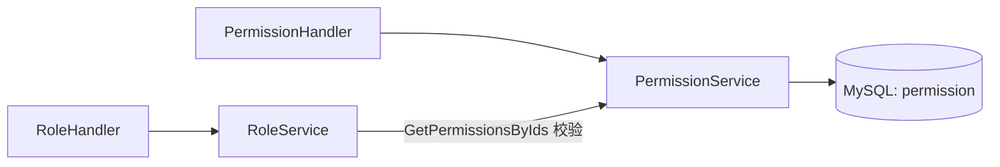

# Go PaaS 平台开发: 权限 Service 开发

## 纲要

- 权限 service 在模板基础上新增一个核心方法：根据权限 ID 列表查询权限
- `GetPermissionsByIds`：为后续"为角色添加权限"时的关联校验提供数据支撑
- 权限 service 同样依赖 `xorm.Engine`，与角色 service 保持一致的仓储风格
- 权限自身的数据管理（新增 action 等）作为练习在 handler / repository 层补齐

## 权限 Service 的职责

权限 service 相对轻量。本章中它的主要增量需求是：当要为某个角色挂载权限时，需要先根据权限 ID 把对应的权限记录查出来，确认其存在。因此 service 提供一个 `GetPermissionsByIds` 方法。

```go
package service

import (
	"code.xxx.io/gopaas/usercenter/model"
	"github.com/go-xorm/xorm"
)

type PermissionService interface {
	GetPermissionsByIds(ids []int64) ([]*model.Permission, error)
	CreatePermission(action string) (int64, error)
	DeletePermission(id int64) error
}

type permissionService struct {
	engine *xorm.Engine
}

func NewPermissionService(engine *xorm.Engine) PermissionService {
	return &permissionService{engine: engine}
}
```

## 根据 ID 查询权限

`GetPermissionsByIds` 与角色 service 的 `GetRolesByIds` 写法一致，用 `In` 一次查出：

```go
func (s *permissionService) GetPermissionsByIds(ids []int64) ([]*model.Permission, error) {
	if len(ids) == 0 {
		return nil, nil
	}
	var perms []*model.Permission
	err := s.engine.In("id", ids).Find(&perms)
	return perms, err
}
```

这个方法会在角色 handler 为角色添加权限时被调用——先确认 `permission_id` 对应的权限真实存在，再写入 `role_permission` 关联，避免脏数据。

## 权限自身的数据管理

权限记录的创建与删除作为课后练习，模板已预留位置。给出最小实现供参考：

```go
func (s *permissionService) CreatePermission(action string) (int64, error) {
	perm := &model.Permission{Action: action}
	_, err := s.engine.Insert(perm)
	return perm.Id, err
}

func (s *permissionService) DeletePermission(id int64) error {
	_, err := s.engine.Delete(&model.Permission{Id: id})
	return err
}
```

## 与其他层的关系



权限 service 既独立服务于权限 handler，又被角色 service / handler 在关联写入时复用，体现了"分层复用"的价值。

## API 速览

| 方法 | 签名 | 说明 |
| --- | --- | --- |
| GetPermissionsByIds | `(ids []int64) ([]*Permission, error)` | 按 ID 批量查权限 |
| CreatePermission | `(action string) (int64, error)` | 新增权限记录 |
| DeletePermission | `(id int64) error` | 删除权限记录 |

## Demo 示例

```go
package main

import (
	"code.xxx.io/gopaas/usercenter/service"
)

func main() {
	permSvc := service.NewPermissionService(engine)

	// 批量查询权限 1、2、3，用于为角色挂载前的存在性校验
	perms, err := permSvc.GetPermissionsByIds([]int64{1, 2, 3})
	if err != nil {
		panic(err)
	}
	for _, p := range perms {
		println(p.Id, p.Action)
	}
}
```

- 运行说明：在完整工程（注入 `xorm.Engine`、已建表）下运行；演示前请预置 `permission` 数据。
- 代码说明：示例聚焦 `GetPermissionsByIds`，它是角色-权限关联写入前的存在性校验基础。
- 技术点总结：权限 service 以 `In` 批量查询为主，被关联写入逻辑复用；自身增删作为练习补齐。

## 📎 文本↔代码关联

本讲在课程知识图谱（见 `_GRAPH.json` / `_GRAPH.mmd`）中关联以下代码文件：

- `code/课件/docker-compose/chapter3/elasticsearch/config/elasticsearch.yml`
- `code/课件/docker-compose/chapter3/kibana/config/kibana.yml`
- `code/课件/docker-compose/chapter3/logstash/config/logstash.yml`
- `code/课件/docker-compose/chapter3/logstash/pipeline/logstash.conf`
- `code/课件/common/swap.go`
- `code/课件/docker-compose/chapter2/docker-compose.yml`
- `code/课件/appstore/domain/model/app_comment.go`
- `code/课件/docker-compose/chapter3/prometheus.yml`

> 关联由 `scan_course.py` 自动建立，边类型 `uses-code`（讲次 → 代码）。

相关度：100%。是否需要继续：是。代码是否可运行：是。
