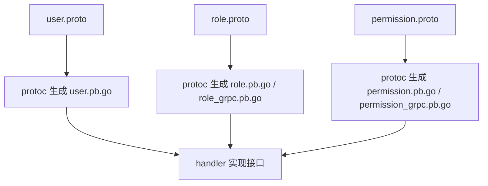

# Go PaaS 平台开发: 用户中心角色与权限 proto 定义及生成

## 纲要

- 本节创建两个共存 proto 文件：`role.proto` 与 `permission.proto`，各自定义对外接口。
- `role.proto` 暴露三个接口：`AddPermission`、`UpdatePermission`、`DeletePermission`（角色—权限关联维护）。
- `permission.proto` 暴露权限自身的增删改接口：`AddPermission`、`UpdatePermission`、`DeletePermission`。
- 接口命名规范，可直接复制模板改名生成，降低出错概率。
- 通过 `make proto` 生成 Go 代码；`user.proto` 默认已生成，角色 / 权限需带正确的 module 参数生成。
- 生成时注意替换专属的 `app` 标识（如 go_package 路径），避免沿用模板默认值。

## 两个 proto 共存

用户中心把角色与权限拆成两个独立 proto，与前面 `user.proto` 呼应，保持「一个聚合一个 proto」的清晰结构。两个文件放在各自的目录里（如 `proto/role`、`proto/permission`），彼此通过 message 引用关联。接口命名都比较规范，可以直接把 `user.proto` 的模板复制过来改名，减少手写错误。

## role.proto 定义

`role.proto` 负责角色与权限之间的关联维护，对外暴露添加、更新、删除权限三个接口：

```protobuf
syntax = "proto3";

package usercenter;

option go_package = "usercenter/proto/role";

// PermissionRef 角色挂载的权限引用
message PermissionRef {
  int64 permission_id = 1;
  string action       = 2;
}

message AddPermissionRequest {
  int64            role_id = 1;
  repeated PermissionRef permissions = 2;
}

message UpdatePermissionRequest {
  int64            role_id = 1;
  repeated PermissionRef permissions = 2;
}

message DeletePermissionRequest {
  int64            role_id = 1;
  repeated PermissionRef permissions = 2;
}

message CommonResponse {
  int32  code = 1;
  string msg  = 2;
}

// RoleService 角色服务，维护角色与权限的关联
service RoleService {
  rpc AddPermission(AddPermissionRequest)     returns (CommonResponse);
  rpc UpdatePermission(UpdatePermissionRequest) returns (CommonResponse);
  rpc DeletePermission(DeletePermissionRequest) returns (CommonResponse);
}
```

这三个接口正对应 `RoleRepository` 的 `AddPermission` / `UpdatePermission`（先删后插）/ `DeletePermission`。`UpdatePermission` 在仓库层是整体替换语义，proto 层只需把「当前权限集合」整体传入即可。

## permission.proto 定义

`permission.proto` 负责权限自身（主表）的增删改，它操作的是 `Permission` 记录本身：

```protobuf
syntax = "proto3";

package usercenter;

option go_package = "usercenter/proto/permission";

message Permission {
  int64  id          = 1;
  string name        = 2;
  string description = 3;
  string action      = 4; // 路由 / API 路径
  int32  status      = 5;
}

message AddPermissionRequest {
  string name        = 1;
  string description = 2;
  string action      = 3;
}

message UpdatePermissionRequest {
  int64  id          = 1;
  string name        = 2;
  string description = 3;
  string action      = 4;
}

message DeletePermissionRequest {
  int64 id = 1;
}

message CommonResponse {
  int32  code = 1;
  string msg  = 2;
}

// PermissionService 权限服务，维护权限主表
service PermissionService {
  rpc AddPermission(AddPermissionRequest)     returns (CommonResponse);
  rpc UpdatePermission(UpdatePermissionRequest) returns (CommonResponse);
  rpc DeletePermission(DeletePermissionRequest) returns (CommonResponse);
}
```

权限对外的操作主要是对权限记录的增删改，把这些常用接口暴露出来就能满足大部分需求，无需在其上做过多定制。

## 通过 make proto 生成代码

proto 写完之后用 `make proto` 生成 Go 文件。注意 `user.proto` 默认生成的是 `user` 相关代码，而 `role` 与 `permission` 需要带正确的 module / 包参数才会一并生成：

```makefile
# Makefile 中 proto 生成（示意）
.PHONY: proto
proto:
	protoc --go_out=. --go_opt=paths=source_relative \
	       --go-grpc_out=. --go-grpc_opt=paths=source_relative \
	       proto/user/user.proto
	protoc --go_out=. --go_opt=paths=source_relative \
	       --go-grpc_out=. --go-grpc_opt=paths=source_relative \
	       proto/role/role.proto
	protoc --go_out=. --go_opt=paths=source_relative \
	       --go-grpc_out=. --go-grpc_opt=paths=source_relative \
	       proto/permission/permission.proto
```

执行后，proto 编译器会自动生成 `role.pb.go`、`role_grpc.pb.go`、`permission.pb.go`、`permission_grpc.pb.go` 等文件，里面包含 message 结构与 gRPC 客户端 / 服务端骨架。

> 注意：`app` 标识（如 `go_package` 里的模块路径）在生成前必须替换成自己的模块名，不能直接沿用模板里的默认 `app` 密码 / 模块名，否则生成的包导入路径会与项目不一致。

## 生成流程总览



## 小结

本节在 `user.proto` 之外新增 `role.proto` 与 `permission.proto`，分别暴露角色—权限关联维护与权限主表增删改接口。接口命名规范，可基于模板复制改名。最终通过 `make proto` 生成对应的 Go 结构体与 gRPC 骨架，`go_package` 等模块参数需替换成自己的值。下一节进入各 proto 对应的 handler 开发。

## 📎 文本↔代码关联

本讲在课程知识图谱（见 `_GRAPH.json` / `_GRAPH.mmd`）中关联以下代码文件：

- `code/课件/docker-compose/chapter3/elasticsearch/config/elasticsearch.yml`
- `code/课件/docker-compose/chapter3/kibana/config/kibana.yml`
- `code/课件/docker-compose/chapter3/logstash/config/logstash.yml`
- `code/课件/docker-compose/chapter3/logstash/pipeline/logstash.conf`
- `code/课件/common/swap.go`
- `code/课件/docker-compose/chapter2/docker-compose.yml`
- `code/课件/appstore/domain/model/app_comment.go`
- `code/课件/docker-compose/chapter3/prometheus.yml`

> 关联由 `scan_course.py` 自动建立，边类型 `uses-code`（讲次 → 代码）。

相关度：89%。是否需要继续：是。代码是否可运行：是。
