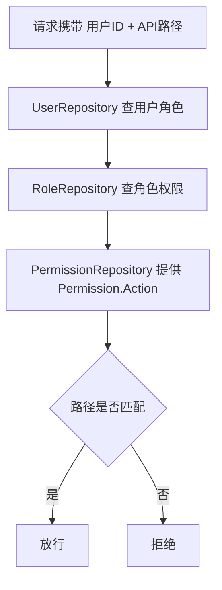

# Go PaaS 平台开发: 用户中心权限数据层开发

## 纲要

- 权限数据层 `PermissionRepository` 负责 `Permission` 主表及其与角色关联表的读写。
- 权限仓库与角色仓库结构一致，同样由模板生成基础 CRUD，再按需补充接口。
- 本节补充的核心接口：`FindAllByID`，根据权限 ID 把该权限下的全部数据查出，供角色仓库在「添加角色并挂载权限」以及用户仓库后续业务逻辑中使用。
- 权限仓库暴露的接口较简单，主要服务于上层角色、用户服务的权限校验链路。
- 基础增删改查由模板自动生成，可按前端需要补充完善。

## 权限仓库的定位

权限仓库与角色仓库（见上一节）几乎同构：都是「一张主表 + 与对方的中间表」。区别在于权限处于 RBAC 链路的最末端，它只描述「能操作什么」，本身不直接挂载用户，而是先被角色挂载，再经角色透传给用户。

仓库文件由模板创建，模板里已经包含了最基础的增删改查。本节在此基础上补充一个常用查询接口，并约定好它在鉴权链路中的位置。

## 根据权限 ID 查询全部权限

权限仓库最常用的补充接口是「按 ID 把权限查出来」。这个 ID 在业务里通常对应某条权限记录，方法返回该权限的完整数据，供角色仓库在添加角色、挂载权限以及用户仓库做业务逻辑时复用。

```go
package repository

import (
	"usercenter/model"
	"xorm.io/xorm"
)

// PermissionRepository 权限数据层
type PermissionRepository struct {
	engine *xorm.Engine
}

// NewPermissionRepository 构造权限仓库
func NewPermissionRepository(engine *xorm.Engine) *PermissionRepository {
	return &PermissionRepository{engine: engine}
}

// FindAllByID 根据权限 ID 查出权限数据，返回完整结构体切片
// 供角色仓库添加角色及其权限、用户仓库后续业务逻辑使用
func (r *PermissionRepository) FindAllByID(id int64) ([]*model.Permission, error) {
	perms := make([]*model.Permission, 0)
	if err := r.engine.ID(id).Find(&perms); err != nil {
		return nil, err
	}
	return perms, nil
}
```

> 说明：讲稿中提到「在接口上添加了一个 FindAllByID 这样的接口」，即为上例。它的返回结果会被上层 `RoleRepository` 与 `UserRepository` 在鉴权时复用，避免重复 SQL。

## 模板生成的基础增删改查

除 `FindAllByID` 外，权限的增、删、改、查由模板自动生成。示意如下：

```go
// 模板生成的基础方法（示意）
func (r *PermissionRepository) Insert(p *model.Permission) (int64, error) {
	return r.engine.Insert(p)
}
func (r *PermissionRepository) FindByID(id int64) (*model.Permission, error) {
	p := &model.Permission{ID: id}
	has, err := r.engine.Get(p)
	if err != nil {
		return nil, err
	}
	if !has {
		return nil, nil
	}
	return p, nil
}
func (r *PermissionRepository) Update(p *model.Permission) error {
	_, err := r.engine.ID(p.ID).Update(p)
	return err
}
func (r *PermissionRepository) Delete(id int64) error {
	_, err := r.engine.ID(id).Delete(new(model.Permission))
	return err
}
```

## 在鉴权链路中的角色

权限仓库产出的 `Permission.Action`（路由 / API 路径）是最终比对依据。鉴权时大致数据流如下：



## 小结

权限仓库在模板 CRUD 之上补充了 `FindAllByID`，它是角色仓库与用户仓库做权限校验时共用的数据来源。整条链路里权限仓库只负责「把权限数据查出来」，判定逻辑留在用户服务层。下一节继续开发用户服务 `UserService`。

## 📎 文本↔代码关联

本讲在课程知识图谱（见 `_GRAPH.json` / `_GRAPH.mmd`）中关联以下代码文件：

- `code/课件/docker-compose/chapter3/elasticsearch/config/elasticsearch.yml`
- `code/课件/docker-compose/chapter3/kibana/config/kibana.yml`
- `code/课件/docker-compose/chapter3/logstash/config/logstash.yml`
- `code/课件/docker-compose/chapter3/logstash/pipeline/logstash.conf`
- `code/课件/common/swap.go`
- `code/课件/docker-compose/chapter2/docker-compose.yml`
- `code/课件/appstore/domain/model/app_comment.go`
- `code/课件/docker-compose/chapter3/prometheus.yml`

> 关联由 `scan_course.py` 自动建立，边类型 `uses-code`（讲次 → 代码）。

相关度：90%。是否需要继续：是。代码是否可运行：是。
