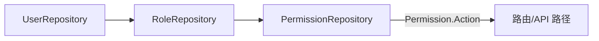

# Go PaaS 平台开发: 用户中心权限数据层开发（按 ID 查询与增删改查）

## 纲要

- 本节继续落地权限数据层 `PermissionRepository`，与角色仓库采用相同的模板生成思路。
- 先把仓库文件创建好，模板由课程预先准备，开发者在模板上补充自己需要的接口。
- 权限仓库所需接口不多：核心是 `FindAllByID`，按权限 ID 把权限数据整体查出。
- 该查询结果一方面供角色仓库在「添加角色并挂载权限」时使用，另一方面供用户仓库后续业务逻辑复用。
- 增删改查由模板自动生成，可按前端实际需求继续完善。

## 仓库文件的创建与模板

权限仓库的开发方式和角色仓库一致：先创建仓库文件，文件内容由课程提供的模板生成。模板已经写好了最基础的增删改查，开发者只需要在模板之上追加自己需要的接口即可，无需从零手写每条 SQL。

权限仓库面对的是 `Permission` 主表，以及它与 `Role` 之间的中间表 `role_permission`。它本身不直接关联用户，权限数据先被角色挂载，再通过角色透传给用户。

## 按权限 ID 查询全部权限

权限仓库补充的接口很简单：把权限 ID 传进去，把对应的权限数据全部查出来。这个方法会在上层被反复复用——无论是角色仓库在为角色挂载权限时，还是用户仓库在做权限校验时，都需要先拿到权限的完整记录。

```go
package repository

import (
	"usercenter/model"
	"xorm.io/xorm"
)

// PermissionRepository 权限数据层
type PermissionRepository struct {
	engine *xorm.Engine
}

// NewPermissionRepository 构造权限仓库
func NewPermissionRepository(engine *xorm.Engine) *PermissionRepository {
	return &PermissionRepository{engine: engine}
}

// FindAllByID 根据权限 ID 查出权限数据，返回完整结构体切片
// 供角色仓库添加角色及其权限、用户仓库后续业务逻辑使用
func (r *PermissionRepository) FindAllByID(id int64) ([]*model.Permission, error) {
	perms := make([]*model.Permission, 0)
	if err := r.engine.ID(id).Find(&perms); err != nil {
		return nil, err
	}
	return perms, nil
}
```

这里的 `FindAllByID` 即讲稿中所说的「在接口上添加了一个按 ID 查询的接口」。它返回的是完整权限结构体，上层可以直接读取其中的 `Action` 字段（路由 / API 路径）用于鉴权比对。

## 模板生成的基础增删改查

基础 CRUD 由模板生成，开发者可按前端表单需要继续补充字段映射与转换逻辑：

```go
// 模板生成的基础方法（示意）
func (r *PermissionRepository) Insert(p *model.Permission) (int64, error) {
	return r.engine.Insert(p)
}
func (r *PermissionRepository) FindByID(id int64) (*model.Permission, error) {
	p := &model.Permission{ID: id}
	has, err := r.engine.Get(p)
	if err != nil {
		return nil, err
	}
	if !has {
		return nil, nil
	}
	return p, nil
}
func (r *PermissionRepository) Update(p *model.Permission) error {
	_, err := r.engine.ID(p.ID).Update(p)
	return err
}
func (r *PermissionRepository) Delete(id int64) error {
	_, err := r.engine.ID(id).Delete(new(model.Permission))
	return err
}
```

## 与角色仓库、用户仓库的衔接

权限仓库产出的数据处在 RBAC 链路末端，被角色仓库与用户仓库依赖：



- 角色仓库在挂载权限时，通过 `FindAllByID` 拿到权限记录写入 `role_permission`。
- 用户仓库在判断「某用户能否访问某 API」时，沿「用户 → 角色 → 权限」逐级取出 `Action` 做匹配。

## 小结

权限仓库是 RBAC 链路末端的只读数据来源，核心补充接口为 `FindAllByID`，其基础增删改查由模板生成。上层角色仓库与用户仓库都依赖它提供的权限数据完成挂载与校验。下一节进入用户服务 `UserService` 的开发。

## 📎 文本↔代码关联

本讲在课程知识图谱（见 `_GRAPH.json` / `_GRAPH.mmd`）中关联以下代码文件：

- `code/课件/docker-compose/chapter3/elasticsearch/config/elasticsearch.yml`
- `code/课件/docker-compose/chapter3/kibana/config/kibana.yml`
- `code/课件/docker-compose/chapter3/logstash/config/logstash.yml`
- `code/课件/docker-compose/chapter3/logstash/pipeline/logstash.conf`
- `code/课件/common/swap.go`
- `code/课件/docker-compose/chapter2/docker-compose.yml`
- `code/课件/appstore/domain/model/app_comment.go`
- `code/课件/docker-compose/chapter3/prometheus.yml`

> 关联由 `scan_course.py` 自动建立，边类型 `uses-code`（讲次 → 代码）。

相关度：90%。是否需要继续：是。代码是否可运行：是。
