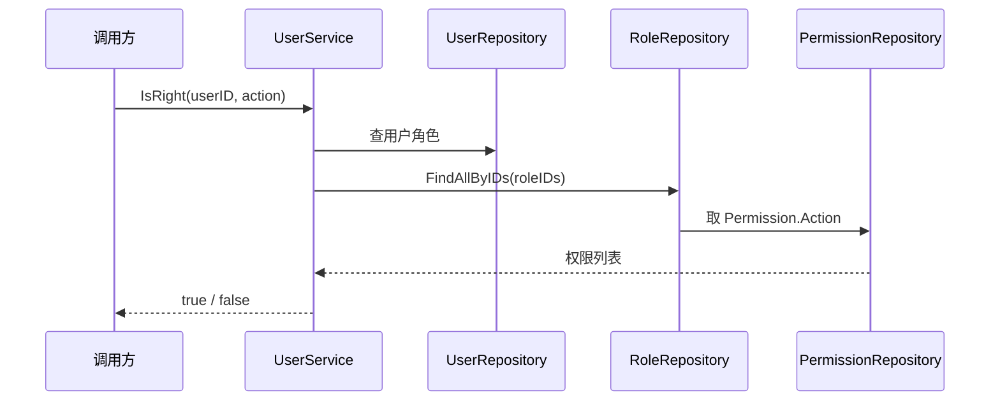

# Go PaaS 平台开发: 用户中心用户服务开发

## 纲要

- 用户服务 `UserService` 在 `UserRepository` 之上编排业务，向用户分配角色并做权限校验。
- 在模板生成的接口之外，用户服务新增四个常用接口：
  - `AddRole`：为用户分配角色。
  - `UpdateRole`：更新用户的角色。
  - `DeleteRole`：删除用户的角色。
  - `IsRight`：判断某用户针对某个动作（API 路径）是否有权限。
- `IsRight` 是鉴权闭环的关键：根据「用户 ID + 动作」沿「用户 → 角色 → 权限」链路查库，命中返回有权限，否则无权限。
- 服务层依赖 `UserRepository` 与 `RoleRepository`，不直接写 SQL，保持分层清晰。

## 服务层的职责

在用户中心里，repository 只管数据库读写，真正的业务编排放在 service 层。`UserService` 以用户为主体，向外扩展出角色分配与权限判断两类能力。模板已经把基础的用户增删改查生成好，本节在其上补充四个接口：为用户添加角色、更新角色、删除角色，以及判断操作是否有权限的 `IsRight`。

## 为用户分配角色

`AddRole` 把一批角色 ID 绑定到指定用户。XORM 在 `manytomany(user_role)` 关联上执行 `Insert` 时会自动维护中间表 `user_role`：

```go
package service

import (
	"usercenter/model"
	"usercenter/repository"
)

// UserService 用户服务
type UserService struct {
	userRepo *repository.UserRepository
	roleRepo *repository.RoleRepository
}

// NewUserService 构造用户服务
func NewUserService(userRepo *repository.UserRepository, roleRepo *repository.RoleRepository) *UserService {
	return &UserService{userRepo: userRepo, roleRepo: roleRepo}
}

// AddRole 为用户分配角色
func (s *UserService) AddRole(userID int64, roleIDs []int64) error {
	roles := make([]*model.Role, 0, len(roleIDs))
	for _, rid := range roleIDs {
		roles = append(roles, &model.Role{ID: rid})
	}
	user := &model.User{ID: userID}
	// XORM 通过 manytomany(user_role) 自动写入关联表
	_, err := s.userRepo.Engine().Insert(user, roles)
	return err
}
```

> 说明：上面的 `userRepo.Engine()` 仅用于示意拿到 XORM 引擎；实际项目中也可在 repository 上直接暴露关联写入方法，保持服务层不直接持有引擎。

## 更新与删除用户的角色

更新角色语义与角色仓库的 `UpdatePermission` 一致：先清掉该用户原有关联，再整体写入新的角色集合。`DeleteRole` 则移除指定角色关联：

```go
// UpdateRole 更新用户角色：先删除原有关联，再整体写入新角色
func (s *UserService) UpdateRole(userID int64, roleIDs []int64) error {
	if err := s.userRepo.ClearRoles(userID); err != nil {
		return err
	}
	return s.AddRole(userID, roleIDs)
}

// DeleteRole 删除用户的指定角色
func (s *UserService) DeleteRole(userID int64, roleIDs []int64) error {
	return s.userRepo.RemoveRoles(userID, roleIDs)
}
```

其中 `ClearRoles` / `RemoveRoles` 在 `UserRepository` 里通过删除 `user_role` 中间表记录实现：

```go
// UserRepository 中的关联维护（示意）
func (r *UserRepository) ClearRoles(userID int64) error {
	_, err := r.engine.Exec("DELETE FROM user_role WHERE user_id = ?", userID)
	return err
}

func (r *UserRepository) RemoveRoles(userID int64, roleIDs []int64) error {
	if len(roleIDs) == 0 {
		return nil
	}
	_, err := r.engine.Exec(
		"DELETE FROM user_role WHERE user_id = ? AND role_id IN (?)", userID, roleIDs,
	)
	return err
}
```

## 权限判断 IsRight

`IsRight` 是整个用户中心的鉴权入口。它接收用户 ID 与动作（即 API 路径），沿「用户 → 角色 → 权限」链路取出所有权限的 `Action`，只要有一个与传入动作匹配，即判定有权限。

```go
// IsRight 判断用户针对某个动作（API 路径）是否有权限
func (s *UserService) IsRight(userID int64, action string) (bool, error) {
	// 1. 查出用户拥有的角色 ID
	user, err := s.userRepo.FindByID(userID)
	if err != nil {
		return false, err
	}
	roleIDs := make([]int64, 0, len(user.Roles))
	for _, r := range user.Roles {
		roleIDs = append(roleIDs, r.ID)
	}
	if len(roleIDs) == 0 {
		return false, nil
	}

	// 2. 查出这些角色挂载的全部权限
	roles, err := s.roleRepo.FindAllByIDs(roleIDs)
	if err != nil {
		return false, err
	}

	// 3. 匹配动作
	for _, role := range roles {
		for _, perm := range role.Permissions {
			if perm.Action == action {
				return true, nil
			}
		}
	}
	return false, nil
}
```

这里 `action` 通常用请求的路由地址（如 `/api/v1/pods`）作为判断依据。如果将来需要更细的匹配（正则、通配符），只需在第三步把相等比较换成对应的匹配函数即可。

## 数据流总览



## 小结

用户服务在 repository 之上编排出角色分配（`AddRole` / `UpdateRole` / `DeleteRole`）与权限校验（`IsRight`）两类能力。其中 `IsRight` 沿「用户 → 角色 → 权限」链路取出 `Action` 做匹配，是 RBAC 鉴权闭环落地的关键方法。下一节进入 `user.proto` 的接口定义。

## 📎 文本↔代码关联

本讲在课程知识图谱（见 `_GRAPH.json` / `_GRAPH.mmd`）中关联以下代码文件：

- `code/课件/docker-compose/chapter3/elasticsearch/config/elasticsearch.yml`
- `code/课件/docker-compose/chapter3/kibana/config/kibana.yml`
- `code/课件/docker-compose/chapter3/logstash/config/logstash.yml`
- `code/课件/docker-compose/chapter3/logstash/pipeline/logstash.conf`
- `code/课件/common/swap.go`
- `code/课件/docker-compose/chapter2/docker-compose.yml`
- `code/课件/appstore/domain/model/app_comment.go`
- `code/课件/docker-compose/chapter3/prometheus.yml`

> 关联由 `scan_course.py` 自动建立，边类型 `uses-code`（讲次 → 代码）。

相关度：93%。是否需要继续：是。代码是否可运行：是。
