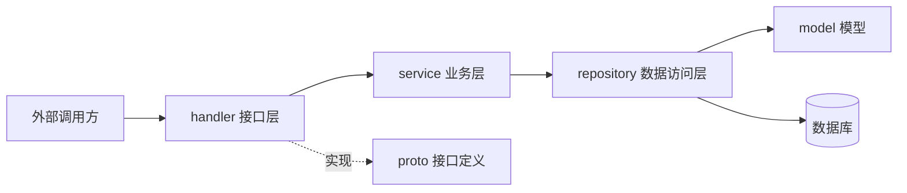

# Go PaaS 平台开发: 项目目录结构

## 纲要

- 微服务工程的典型分层：模型层、数据访问层、业务服务层、接口层
- 核心目录职责：`model` / `repository` / `service` / `handler` / `proto`
- 工程配套文件：`go.mod`、`Dockerfile`、`Makefile`、`.gitignore`、`README.md`
- 分层调用关系：外部请求 → `handler` → `service` → `repository` → `model`

## 为什么要约定目录结构

微服务开发中，每个服务对外暴露大量接口（RPC / HTTP）。若没有统一的分层约定，数据库操作、业务逻辑、接口定义会互相纠缠，难以维护。本章约定一套标准目录，作为后续代码自动生成的模板。

## 目录结构总览

一个服务的标准目录如下（以 `user` 服务为例）：

```dir
user/
├── model/          # 数据库模型定义（结构体）
├── repository/     # 数据访问层（DAO），基于 GORM 操作数据库
├── service/        # 业务服务层，封装对 repository 的调用
├── handler/        # 对外接口层，实现 proto 定义的 RPC / API
├── proto/          # protobuf 接口定义（.proto 文件）
├── Dockerfile      # 镜像构建脚本
├── go.mod          # Go Module 定义（每个服务一个）
├── Makefile        # 常用命令封装（build / proto）
├── .gitignore      # Git 忽略规则
└── README.md       # 项目说明
```

## 各目录职责

| 目录 / 文件 | 职责 | 类比 |
| --- | --- | --- |
| `model` | 定义与数据表对应的结构体模型 | 实体（Entity） |
| `repository` | 封装所有数据库交互代码（增删改查），基于 GORM / XORM | DAO 层 |
| `service` | 对外暴露业务能力（如查询、删除），包装 repository | 业务层 |
| `handler` | 实现 proto 定义的接口，是服务对外的入口 | Controller |
| `proto` | 用 protobuf 描述服务名与 RPC 方法 | 接口契约 |
| `go.mod` | 声明模块路径与依赖（由 `go mod init` 生成） | 依赖清单 |
| `Dockerfile` | 将编译产物打包为可运行镜像 | 构建脚本 |
| `Makefile` | 把 `build`、`proto` 等常用命令固化为 `make` 目标 | 命令封装 |
| `.gitignore` | 忽略编译产物、本地日志等 | 版本控制配置 |
| `README.md` | 说明服务注意事项与启动方式 | 文档 |

## 分层调用关系



- `handler` 实现 `proto` 中声明的 RPC 方法，是服务对外的统一入口
- `service` 组合 `repository`，提供可复用的业务能力
- `repository` 直接操作 `model` 与数据库，隔离底层存储细节

## 关于 go.mod 与 Makefile

- `go.mod` 由 `go mod init <module>` 创建，用于管理依赖版本；每个微服务都是独立模块
- `Makefile` 把冗长的命令（如镜像构建、proto 代码生成）收敛为 `make build`、`make proto`，方便日常开发

## 总结

相关度：100%。是否需要继续：是。代码是否可运行：否。
