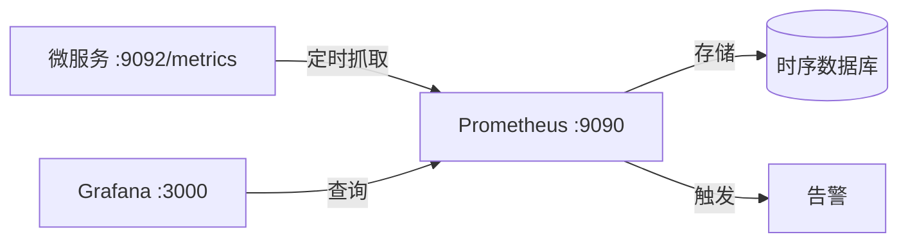

# Go PaaS 平台开发: go-micro v3 添加监控中心

## 纲要

- 微服务需要观测运行时指标：GC 延迟、goroutine 数量、内存、并发量等，这些在单体应用中往往没有。
- 采集链路：服务暴露 `/metrics` → Prometheus 定时抓取 → 存储 → Grafana 图表化展示与告警。
- 用 docker-compose 启动 Prometheus + Grafana；go-micro v3 服务通过 Prometheus 客户端暴露指标端点。
- Grafana 添加 Prometheus 数据源（默认 9090）并创建看板，可视化 GC、goroutine、内存等维度。

## 监控架构



Prometheus 通过配置文件里定义的目标地址，每隔固定间隔（默认 15 秒）抓取 `/metrics` 接口暴露的指标，存入自身时序数据库；Grafana 连接 Prometheus 作为数据源，把指标绘制成看板，并可基于规则告警。

## 关键端口

| 端口 | 作用 |
| --- | --- |
| 9090 | Prometheus 服务端与抓取目标（配置中 target 端口） |
| 3000 | Grafana Web UI |

> 注：服务暴露指标的端口（本例 `9092`）需与 Prometheus 配置里的 `targets` 保持一致；容器网络内不能用 `127.0.0.1` 指向宿主机，应使用容器服务名或宿主机内网地址。

## Prometheus 抓取配置

```yaml
global:
  scrape_interval: 15s

scrape_configs:
  - job_name: "paas"
    scrape_interval: 5s
    static_configs:
      - targets: ["host.docker.internal:9092"]
```

`job_name` 即一个采集任务；`scrape_interval` 可针对该 job 覆盖全局的 15 秒；`targets` 为服务暴露指标的地址列表。

## Demo 示例

### docker-compose 启动 Prometheus + Grafana

```yaml
version: "3.8"

services:
  prometheus:
    image: prom/prometheus:latest
    container_name: prometheus
    volumes:
      - ./prometheus.yml:/etc/prometheus/prometheus.yml:ro
    ports:
      - "9090:9090"

  grafana:
    image: grafana/grafana:latest
    container_name: grafana
    depends_on:
      - prometheus
    ports:
      - "3000:3000"
```

### 代码说明

服务侧用 Prometheus 官方客户端暴露指标端点，并把该端口注册到服务自身：

```go
package main

import (
	"log"
	"net/http"

	"github.com/asim/go-micro/v3"
	"github.com/prometheus/client_golang/prometheus"
	"github.com/prometheus/client_golang/prometheus/promhttp"
)

// metricsPort 每个服务暴露指标所用端口，需与 prometheus.yml 的 target 一致
const metricsPort = "9092"

func main() {
	// 自定义一个计数器指标
	reqCounter := prometheus.NewCounter(prometheus.CounterOpts{
		Name: "paas_request_total",
		Help: "paas service total request count",
	})
	prometheus.MustRegister(reqCounter)

	// 暴露 /metrics 指标端点
	go func() {
		http.Handle("/metrics", promhttp.Handler())
		if err := http.ListenAndServe(":"+metricsPort, nil); err != nil {
			log.Fatalf("metrics server failed: %v", err)
		}
	}()

	service := micro.NewService(
		micro.Name("go.micro.srv.paas"),
	)
	service.Init()
	if err := service.Run(); err != nil {
		panic(err)
	}
}
```

### 运行说明

1. 启动 Consul、MySQL 等前置依赖（日志中心资源紧张时可暂不启动 ELK）。
2. 启动监控：`docker compose -f prometheus.yaml up -d`。
3. 拉取依赖：`go get github.com/prometheus/client_golang/prometheus github.com/prometheus/client_golang/prometheus/promhttp`。
4. 运行服务，`telnet 127.0.0.1 9092` 或访问 `http://127.0.0.1:9092/metrics` 确认指标已暴露。
5. 打开 `http://127.0.0.1:3000` 进入 Grafana，添加数据源（类型 Prometheus，地址填 `http://prometheus:9090` 或宿主机 `http://host.docker.internal:9090`）。
6. 创建看板，添加 `go_gc_duration_seconds`、`go_goroutines`、`process_resident_memory_bytes` 等指标，即可看到 GC、goroutine、内存等运行时维度。

### 技术点总结

- 监控相比其他中间件接入最简单：起一个 HTTP `/metrics` 端点即可被 Prometheus 抓取。
- 关注的核心维度：GC 延迟、goroutine 数量、内存占用、并发量；出问题时有看板才能快速定位。
- Grafana 看板可沉淀为模板，形成"程序运行状态"的统一视图，是 PaaS 平台可观测性的重要一环。

相关度：100%。是否需要继续：是。代码是否可运行：是。
